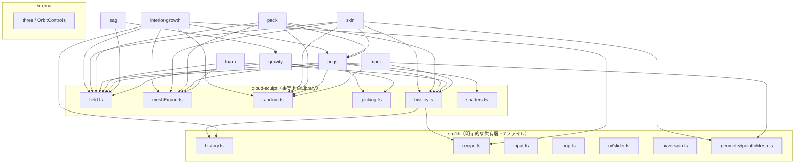

# Katachi 依存関係・重複マップ（R0 調査 / 成果物B）

作成日: 2026-07-25
調査指示書: `Optimizer/docs/sonnet-instruction-20260725-katachi-capability-map-and-reorganization-r0.md` §4
関連: `katachi-capability-map-20260725.md`（成果物A）、`katachi-reorganization-plan-20260725.md`（成果物E）

この文書は**整理のための事実調査**であり、リファクタリング実装ではない。
production codeは一行も変更していない。

記法（指示書§2.4）:

- **Observed** — コード・import・実行結果から確認した事実
- **Inferred** — 複数の事実から導いた解釈
- **Proposed** — 将来の整理案
- **Author decision** — 作者が選ぶ必要がある事項

調査方法: `rg` による全import抽出、`md5`/`diff` による同名ファイル比較、
`wc -l`、`vite.config.ts`、`package.json`、各Study `manifest.json`。
**行数だけで共通化の優先度を決めていない**（指示書§9）。
Katachiは未コミット・未追跡ファイルを多数含むため、`git diff` ではなく実ファイルを読んだ。

---

## 1. 実依存グラフ（§4.1）

### 1.1 全体像



### 1.2 Study → 別Study（クロスStudy依存の全件）

**Observed.** `rg '^\s*import .*from "\.\./[a-z-]+/' src/studies` の全件。
指示書は `interior-growth/meshExport.ts → cloud-sculpt/meshExport.ts` を例として挙げているが、
実際の依存はそれより広い。**依存先モジュール別**にまとめる。

#### 依存先 `cloud-sculpt/field.ts`（8 Study = 自分以外の全Study）

| 依存元 | 取り込んでいるもの |
|---|---|
| gravity | `Ball`, `FieldParams`, `DEFAULT_FIELD_PARAMS`, `growBalls`, `resetBallIdCounter`, `freshBallId` |
| sag | `Ball`, `FieldParams`, `DEFAULT_FIELD_PARAMS`, `growBalls`, `resetBallIdCounter`, `freshBallId` |
| mpm | `Ball`, `DEFAULT_FIELD_PARAMS`, `growBalls`, `resetBallIdCounter`, `freshBallId` |
| foam | `Ball`, `FieldParams`, `DEFAULT_FIELD_PARAMS`, `growBalls`, `resetBallIdCounter`, `ballSdf`, `fieldSdf`, `smoothMin` |
| rings | `Ball`, `freshBallId`, `resetBallIdCounter` |
| pack | `Ball`, `FieldParams`, `DEFAULT_FIELD_PARAMS`, `growBalls`, `resetBallIdCounter`, `ballSdf`, `fieldSdf`, `smoothMin` |
| skin | `Ball`, `FieldParams`, `DEFAULT_FIELD_PARAMS`, `growBalls`, `resetBallIdCounter`, `fieldSdf`, `smoothMin` |
| interior-growth | `smoothMin` のみ |

#### 依存先 `cloud-sculpt/meshExport.ts`（5 Study）

| 依存元 | 取り込んでいるもの |
|---|---|
| foam | `MeshBuildResult` |
| rings | `MeshBuildResult` |
| pack | `Bounds`, `MeshBuildResult`, `Triangle`, `computeSamplingBounds` |
| skin | `Bounds`, `MeshBuildResult`, `MeshVertex`, `Triangle`, `Corner`, `SavedStlTopologyReport`, `computeSamplingBounds`, `encodeBinaryStl` |
| interior-growth | `buildMeshFromField`, `Bounds`, `Triangle`, `MeshBuildResult`, `rescaleMeshResult`, `orientMeshForSavedStl`, `inspectSavedStlTopology`, `computeMeshVolume`, `encodeBinaryStl`, `meshSummary` |

#### 依存先 `cloud-sculpt/random.ts`（5 Study）

mpm, rings, pack, skin, interior-growth が `hashSeed` / `makeRng` を取り込む（skin は `partition.ts` からも）。

#### 依存先 `cloud-sculpt/history.ts`（5 Study）

foam, mpm, pack, skin, rings が `HistoryEntry`（S1形式）、`parseRecipe as parseS1Recipe`、
`replay as replayS1`、`serializeRecipe as serializeS1Recipe` を取り込む。
**Inferred**: これは「S1のレシピを他Studyが読み込んで還流させる」設計意図の実装であり、
偶然の再利用ではない（各StudyのREADMEが「S1レシピ還流」を明示）。

#### 依存先 `cloud-sculpt/picking.ts`（3 Study）

gravity, rings, sag が `raymarchField` を取り込む。

#### 依存先 `cloud-sculpt/shaders.ts`（1 Study）

rings が `MAX_BALLS` のみ取り込む。

#### 依存先 `rings/ring.ts`（3 Study）

| 依存元 | 取り込んでいるもの |
|---|---|
| pack | `generateRingBalls`, `rotatePoint`, `RingRecipe`, `Vec3` |
| skin | `generateRingBalls`, `rotatePoint`, `RingRecipe`, `Vec3` |
| interior-growth | `generateRingBalls`, `rotateVector`, `vCross`, `RingRecipe` |

#### 依存先 `rings/linking.ts`（1 Study）

skin が `gaussLinkingNumber` を取り込む。

#### 依存先 `gravity/physics.ts`（cross-Study importer 1 / 利用Study総数 2）

sag が `ballVolume`, `overlapArea`, `computeStrain` を取り込む。

**Observed（数え方の注意）**: 本節の「依存先」見出しの数字は
**そのモジュールを import している「他の」Study数**であり、定義元Study自身を含まない。
`gravity/physics.ts` は gravity 自身が使い、sag が import しているので、
**利用Study総数は2**である。Katachi `AGENTS.md` §4 の昇格基準
「同じ操作を**2つ以上のStudy**で使いたくなったら」は利用Study総数で数えるため、
この区別で結論が変わる（下の B-6 を参照）。
同じ注意は `rings/linking.ts`（importer 1 / 総数 2）と
`cloud-sculpt/shaders.ts`（importer 1 / 総数 2）にも当てはまる。

### 1.3 Study → `src/lib`

**Observed.** 利用状況には**大きな偏り**がある。

| src/lib モジュール | 利用Study数 | 利用Study |
|---|---|---|
| `ui/slider.ts` | 9 | cloud-sculpt, foam, gravity, mpm, pack, rings, sag, skin, interior-growth（9） |
| `ui/version.ts` | 9 | 同上 |
| `loop.ts` | 9 | cloud-sculpt, foam, gravity, mpm, pack, rings, sag, skin, interior-growth |
| `input.ts` | 6 | cloud-sculpt, gravity, pack, rings, sag, skin |
| `geometry/pointInMesh.ts` | 2 | mpm(`stlImport.ts`), skin(`partition.ts`) |
| `history.ts` | **2** | cloud-sculpt, interior-growth |
| `recipe.ts` | **2** | cloud-sculpt, interior-growth |

**訂正（2026-07-26）**: 初版はTypeScriptの `import` だけを抽出したため、
**CSSの `@import` による共有を見落としていた**。実際には `src/lib` の外に、
もう一つ全Study共有の実装がある。

| 共有ファイル | 利用Study数 | 実測 |
|---|---|---|
| `src/styles/base.css` | **9（全部）** | 9 Studyの `style.css` が冒頭で `@import "../../styles/base.css";` |

126行・CSS custom property 25個。`--paper` `--ink` `--mist` `--faint` `--hairline`
`--bg` `--panel-bg` `--text` `--muted` `--accent` `--danger` と font/`#viewport`/`button` 等の
骨格を持つ。冒頭コメントは `docs/tasks/T18-design-alignment.md Part A` を出典として挙げる。

**Observed（重要）**: 9 Studyすべてが自分の `history.ts` に recipe 直列化関数を定義しているが、
共有envelope `src/lib/recipe.ts` を通しているのは cloud-sculpt と interior-growth の**2つだけ**。
残り7 Study（gravity, sag, mpm, foam, rings, pack, skin）は
`{ formatVersion: 1, studyId, exportedAt, entries }` という同じ封筒を各自で組んでいる。

**訂正（2026-07-26）**: 初版は「`serializeRecipe` の定義は9箇所」と書いたが、
**foam だけ関数名が `serializeFoamRecipe`** である（封筒の構造は他と同じ）。
`serializeRecipe` という名前だけで数えると8箇所になり、1件少なく見える。

### 1.4 Study → external

**Observed.** three.js を直接importするのは main/renderer/picking のみ。
`OrbitControls` は9 Study全部の renderer が使う。
`three` 以外の実行時外部依存は**ゼロ**（`package.json` の dependencies は `three` のみ）。
テストは `node:assert/strict` のみを使い、テストフレームワークを持たない。

### 1.5 HTML entry → Study main

**Observed.** `vite.config.ts` の rollupOptions.input と実ファイルから:

| HTML | → main | 備考 |
|---|---|---|
| `index.html` | `src/studies/cloud-sculpt/main.ts` | **launcher画面ではなくStudy本体** |
| `gravity.html` | gravity/main.ts | |
| `sag.html` | sag/main.ts | |
| `mpm.html` | mpm/main.ts | |
| `foam.html` | foam/main.ts | |
| `rings.html` | rings/main.ts | |
| `pack.html` | pack/main.ts | |
| `skin.html` | skin/main.ts | |
| `interior-growth.html` | interior-growth/main.ts | |

計9ページ。`npm run build` の実測出力も9 html（Observed）。

**Observed**: Katachiには**トップレベルのlauncher画面が存在しない**。
Study間の移動は各Study `ui.ts` にハードコードされた nav-row リンクだけで行われる。

### 1.6 test → production module

**Observed.** テストファイルは4つのみ。

| テスト | 対象 | 実測件数 |
|---|---|---|
| `interior-growth/growth.test.ts` | growth / coverage / colonization / meshExport / history / generationContext / field | 106 |
| `skin/partition.test.ts` | skin/partition.ts, cloud-sculpt/meshExport.ts, lib/geometry/pointInMesh.ts | 41 |
| `skin/partitionTutorial.test.ts` | skin/partitionTutorial.ts | 50 |
| `skin/coinBulge.test.ts` | skin/field.ts, cloud-sculpt/field.ts | 11 |

**Observed**: テストを持つStudyは **skin と interior-growth の2つだけ**。
残り7 Study（cloud-sculpt, gravity, sag, mpm, foam, rings, pack）には自動テストが無い。
これは `cloud-sculpt/field.ts` と `cloud-sculpt/meshExport.ts` が
**8 Studyから依存されているのに、自分自身のテストを持たない**ことを意味する
（間接的には skin/interior-growth のテストが一部を通る）。

---

## 2. 重複の分類（§4.2）

分類記号:

- **A: 既に安定共有済み** — 共有実装があり実際に使われている
- **B: Library昇格候補** — 2 Study以上で同一責任、単体で説明でき、昇格の実需がある
- **C: 契約だけ共通化候補** — 実装は違ってよい。型・順序・不変条件だけ揃える
- **D: Study固有のまま維持** — 見た目が似ていても責任が違う
- **E: 偶然の重複・整理不要**

各候補は Katachi `AGENTS.md` §4 の昇格基準と、指示書§2.2の6条件で判定した。

### 2.1 分類表（要約）

| 対象 | 分類 | 一行根拠 |
|---|---|---|
| `cloud-sculpt/field.ts` の `Ball`/`smoothMin`/`ballSdf`/`fieldSdf` | **B** | 8 Studyが依存。実体はLibraryなのに置き場所がStudyの中 |
| `cloud-sculpt/meshExport.ts` の marching tetrahedra + saved-topology | **B** | 5 Studyが依存。単体で説明でき、Study状態を持たない |
| `cloud-sculpt/random.ts`（`hashSeed`/`makeRng`） | **B** | 5 Studyが依存。28行の純粋関数。再現性の土台 |
| `rings/ring.ts` の `generateRingBalls`/`rotateVector`/`rotatePoint` | **B** | pack/skin/interior-growth の3 Studyが依存 |
| `shaders.ts` の `vertexShader` | **B** | **7 Study完全同一**（md5一致） |
| `sha256Hex` | **B** | skin/interior-growth の2箇所に同一ロジック |
| recipe envelope（`serializeRecipe` の封筒部分） | **B** | 9 Study同一責任、うち2 Studyが既に `src/lib/recipe.ts` へ移行済み |
| `renderer.ts` の camera/resize lifecycle | **C** | 生成部は4 Study完全同一だが描画本体は別物 |
| Worker protocol（requestId/progress/cancel/stale） | **C** | 2 Studyで同型だがpayloadは別。契約だけ揃う |
| save gate の合否条件 | **C** | 何を拒否するかは共通化できるが、判定対象の形状は別 |
| `style.css` | **A** | 9 Study全部が `src/styles/base.css`（126行・変数25個）を `@import`。各Studyのは上書き差分（2026-07-26訂正） |
| `renderer.ts` の描画本体 | **D** | raymarch / InstancedMesh / Points / LineSegments で原理が違う |
| `shaders.ts` の `fragmentShader` | **D** | 各Studyの形状原理そのもの |
| `ui.ts` | **D** | Studyごとに作者が触るパラメータが違う |
| `picking.ts`（pack ↔ skin） | **D** | 関数名は同じだが実装の大半が相違 |
| `history.ts` の op 定義とreplay | **D** | opは各Studyの操作語彙そのもの |
| `gravity/physics.ts` の `ballVolume`/`overlapArea`/`computeStrain` | **B** | gravity + sag の**2 Study**が使う＝`AGENTS.md` §4 の基準を満たす。移動優先度は低い |
| `cloud-sculpt/history.ts` のS1レシピ還流 | **E** | 設計意図どおりの参照。重複ではない |

### 2.2 根拠の詳細

#### B-1. `cloud-sculpt/field.ts` — 事実上のLibraryがStudyの中にある

**Observed**: `Ball`, `FieldParams`, `smoothMin`, `ballSdf`, `fieldSdf`, `growBalls`,
`freshBallId`, `resetBallIdCounter` を**自分以外の8 Study全部**が取り込んでいる。
100行。three非依存の純粋関数とデータ型のみ。

§2.2の6条件: 2 Study以上で同一責任 ✓ / 単体で説明できる ✓ / Study固有状態を持たない
△（`freshBallId`/`resetBallIdCounter` はモジュールレベルのカウンタという可変状態を持つ。
ただし各Studyのreplayが `resetBallIdCounter` を明示的に呼ぶ規約で再現性を保っている）/
recipe再現性 ✓（IDカウンタのreset規約を壊さない限り）/ 実験速度 ✓ / option引数化不要 ✓。

**Inferred**: これは「Libraryへ昇格すべきものが、歴史的経緯でS1の中に残っている」状態。
Katachi `AGENTS.md` の昇格基準（安定・単体で説明できる・再利用の実需）を
**すでに8 Study分満たしている**。

#### B-2. `cloud-sculpt/meshExport.ts` — 879行の造形出口

**Observed**: 5 Studyが依存。`buildMeshFromField`（marching tetrahedra）、
`inspectSavedStlTopology`（Float32保存後のtopology検査）、`computeConnectedComponentsWithKey`、
`rescaleMeshResult`、`orientMeshForSavedStl`、`encodeBinaryStl`、`computeMeshVolume` 等。

**Inferred**: 責任が2種類混在している。
(a) 場→メッシュの抽出、(b) 保存形状の検査と符号化。
昇格するなら**この2つを分ける**のが自然（§7の段階案へ）。

#### B-3. `vertexShader` — 7 Study完全同一（最も明確な重複）

**Observed**: shaders.ts を持つ7 Study（cloud-sculpt, foam, gravity, pack, rings, sag, skin）の
`vertexShader` は**md5が全て一致**（`68d9dc32a811532d443da876bdf83e70`）。
全画面クアッド用の同一シェーダが7回書かれている。

§2.2の6条件を全て満たす。反対理由が見当たらない最小の昇格候補。

**Observed（対比）**: 同じファイルの `fragmentShader` は7 Study全て異なる。
`MAX_BALLS` 等の定数名・値もStudyごとに違う（pack は `HOST_MAX_BALLS`/`VOID_MAX_BALLS`/
`VOID_MAX_UNITS`、skin は `HOST_MAX_BALLS`/`PATCH_MAX_POINTS`/`PATCH_MAX_COUNT`）。
→ vertexShaderだけがB、残りはD。

#### B-4. `sha256Hex` — 2箇所に同一ロジック

**Observed**:

- `src/studies/skin/main.ts:1016` — `async function sha256Hex(data: ArrayBuffer | string)`（private）
- `src/studies/interior-growth/meshExport.ts:470` — `export async function sha256Hex(data: ArrayBuffer)`

どちらも `crypto.subtle.digest("SHA-256", bytes)` → hex文字列。
差は文字列入力を受けるかどうかだけ。6条件を全て満たす。

#### B-5. recipe envelope — 9 Study同一責任、2 Studyに移行実績

**Observed**: recipe直列化関数の定義は9箇所（foam のみ `serializeFoamRecipe`、他8つは `serializeRecipe`）。
`src/lib/recipe.ts` の `serializeRecipeEnvelope`/`parseRecipeEntries`/`RecipeEnvelope` を
通しているのは cloud-sculpt と interior-growth のみ。

**Inferred**: 共有envelopeは既に存在し、2 Studyで動いている。
昇格の是非ではなく**残り7 Studyを移行するかどうか**の問題。
移行にはrecipe互換性の検証が要るため、1 Studyずつが妥当。

#### C-1. `renderer.ts` — camera/resizeだけが契約候補

指示書§4.2の「良い例」に対応する箇所。**Observed**:

cloud-sculpt / foam / gravity / rings の4 Studyで、次が**完全同一**:

```ts
this.renderer.setPixelRatio(Math.min(window.devicePixelRatio, 2));
this.camera = new THREE.PerspectiveCamera(45, 1, 0.1, 100);
this.controls = new OrbitControls(this.camera, this.renderer.domElement);
// resize:
this.renderer.setSize(w, h);
this.camera.aspect = w / h;
this.camera.updateProjectionMatrix();
```

一方、描画本体は原理ごとに別物:

| Study | 行数 | 描画方式 |
|---|---|---|
| cloud-sculpt / foam / gravity / rings | 97–105 | ShaderMaterial による raymarch |
| sag | 156 | ShaderMaterial（休み形/たわみ形の二枚表示） |
| mpm | 132 | `THREE.Points`（粒子） |
| pack | 323 | ShaderMaterial + InstancedMesh |
| skin | 551 | ShaderMaterial + InstancedMesh + Points |
| interior-growth | 505 | InstancedMesh + LineSegments + 3 scissor viewport共有camera |

**Proposed**: 共通化するのは frame/viewport lifecycle の**契約**まで。
「万能renderer」を作らない（指示書§2.3）。interior-growth は1 cameraを3 viewportへ
scissor共有する特殊構造を持ち、これをoption引数へ押し込むのは§2.2の最終条件に反する。

#### C-2. Worker protocol — 2 Studyで同型、payloadは別

**Observed**: Workerを持つのは2 Studyのみ。

| | skin | interior-growth |
|---|---|---|
| Worker | `partition.worker.ts`(43行) | `growth.worker.ts`(69行) |
| Protocol | `partitionWorkerProtocol.ts`(33行) | `growthWorkerProtocol.ts`(66行) |
| 中止方法 | `worker.terminate()` | `worker.terminate()` |
| stale判定 | requestId | requestId **＋ 入力snapshotのcontext key** |

**Observed**: 両者とも `{type:"progress"|"result"|"error", requestId, elapsedMs}` という同じ形。
interior-growth 側だけが `generationContext.ts` による入力照合を追加している
（生成中に入力を変えると古い結果が混入する不具合の修正として2026-07-25に追加）。

**Proposed**: 共通化するのは**契約**（requestIdの意味、progressの単調性、
terminateによるcancel、stale result破棄の責任範囲）。
skin側にもcontext照合が要るかは別途判断（**Author decision**）。

#### A-1. `style.css` — 共有base + 各Studyの上書き（初版の判定を訂正）

**訂正（2026-07-26）**: 初版はこれを **C（契約だけ共通化候補）** とし、
「CSS変数はrings(1個)以外に無く色はリテラル直書き」「コピー&改変で増えた同一骨格が
3世代に分かれて固まっている」と書いていた。**両方とも誤りである。**
原因は、TypeScriptの `import` だけを抽出し、**CSSの `@import` を見なかった**こと。

**Observed（実測）**: 9 Study すべての `style.css` が冒頭で
`@import "../../styles/base.css";` している。`src/styles/base.css` は126行で
`:root` に25個のcustom propertyを持つ。したがって:

- 色はリテラル直書きではなく、`--paper` / `--ink` / `--mist` / `--danger` 等の
  共有変数として一箇所で定義されている
- 各Studyの `style.css` は独立したコピーではなく、**共有baseへの上書き・追加**である
- `.panel` ルールが3系統のmd5に分かれるのは「3世代のコピー」ではなく、
  共有baseの上に各Studyが載せた差分の違いである

**分類を A（既に安定共有済み）へ改める。** T16-3「style共通化」の成果物であり、
昇格候補ではない。

**なお未確認**: Katachi `AGENTS.md` §5 の「余白の色は全Study共通のスケール
（青=楽 ↔ 赤=限界）」が `base.css` の変数として表現されているかは確認していない。
`base.css` にあるのは chrome（紙白・墨・ヘアライン）の色で、
計器の色スケールは各StudyのTS側にある可能性が高い。断定しない。

#### D-1. `picking.ts`（pack ↔ skin）は名前が同じだけ

**Observed**: pack(135行) と skin(234行) はどちらも `raymarchComposite` と `raymarchHost` を
exportするが、空白を除いた行単位diffで**203行が相違**。
cloud-sculpt(48行) は `raymarchField` のみで別物。

**Inferred**: 「同名だから共通化」は誤り。pack は虚(void)ユニット、
skin は表面patch を拾うため、field合成もヒット判定も違う。**D**。

#### B-6. `gravity/physics.ts` — 2 Studyが使う。「3 Study目」は憲章に無い基準だった

**Observed**: sag が `ballVolume`, `overlapArea`, `computeStrain` を import する。
gravity 自身も使うので**利用Study総数は2**。

**訂正（2026-07-26）**: 本文書の初版はこれを **E（偶然の重複・整理不要）** とし、
理由を「昇格の実需（3 Study目）はまだ無い」と書いていた。
**この「3 Study目」という基準は Katachi `AGENTS.md` に存在しない。**
憲章§4の文言は次のとおりで、閾値は2である。

> 同じ操作を2つ以上の Study で使いたくなったら Library への昇格を人間に提案する。

したがって分類を **B: Library昇格候補** へ改める。
§2.2の6条件で再確認した結果:

| 条件 | 判定 |
|---|---|
| 2 Study以上で実際に同じ責任 | ✓ gravity（自Study）+ sag |
| 入出力を単体で説明できる | ✓ `ballVolume(ball)`, `overlapArea(a,b)`, `computeStrain(...)` は球と数値のみを扱う |
| Study固有状態を持ち込まずに使える | ✓ モジュールレベルの可変状態を持たない |
| recipe/historyの再現性を壊さない | ✓ 純粋計算。ID採番にも乱数にも触れない |
| 個別Studyの実験速度を落とさない | ✓ |
| 現在の違いをoption引数へ押し込まない | ✓ sag は import した関数をそのまま使い、分岐を足していない |

**Proposed**: ただし**移動の優先度は低い**。S2（重力）→S2b（たわむ）は研究上の連続であり、
現状の置き場所でも読み手が迷いにくい。R2の対象には**しない**（R2は1件だけに絞る）。

**Author decision**: 昇格するか、するならいつ・どこへ置くか。
**本文書の分類Bは「昇格候補である」という提案であり、移動の承認ではない。**

---

## 3. 現在の文書と実体の不一致（§4.3）

すべて **Observed**。**今回は直さない**（指示書§0）。

| # | 不一致 | 実測 |
|---|---|---|
| 1 | root README「三層構造」が `src/library/` をLibraryの場所として記述 | `src/library/` は**存在しない**。実共有コードは `src/lib/`（7ファイル） |
| 2 | root README「状態: **v0.1.0（2026-07-03）**。T1 Study「雲をこねる」を実装済み」 | 現在9 Study。manifestは cloud-sculpt v0.2.0 / skin v0.13.0 / interior-growth v0.5.0 等 |
| 3 | root README「現在の実装」が cloud-sculpt のみ列挙 | 9 Study・9ページが実在 |
| 4 | root README の現在状態がページ数に触れていない | 現在の `npm run build` は**9ページ**。※ 2026-07-19 Observation の「8ページの本番ビルド」は**当時の実測として整合する**（interior-growth 追加は2026-07-24）。**歴史的Observationは書き換えない** — 現在状態の節へ9ページを書くか、新しい日付のObservationとして追記する |
| 5 | `package.json` version `0.1.0` が何も追跡していない | 各Study manifestは独立にversionを持つ。root statusとの対応規則が無い |
| 6 | `docs/tasks/README.md` の見出しが「**Yohaku** — 実装タスク指示書」 | プロジェクトは2026-07-17に Katachi へ改称済み（root README冒頭に記載） |
| 7 | nav-row が各Study `ui.ts` に手書きされ、Study間で本数が揃っていない | 「各Studyから他8 Studyへ」という多数派パターンで数えると実測66/72。6経路が不足（下表） |
| 8 | `index.html` が launcher ではなく cloud-sculpt Study 本体 | Study一覧のトップページが存在しない |
| 9 | 8 Studyから依存される `cloud-sculpt/field.ts`・`meshExport.ts` に専用テストが無い | テストを持つStudyは skin と interior-growth のみ |
| 10 | 保存STLのbinary headerが全Study共通で旧名 | `cloud-sculpt/meshExport.ts:811` が `` `Yohaku Cloud Sculpt ${name}` `` を書き込む。`encodeBinaryStl` は7 Studyが共有するため、**どのStudyから保存しても旧名がSTLに焼き込まれる**（改称は2026-07-17）。OBJ側(`:792`)も同文言。**名称の訂正であっても保存物のバイト列とSHA-256が変わる production 変更**であり、docs-only では直せない（**Author decision**、成果物E参照） |
| 11 | provenanceの `toolVersion` が実体と無関係 | interior-growth は `TOOL_VERSION` 定数を持ち、manifest version（v0.5.0）と連動しない。skin は `manifest.version` を使う。2 Studyでprovenanceのversion源が違う |
| 13 | **未解決の metadata drift**: `interior-growth/manifest.json` の `title` が「S2.1 audit-fix — 構造修正済み・**coverage最低合格は依然未達**」のまま | 同Studyの README Observation（優先される最新状態）は coin target 25% の最低合格matrix **達成**を記録している。manifest 変更は本タスクの範囲外のため未修正。将来は達成/未達という**一時状態を title へ埋め込まず**、恒久的なStudy名（例: `"内部から育つネットワーク (Interior Growth)"`）へ戻す案を作者へ提示する。version / updatedAt / revisits の扱いはその修正タスクで決める |
| 12 | printer preset の数値がKatachiとOptimizerに二重定義 | Katachi `field.ts` `PRINTER_PRESETS`（A1=256³/A1 mini=180³）と Optimizer `config/defaults.toml`（`a1 = [256,256,256]` / `a1_mini = [180,180,180]`）が同じ値を各自保持。**ロジックではなくデータの重複**。詳細は別文書C |

**Follow-up（2026-07-26）**: 行11について、同日付で版契約文書
[katachi-version-contract-20260726.md](katachi-version-contract-20260726.md) ができたが、
**production 統一は未実装**なので、この drift 行（行11）は解消されていない。

**Follow-up（2026-07-26、行10）**: 行10の「7 Studyが共有する」は、mpm を export 側に数えた
初版の計数である。`encodeBinaryStl` の全呼出を再計測した結果は6 Study（cloud-sculpt, foam,
rings, pack, skin, interior-growth）で、mpm は STL import のみ。Q9 の production 影響範囲は
6 Studyとして扱う。詳細の正本は[版契約§10](katachi-version-contract-20260726.md)。

### 3.1 nav-row の欠落（実測）

| Study | リンク数 | 欠落しているリンク先 |
|---|---|---|
| gravity | 7 | mpm |
| sag | 7 | cloud-sculpt（`index.html`） |
| mpm | 7 | gravity |
| foam | **5** | gravity, sag, mpm |
| cloud-sculpt / rings / pack / skin / interior-growth | 8 | — |

**Observed（ここまでが実測）**: 上の6経路について、**そのStudyの画面に直接リンクが無い**。

**未確認（断定しない）**:

- 既存リンクの href が 404 になる「リンク切れ」は**確認していない**。
  観測しているのはリンクの**不在**であって、壊れたリンクではない
- 「全Studyから他の全Studyへ直接移動できる」ことを要求する
  **明文化されたUI契約は現時点で存在しない**。72という分母は、
  9 Study中5つ（cloud-sculpt, rings, pack, skin, interior-growth）が
  8リンクを持つという**多数派パターンをそう読んだ場合**の値である

**Inferred**: 現在の多数派パターンを「各Studyから他8 Studyへの直接リンク」と読むと、
6経路が不足している。これは手書きN×Nによる **navigation drift** の観測である。
完全N×Nを正式契約にするか、launcher中心へ変えるかは **Author decision**。

**Observed（契約に依存しない事実）**: どちらの契約を選ぶにせよ、
現在の構造ではStudyを1つ追加するたびに**他8つの `ui.ts` を手で直す**必要がある。
5 Studyが8リンク・4 Studyがそれ未満という不揃いは、その重複修正が
実際に揃わなかった結果である。

**訂正（2026-07-26）**: 本文書の初版は #4 を「8ページ→9ページの事実誤り」と書いていた。
これは誤りで、2026-07-19 の8ページは interior-growth 追加（2026-07-24）より前の実測として
正しい。歴史的Observationは原文のまま保持し、現在状態を別に書くのが正しい扱いである
（Katachi `AGENTS.md`「記録 > 記憶」「Observationは実測のみ」）。

### 3.2 推奨修正順（**Proposed**）

実装コストが小さく、他の判断を前提としない順:

1. **#6 と #4**（旧プロジェクト名・現在状態の追記）— 現状を記述へ反映するだけの docs-only。判断不要。
   ただし #4 は**過去のObservationを書き換えることではない**（下の注を参照）
2. **#2 #3**（root README の現状更新）— 9 Study一覧と各version表へ
3. **#7**（nav-row の6経路不足）— **docs-only では直せない。UI変更であり production 変更**。
   完全N×Nを契約にするのか launcher を正本にするのかで、直す内容そのものが変わる
   （**Author decision**、成果物E Q4/Q5）。実装する場合は `AGENTS.md` §3 に従い
   実座標クリックでの確認が要り、公開へ影響するため deploy 判断も伴う
4. **#1**（`src/lib` を正式Libraryと呼ぶか `src/library` へ移すか）— **Author decision**。
   文書だけ直して実体を動かさない選択も可
5. **#8**（launcher画面の新設）— UI設計判断を伴う。成果物E §7.4 で案を出す
6. **#5**（versionの対応規則）— 規則を決める必要がある。**Author decision**
7. **#9**（共有モジュールのテスト）— 昇格（B候補）と同時にやるのが自然

---

## 4. この文書の限界

- **依存カウントの注意**: 一次抽出は1行1 importの正規表現で行ったため、
  複数行にまたがるimport文を取りこぼす。表の数値は取りこぼし分を実ファイルで
  確認して補正済み（例: `cloud-sculpt/history.ts` → `src/lib/recipe.ts` は
  複数行importのため一次抽出に現れず、直接読んで確認した）。
  同種の取りこぼしが他に無いとは断定しない

- **Observed** は 2026-07-25 時点の実ファイルに基づく。Katachiは未コミット・未追跡の
  変更を43パス含み、`src/studies/interior-growth/` は全体が未追跡である
- 重複判定は同名ファイルと実importに基づく。**意味的に同じだが名前が違う重複**は
  網羅していない（例: 各Studyのcolor scale実装、metric table描画）
- 行数は規模の目安としてのみ載せた。優先度の根拠には使っていない
- 昇格候補の実装順・互換方法・rollbackは成果物E（`katachi-reorganization-plan-20260725.md`）が扱う
