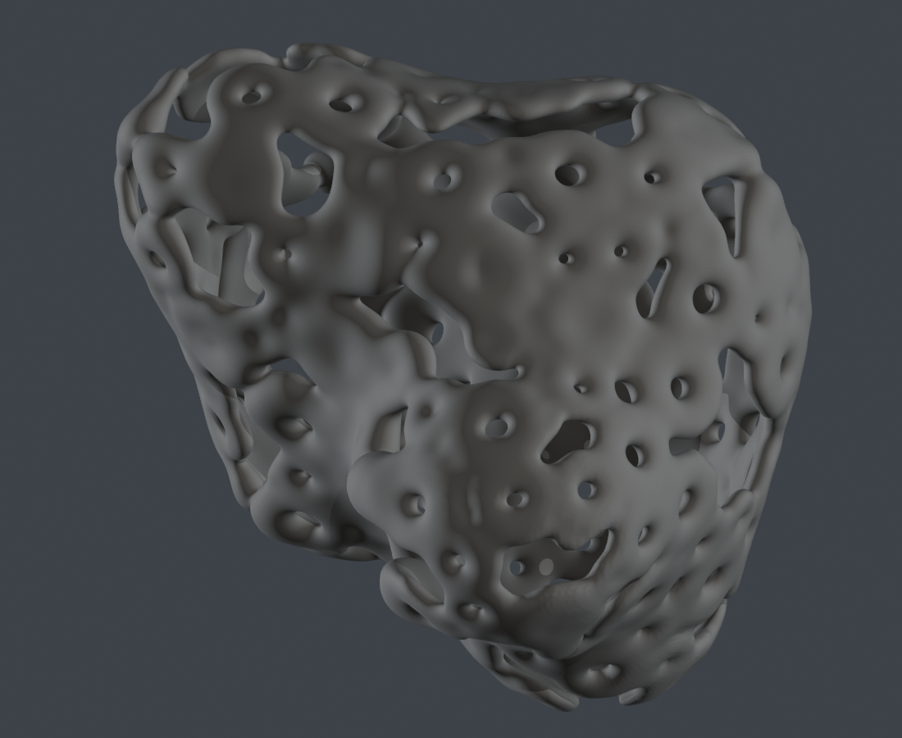

# Katachi Figure / Ground Duality — 図と地を等価に扱う（2026-08-09）

状態: **研究方向を記録。Flower Packing と並行し、まだ Core 型へ昇格しない。**

## 作者の言葉

> さらにサンプルを追加していまやろうとしているアイデアに近い形を見せる
>
> これまでの方法で作成したかたちをblenderで調整していた
>
> ここでは丸い穴が開くよりも図と地が反転するような穴が本体なのか表面が本体なのか、
> どちらの形状も等価に扱うような状況を目指している
>
> 今進めている花はそのまま進めつつ、こちらについても同時に考えたい

## Sample

- Source: `samples/katachi_260808.stl`
- Blender 5.2 での実測: 4,300,176 vertices / 8,600,848 triangles
- Bounds: 約 `80.16 × 65.81 × 78.46`
- 作者による来歴: Katachi の従来手法で生成した形を Blender で調整



## Observation

この形では、大小の開口が滑らかな膜をただ穿っているのではない。開口どうしの間に残る厚み、
奥で別の開口へ連なる通路、外周の薄い帯が一緒になって形を成立させている。表面だけを本体と呼ぶと
空隙側の連続性が消え、穴だけを本体と呼ぶと膜側の連続性が消える。

したがって「穴を球で引く」のような一方向の Boolean だけでは目標を十分に表せない。同じ生成結果を、
物質相からも空隙相からも観察・保存・下流利用できることが必要である。

## Working model

Katachi の正本は、可能な限り次の組として持つ。

```ts
interface DualPhaseShape {
  fieldRef: string;
  domain: FiniteDomain3;
  isoValue: number;
  phaseLabels: readonly ["phase-a", "phase-b"];
  selectedPhase: "phase-a" | "phase-b" | "interface" | "both";
}
```

重要なのは `selectedPhase` の名前ではなく、次の不変条件である。

1. Phase A と Phase B は同じ field / iso / domain を共有する。
2. complement を有限の形として扱うため、観察領域 `FiniteDomain3` を必須にする。
3. `interface` は独立した第三の物体ではなく、二相の共有境界である。
4. メッシュは選択した相または境界から導出できるが、正本をメッシュだけに戻さない。
5. 反転時も seed、生成経路、物理スケール、field hash は変わらない。

`inside/outside` という語は片方を暗黙に主役にするため、UI ではまず `A / B` または作者が観察から
与えた具体名を使う。どちらを物質として書き出すかは、観察・製造・光学の各段階で明示する。

## Flower Packing との関係

Flower はそのまま進める。

```text
Flower track: Motif → Pack → Rigid / Soft → InstanceSet
Phase track:  Field → A / B / Interface → Dual observation
```

将来この二つを接続する場合、Flower motif を場へ stamp し、その合成場の A/B を反転して観察できる。
ただし今の Flower Spike に phase semantics を混ぜない。先に二つの違いを別画面で理解する。

## Hikari boundary

Hikari へ渡すのは「表面が本体」という前提を含む mesh だけでは足りない場合がある。Snapshot は将来、
少なくとも次を識別できる余地を残す。

- 有限領域と二相の意味
- どちらの相を幾何として materialize したか
- 二相の共有 interface
- region ID / boundary ID
- phase selection から mesh や sampled field へ変換した記録と誤差

光学 material / medium の割当は Hikari 側の責務である。Katachi は `phase-a` がガラスか空気かを決めず、
二相と境界の幾何学的関係だけを不変 Snapshot として伝える。

## Next observation

[FIGURE-GROUND-SPIKE](../tasks/FIGURE-GROUND-SPIKE.md) では、同じ場の A と B を横並びにし、iso と
観察領域を動かしたときに「同じ形の反転」と感じられるかをまず見る。STL は参照像として使うが、
8.6M triangles をそのまま新しい正本にはしない。
