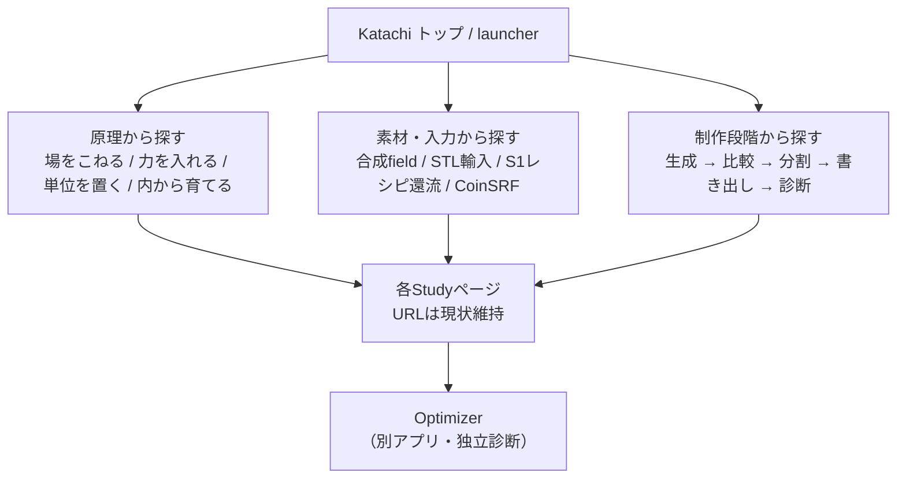

# Katachi 整理計画 R0（成果物E）

作成日: 2026-07-25
調査指示書: `Optimizer/docs/sonnet-instruction-20260725-katachi-capability-map-and-reorganization-r0.md` §7・§8
前提文書: `katachi-capability-map-20260725.md`（A）、`katachi-dependency-duplication-map-20260725.md`（B）、
`katachi-optimizer-boundary-20260725.md`（C）、`katachi-coordinate-export-contract-20260725.md`（D）

**これは整理実装ではない。整理を始める前の地図と段取りである。**
production codeは一行も変更していない。

記法: **Observed**（実測）/ **Inferred**（解釈）/ **Proposed**（案）/ **Author decision**（作者が選ぶ）

---

## 1. 目標構造（§7.1）

Katachi既存の三層（root `README.md` / `AGENTS.md`）を尊重する。**新しい最上位層を足さない。**

```text
Study      = 一つの形状原理を研究する自己完結単位
Library    = 複数Studyで実需が確認された安定操作
Instrument = LibraryとStudy成果を束ね、作者が制作へ使う場
Optimizer  = 外部の独立診断・別ファイル変換器（別リポジトリ）
```

指示書§7.1の指示どおり、「Fabrication Planning」「Evaluation」「Runtime」を
新しい最上位層として追加しない。これらは Library / Instrument の**内部の責任**として置く:

| 責任 | 置き場所（Proposed） | 根拠 |
|---|---|---|
| printer preset / build volume / build axis / plate | Library内の `fabrication` 責任 | 現状 interior-growth のみが持つ（文書D）。2 Study目が出るまでは昇格しない |
| saved topology / component gate / coverage / void | Library内の `evaluation` 責任 | `inspectSavedStlTopology` は既に5 Studyが依存（文書B） |
| Worker run identity / progress / cancel | Library内の `runtime` **契約**のみ | 実装は2 Studyで別物。契約だけ揃える（文書B C-2） |

**Inferred（重要な現状認識）**: Katachiの三層のうち、**Libraryだけが名前と実体がずれている**。

- `src/library/` は**存在しない**（Observed）
- 実際の共有コードは `src/lib/`（7ファイル）
- しかし**本当の共有ハブは `src/studies/cloud-sculpt/`** で、
  `field.ts` に8 Study、`meshExport.ts` に5 Study、`random.ts` に5 Study、
  `history.ts` に5 Studyが依存している（Observed、文書B §1.2）

つまり Katachi は「Libraryが無い」のではなく、
**Libraryの中身がS1 Studyの中に置かれたまま育った**状態にある。
整理の中心はここであり、新しい抽象を作ることではない。

**決定済み（2026-07-26・Q1）**: 上の「名前と実体のずれ」のうち**置き場所の側は解消した** —
作者承認により、Katachiの正式なLibraryは **`src/lib/`** である（詳細と理由は §5 Q1）。
`src/library/` は作らない。以後、本計画で「Library」と書く場合の置き場所は `src/lib/` を指す。
ただし**共有ハブが `src/studies/cloud-sculpt/` に残っている状態は変わっていない**。
これは1件ずつの昇格で扱う（一括移動しない）。

---

## 2. Library昇格候補（§7.2）

Katachi `AGENTS.md` §4 の基準（安定・単体で説明できる・再利用の実需）と
指示書§2.2の6条件で判定した。**小さい順**に並べる。

### 2.1 昇格候補（実需が確認できたもの）

| # | 候補 | 現在地 | 依存Study数 | 規模 | 6条件 |
|---|---|---|---|---|---|
| 1 | `vertexShader`（全画面クアッド） | 7 Studyに同一コピー | 7 | 数行 | 全て満たす。md5完全一致 |
| 2 | `sha256Hex` | skin/main.ts, interior-growth/meshExport.ts | 2 | 7行 | 全て満たす |
| 3 | `hashSeed` / `makeRng` | cloud-sculpt/random.ts | 5 | 28行 | 全て満たす |
| 4 | `smoothMin` / `ballSdf` / `fieldSdf` / `Ball` | cloud-sculpt/field.ts | 8 | 約60行 | 満たす（下の注意つき） |
| 5 | recipe envelope | src/lib/recipe.ts（2 Study利用） | 9が同一責任 | 32行 | 満たす。移行は1 Studyずつ |
| 6 | saved STL topology 検査 | cloud-sculpt/meshExport.ts | 5 | 約200行 | 満たす |
| 7 | mesh field 抽出（marching tetrahedra） | cloud-sculpt/meshExport.ts | 5 | 約250行 | 満たす |
| 8 | `generateRingBalls` / `rotateVector` / `rotatePoint` | rings/ring.ts | 3 | 約80行 | 満たす |
| 9 | `ballVolume` / `overlapArea` / `computeStrain` | gravity/physics.ts | **2**（gravity自身 + sag） | 約60行 | 満たす（文書B B-6） |

**訂正（2026-07-26・#9）**: 本計画の初版は `gravity/physics.ts` を
「2 Study以上を満たすが3 Study目の実需が無い」として候補から外していた。
**この「3 Study目」という閾値は Katachi `AGENTS.md` に存在しない**（憲章の文言は
「同じ操作を2つ以上の Study で使いたくなったら」）。6条件を再確認したうえで候補へ戻した。
ただし**移動優先度は低く、R2の対象にはしない**。昇格の時期と置き場所は **Author decision**（Q7）。
分類Bは提案であって移動の承認ではない。

**注意（#4）**: `freshBallId` / `resetBallIdCounter` はモジュールレベルの可変カウンタを持つ。
各Studyのreplayが `resetBallIdCounter` を明示的に呼ぶ規約で再現性を保っている（Observed）。
昇格時にこの規約を壊すとrecipe再現性が壊れる。**純粋関数部分とID採番を分けて扱う**こと。

### 2.1b 既に共有済み（昇格候補ではない）

**訂正（2026-07-26）**: 初版はこれを「候補から外したもの」表に
「骨格は共通だが色スケール規約がCSSに無い」として載せていた。
これは `src/styles/base.css` の存在を見落としたことによる誤りである（文書B A-1）。

| 対象 | 状態 |
|---|---|
| `src/styles/base.css` | 9 Study すべての `style.css` が冒頭で `@import` する。126行・CSS custom property 25個。**既に安定共有済み（分類A）であり、Library昇格候補ではない** |

各Studyの `style.css` は base のコピーではなく**固有差分**であり、そのまま残す。

**`src/styles/base.css` を `src/lib` へ移す提案はしない。**
共有 presentation infrastructure として現在地に置ける。

共通の余白色スケール（`AGENTS.md` §5「青=楽 ↔ 赤=限界」）を base へ置くかどうかは
**別の契約**であり、今回の整理対象と混同しない（base.css にあるのは
chrome の色 — 紙白・墨・ヘアライン — であって計器の色スケールではない）。

### 2.2 候補から外したもの（実需が確認できない／条件を満たさない）

| 対象 | 外した理由（§2.2のどの条件に失敗するか） |
|---|---|
| `renderer.ts` 全体 | 「現在の違いを無理にoption引数へ押し込まない」に失敗。raymarch/InstancedMesh/Points/LineSegments/3-viewport-scissor は別物 |
| `ui.ts` | 「2 Study以上で同じ責任」に失敗。作者が触るパラメータはStudyごとに違う |
| `picking.ts` | 同上。pack↔skin は関数名が同じだけで実装の大半が相違（実測203行差） |
| `history.ts` の op/replay | 「Study固有状態を持ち込まずに使える」に失敗。opは各Studyの操作語彙そのもの |
| Worker 実装本体 | 「単体で説明できる」に失敗。payloadがStudy固有。契約だけならC分類で可 |
| `fabrication envelope`（printer/plate） | 現状 interior-growth のみ（1 Study）。**2 Study目が出るまで昇格しない** |
| printer preset の数値 | Katachi内では1 Study。ただし**Optimizer `config/defaults.toml` と同じ値を二重に持つ**（文書C）。これはKatachi内のLibrary昇格ではなく、リポジトリ間のデータ契約の問題 |

**Proposed**: 「万能renderer」「BaseStudy」「全Study共通state manager」「万能Worker」は
今回の調査からは**正当化できない**（指示書§2.3）。候補はすべて
純粋関数・データ形式・契約のいずれかに収まっている。

---

## 3. 段階移行（§7.3）

各段階は**単独で完結し、単独で戻せる**。1段階ごとに build / test / browser を確認できる。

### R0.5 — 記述の事実誤りだけを直す（docs-only・判断不要）

**Proposed**: R1の前に、**現状を記述へ反映するだけで済むもの**を潰せる。
ここに入れてよいのは、production の出力・UI・保存バイト列を**一切変えない**ものに限る。

| 対象 | 内容 |
|---|---|
| root README | 現在状態へ「9 Study・9ページ」を**追記**する（文書B #4）。**2026-07-19 Observation の「8ページ」は当時の実測として正しいので書き換えない**。9ページを記録するなら、その場で実際に `npm run build` を通し、その結果だけを書く |
| root README | 「状態: v0.1.0・T1 Study「雲をこねる」を実装済み」「現在の実装」→ 9 Study一覧へ（#2 #3） |
| `docs/tasks/README.md` | 見出しの旧プロジェクト名「Yohaku」→ Katachi（#6。改称は2026-07-17） |

**互換方法/テスト/rollback**: いずれも不要（docs-only）。
**作者判断点**: なし。

**この段階に含めないもの（初版からの訂正、2026-07-26）**:

初版のR0.5は nav-row の追加と STL/OBJ ヘッダの変更を同じ「判断不要」に入れていた。
**どちらも docs-only ではなく production 変更であり、この段階から外す。**

| 外した対象 | 外した理由 | 接続先 |
|---|---|---|
| nav-row の6経路 | UI変更。そもそも「完全N×Nを契約とするか、launcher を正本とするか」で直す内容が変わる。`AGENTS.md` §3 の実座標クリック確認が要り、公開へ影響するため deploy 判断も伴う | Q4 / Q5 → R5 |
| STL/OBJ ヘッダ `Yohaku Cloud Sculpt` | 名称の訂正であっても**保存物のバイト列とSHA-256が変わる**。`encodeBinaryStl` を共有する7 Study全部に及ぶ | 下のQ9（独立した小タスク候補） |
| `toolVersion` | 保存来歴の意味を変える | Q8 |

### R1 — 文書と命名の正本化（コード変更ゼロ）

| 項目 | 内容 |
|---|---|
| **目的** | 「文書が言っていること」と「実体」を一致させる。以後の判断の土台 |
| **対象** | root `README.md`、`docs/tasks/README.md`、本 `docs/architecture/` 一式 |
| **移動候補** | なし（コードを動かさない） |
| **やること** | 文書B §3 の不一致 #2 #3 #4 #6 を修正。9 Study一覧・各version表・9ページビルドへ更新。`src/lib` と将来の `src/library` の関係を**文書上で**確定（実体は動かさない）。capability index を本 `docs/architecture/` から参照 |
| **互換方法** | 不要 |
| **テスト** | 不要（docs-only） |
| **browser確認** | 不要 |
| **rollback** | 文書を戻すだけ |
| **作者判断点** | Q1（`src/lib` を正式Libraryとするか）→ **2026-07-26 決定済み: `src/lib` を正式Libraryとする**（§5 Q1） |

**Inferred**: R1を先にやる理由は、#1（`src/library` 問題）が
**R2以降の置き場所を決めてしまう**ため。コードを動かす前に名前を決める。

**Observed（2026-07-26 実施分）**: 作者がQ1を承認したため、R1の文書側を反映した。
root README の「三層構造」は三層の意味を
（Study = 一つの生成原理を研究する自己完結単位 / Library = `src/lib/` の小さな安定操作 /
Instrument = LibraryとStudy成果を束ねる制作の入口）へ合わせ、
`src/library/` という未実在の記述と「Q1で未決定」注記を決定の記録へ置き換えた。
併せて `src/studies/cloud-sculpt/` に残る共有ハブは**段階的な昇格候補であり一括移動しない**こと、
`src/styles/base.css` は**既に安定共有済み（分類A）で昇格候補ではない**ことを注記した。
この作業で production code は一行も変更していない。

### R2 — pure function の小規模昇格（1つだけ）

| 項目 | 内容 |
|---|---|
| **目的** | 昇格の手順・テスト・rollbackを1件で確立する。範囲を広げない |
| **対象** | **`sha256Hex` 1つだけ**を推奨（候補#2） |
| **移動候補** | `src/lib/hash.ts` へ（R1でQ1が決定したため、置き場所は `src/lib/` に確定）。skin/main.ts と interior-growth/meshExport.ts が参照 |
| **互換方法** | interior-growth 側は `export` 済みなので再exportで互換維持。skin側はprivateなので呼び出し置換のみ |
| **テスト** | `npm run test:interior-growth`（既存のSHA-256決定性テストがそのまま回帰テストになる）。`npm run test:partition` |
| **browser確認** | skin と interior-growth でSTL保存 → SHA-256表示が変わらないこと |
| **rollback** | 1ファイルの追加と2箇所の import 差し戻し |
| **作者判断点** | なし |

**Proposed**: `vertexShader`（候補#1、7 Study）の方が重複数は多いが、
**7 Studyの画面すべてを目視確認する必要がある**ため2番目に回す。
`sha256Hex` は既存の自動テストで検証でき、目視確認が2画面で済む。
「小さく戻せる」を優先する。

**T16との関係（2026-07-26）**: **R2は `docs/tasks/T16-consolidation.md` の T16-1〜5 を再実行するものではない。**
T16は既に完了した共通化であり、やり直さない。R2が扱うのは**T16の後に残った重複**であり、
その所在と規模はR0の実測（文書B の依存グラフと重複分類）に基づく。
扱い方は**1件ずつ**で、1件ごとに build / test / 実画面 / rollback を確認してから次へ進む。
一度に複数の候補へ手を広げない。

### R3 — fabrication / export contract

| 項目 | 内容 |
|---|---|
| **目的** | build axis / plate / Z-up transform / provenance の契約を確定する |
| **対象** | 文書D の判断結果。`interior-growth/meshExport.ts`、`cloud-sculpt/meshExport.ts` の `orientMeshForSavedStl`/`rescaleMeshResult` |
| **移動候補** | まだ動かさない。**契約（型と不変条件）を文書と型定義で先に固定する** |
| **互換方法** | 既存の保存STLのSHA-256が変わるかどうかを先に判定。変わるなら旧形式の再現手段をprovenanceへ残す |
| **テスト** | interior-growth の保存mesh系テスト（現在10件）。保存binary STLを再読込して最低build軸座標を測る既存手順 |
| **browser確認** | 3 host × coin でSTL保存 → 実バイナリ再読込 |
| **rollback** | 契約文書のみなら破棄。型を入れた場合は型定義の差し戻し |
| **作者判断点** | Q2（Z-up/plate=0 正規化するか）、Q3（rawとprint-readyを両方残すか） |

**Observed（現状スコープの狭さ）**: `buildAxis` / `buildVolumeMm` / `PRINTER_PRESETS` /
`layerHeightMm` のいずれかを含むファイルを持つのは **interior-growth の1 Studyだけ**（14ファイル）。
他8 Studyは0ファイル。STL書き出し自体は7 Study（cloud-sculpt, foam, mpm, rings, pack, skin,
interior-growth）が持ち、mm スケール（`scaleMmPerUnit`/`targetLongestMm`）は6 Studyが持つが、
**printer・build axis・build plate という造形の向きの概念を持つのは interior-growth だけ**である。
したがってR3は「全Studyへ広げる」作業ではなく、
**1 Studyの契約を、2 Study目が来たときに再利用できる形へ整える**作業である。

### R4 — Worker・保存ゲート等の横断契約

| 項目 | 内容 |
|---|---|
| **目的** | 実装を統合せず、契約だけ揃える（文書B C-2 / C-3） |
| **対象** | `skin/partitionWorkerProtocol.ts`、`interior-growth/growthWorkerProtocol.ts`、両者の save gate |
| **移動候補** | 共通の型のみ（`requestId` の意味、`progress` の単調性、`terminate` による cancel、stale result 破棄の責任範囲） |
| **互換方法** | 型の共通化のみ。メッセージのpayloadはStudy固有のまま |
| **テスト** | interior-growth の generation context テスト群（現在9件）。skin の partition テスト |
| **browser確認** | 両Studyで生成中の入力変更・cancel |
| **rollback** | 型ファイルの削除と各Protocolの復元 |
| **作者判断点** | skin側にも入力context照合を入れるか（現在は interior-growth のみ） |

### R5 — Instrument の最小prototype

| 項目 | 内容 |
|---|---|
| **目的** | Studyを消さずに**入口だけ**束ねる |
| **対象** | 新規 launcher ページ（`index.html` の扱いはQ5次第） |
| **移動候補** | 各Study `ui.ts` の nav-row を、1つのデータ（Study一覧）から生成する形へ |
| **互換方法** | 既存9ページのURLを変えない。Study本体は触らない |
| **テスト** | `npm run build` が9（または10）ページ |
| **browser確認** | 全ページのnav表示。`AGENTS.md` §3 に従い実座標クリックで確認（合成clickはヒットテストを迂回する） |
| **rollback** | launcherページとnavデータの削除 |
| **作者判断点** | Q5（研究順で見せるか、制作目的で見せるか）、Q4（Instrumentの最初の役割） |

**Observed（2026-07-26 実施分 — R5-1/R5-2）**: Q4/Q5 の作者承認を受けて実施した。

- `src/lib/studies.ts` に9 Studyのcatalogを作った。id・表示名・statusは各
  `manifest.json` と自動テストで突き合わせる（`npm run test:studies` 15件）。
  **versionはcatalogへ複製していない** — 手入力の二重正本を作らないため
- `studies.html` を10番目のvite entryとして追加。**10 entryのビルド成功**。
  root `index.html` は変更せず、`/` は従来どおり cloud-sculpt。既存9 URLも不変
- 実ブラウザで**9リンクすべてを実座標クリック**して遷移を確認。
  クリック前に9リンク全部の `elementFromPoint` が当該 `<a>` を返すことも測った。
  mobile幅375pxで横スクロールなし・重なりなし。console error なし
- **nav-rowは一切変更していない**（66/72のまま）。完全N×Nを契約にするか
  launcherを正本にするかは未決で、埋めると決めた形に縛られるため。
  作者がlauncherを使ってから別タスクで判断する

**訂正（2026-07-26）**: 本計画のR5表は `| **browser確認** | 全ページのnav表示…` と
書いていたが、今回のR5では**navを変更していない**ので、確認したのはlauncher側の
9リンクである。nav-rowの確認は、navを実際に変える将来のタスクの範囲。

**Observed（R5の実需）**: nav-row は各Study `ui.ts` に手書きされている。
9 Study中5つ（cloud-sculpt, rings, pack, skin, interior-growth）が他8 Studyへの
リンクを持つ一方、残り4つは本数が少ない。この多数派パターンを
「各Studyから他8 Studyへ」と読むと **66/72、6経路が不足**する:

| Study | 欠落しているリンク先 |
|---|---|
| gravity | mpm |
| sag | cloud-sculpt（`index.html`） |
| mpm | gravity |
| foam | gravity, sag, mpm |

**未確認（断定しない）**: 既存リンクの href が 404 になる「リンク切れ」は確認していない。
観測しているのはリンクの**不在**である。また「全Studyから他の全Studyへ直接移動できる」ことを
要求する**明文化されたUI契約は現時点で存在しない** — 72という分母は多数派パターンをそう読んだ場合の値。

**Inferred**: これは手書きN×Nによる **navigation drift** の観測である。
**R5の実需は「壊れたリンクの修理」ではない。**
Studyを1つ追加するたびに他8つの `ui.ts` へ同じ修正が必要で、
その結果として表示の不整合が実際に観測された、という点に置く。

**Author decision**: 完全N×Nを正式なUI契約にするのか、launcher を正本にして
各画面のnavを簡素化するのか（Q4 / Q5）。どちらを選ぶかで直す内容そのものが変わる。

---

## 4. UI情報設計案（§7.4）

**前提（Observed）**: 現在トップ画面は存在しない。`index.html` は cloud-sculpt Study 本体。
Study間移動は各画面上部の nav-row のみ。
`docs/launcher-spec.md`（root共通）は `scripts/launch-*.command` という
**shell起動スクリプトの仕様**であり、Web UIのlauncher画面とは別概念。
Katachi は `scripts/launch-codex.command` / `launch-server.command` を既に持ち、この仕様には準拠している。

**Proposed**: Study名と個別ページは維持したまま、入口を1枚足す。



### 4.1 三つの軸に現Studyを割り当てた案（Proposed）

| 軸 | 区分 | Study |
|---|---|---|
| 原理 | 場をこねる | cloud-sculpt |
| | 力を入れる | gravity, sag, mpm |
| | 単位を置く | rings, foam |
| | 虚/表面を詰める | pack, skin |
| | 内から育てる | interior-growth |
| 入力 | 合成fieldのみ | cloud-sculpt, gravity, sag, foam, rings, interior-growth |
| | 外部STL輸入 | mpm |
| | S1レシピ還流 | foam, mpm, pack, rings, skin |
| | 実CoinSRF | skin |
| 制作段階 | 生成 | 全Study |
| | 比較 | interior-growth（3候補並置）, sag（二枚の姿） |
| | 分割 | skin（A/B partition） |
| | 書き出し | cloud-sculpt, foam, mpm, rings, pack, skin, interior-growth（`encodeBinaryStl` 利用の実測7 Study） |
| | 診断 | skin, interior-growth（+ 外部Optimizer） |

**Follow-up（2026-07-26）**: 上表「書き出し」行の「実測7 Study」は、mpm を export 側に数えた
初版の計数である。全呼出を再計測した結果は6 Study（cloud-sculpt, foam, rings, pack, skin,
interior-growth）で、mpm は STL import のみ。Q9 の production 影響範囲はこの6 Studyとして扱う。
同じ誤数えは本文書148行目のSTL/OBJヘッダ、216行目のSTL書き出し数にも及ぶため、いずれも6と
読み替える。詳細の正本は[版契約§10](katachi-version-contract-20260726.md)。

**Author decision**: この割り当ては調査者の解釈（Inferred）であり、
作者の研究上の分類とは違う可能性がある。**軸そのものを作者が決めるべき**。

### 4.2 実装しないこと

wireframeは文章とMermaidまで。実装はR5で、かつ作者がQ4/Q5を決めてから。

---

## 5. 作者判断キュー（§8）

優先度順。各項目に推奨案と影響を添えるが、**確定はしない**。

### Q1. `src/lib` を正式Libraryとするか、`src/library` へ段階移行するか

**決定済み（2026-07-26・作者承認）**: **A案 — `src/lib/` をKatachiの正式Libraryとする。**
`src/library/` は作らない。root README の三層構造の記述をこの実体へ合わせた（R1）。

- **決定の理由（Observed に基づく）**: 9 Study が既に `src/lib` を参照している
  （`ui/slider`・`ui/version`・`loop` は9 Study）。`src/library` への改名は
  **9 Study 全部の import を書き換える**割に、得られるのは名前の一致だけで、
  **制作の能力は一つも増えない**
- **決定に伴う運用**: `src/studies/cloud-sculpt/` に残る共有ハブは
  段階的な昇格候補として**1件ずつ**扱い、一括移動しない（Q7）。
  `src/styles/base.css` は既に安定共有済み（分類A）であり昇格対象ではない（§2.1b）
- **決定の影響（実績）**: R1は文書修正のみで完結した。R2以降の移動先は `src/lib/` に固定される

**初版の選択肢（決定履歴として保持・削除しない）**:

| 案 | 内容 | 初版の評価 |
|---|---|---|
| A（採用） | `src/lib` を正式Libraryとし、root READMEの記述を実体へ合わせる | **推奨（Proposed）**。理由は上と同じ |
| B | `src/library` へ段階移行する | 名前は三層の呼称と一致するが、9 Study全部のimport書き換えが要る。選んだ場合、R2以降の移動先が変わる |

### Q2. print-ready STL を Z-up / plate=0 へ正規化するか

- **文書Dの推奨**: **A案（raw保存）+ provenanceへ3項目追記**。Z-up/plate=0への正規化と
  その逆変換・入出力SHA-256はOptimizer `orient` に既に実装・検証済みで、
  Katachi側に作り直すと同じ分業を複製するだけになるため
- **文書Dが同時に挙げる反論**: build plateでの切断は既に**不可逆な造形判断**を保存形状へ
  焼き込んでいる。それを許しながら**可逆な剛体変換**だけを「保存時にgeometryを触らない」
  として拒むのは一貫していない。この対立は作者が裁定する
- **影響**: 保存STLのSHA-256が変わる。既存の保存物との同一性が切れる。
  provenanceに変換と逆変換を残す必要（文書D §6.2）
- **前提**: 現在 build axis を持つのは interior-growth のみ

### Q3. raw STL と print-ready STL を両方残すか

- **影響**: ファイル数・UI・来歴が増える。研究形状と制作形状を分離できる
- **Q2と連動**: Q2でB案を選ぶならQ3はほぼ自動的に「両方残す」へ寄る

### Q4. Instrument の最初の役割を何にするか

- **候補**: (a) Study launcher だけ / (b) 保存物（STL・recipe・provenance）の一覧と再読込 /
  (c) Optimizer診断結果の突き合わせ
- **推奨**: (a) から。**道具は研究の堆積物**（`AGENTS.md` §1）に従い、先回りして作らない
- **影響**: R5の規模が決まる

### Q5. Study一覧を研究順で見せるか、制作目的で見せるか

- **推奨**: 両方。既定は研究順（S1→S2→…の時系列は作者自身の歩みでもある）、
  制作目的は切替軸として添える
- **影響**: §4の三軸のうちどれを既定にするか

### Q6. Katachi内の高速近似と Optimizer 独立診断を両方残す基準

- **現状（Observed）**: Katachiは生成中の高速近似（saved topology、component数、coverage、
  void flood fill、support/overhang近似）を持ち、Optimizerは完成ファイルの独立診断を持つ
- **推奨（Proposed）**: 「生成の**途中で**判断に使うもの」はKatachiに残し、
  「保存物の**合否**を最終的に言うもの」はOptimizerへ寄せる。
  同名でも役割が違うなら削除しない（文書C §5.3）
- **影響**: 二重実装をどこまで許容するかの方針。詳細は文書C

### Q7. 共有ハブ（`cloud-sculpt/field.ts` 等）を昇格させる順序と時期

- **現状（Observed）**: 8 Studyが `cloud-sculpt/field.ts` に依存しているが、
  このファイル自身には自動テストが無い
- **推奨**: R2で手順を確立してから。昇格と同時に最小のテストを付ける
- **影響**: 昇格中に壊すと9 Study全部に波及する。段階を小さく保つ理由そのもの

### Q8. 各Study version と package.json version の対応規則

- **現状（Observed）**: `package.json` 0.1.0、manifest は cloud-sculpt 0.2.0 〜 skin 0.13.0 とばらばら。
  対応規則が無い。さらに provenance の version 源も統一されていない
  （interior-growth は `TOOL_VERSION = "0.2.0"` 定数、skin は `manifest.version`）
- **推奨**: package.json はアプリ全体の公開版として別管理し、Study versionと連動させない。
  root README の「状態」表記をStudy一覧表へ置き換える
- **影響**: R1の文書修正範囲

**Follow-up（2026-07-26 実施分）**:

- 作者が上記の推奨案を承認した（Gate A、2026-07-26）
- 正本文書 [katachi-version-contract-20260726.md](katachi-version-contract-20260726.md) を作った
- package version と Study version は連動させない
- provenance 語彙（`toolVersion` の意味の相違）の production 統一は**未実装**であり、
  文書契約だけが先にできた状態である
- major/minor/patch を何で上げるかの基準は**未決**のまま
- Q9（STL/OBJ ヘッダ）は引き続き独立した作者判断であり、Q8 の文書化は Q9 の承認ではない

---

### Q9. 保存STL/OBJ の header 文字列をどうするか

- **現状（Observed）**: `cloud-sculpt/meshExport.ts:811` が binary STL へ
  `` `Yohaku Cloud Sculpt ${name}` `` を、`:792` が OBJ へ `# Yohaku Cloud Sculpt OBJ` を書く。
  `encodeBinaryStl` は7 Studyが共有するため、**どのStudyから保存しても旧名が焼き込まれる**
- **判断に必要な項目**:
  1. 新しいheaderを `Katachi` 固定にするか、Study名を含めるか
  2. binary STLだけでなくOBJコメントも同じ規約にするか
  3. **geometryが同一でも旧出力とのSHA-256が変わる**（provenanceに記録済みのhashとの同一性が切れる）
  4. provenance / recipe 互換を壊さないことをどう確認するか
  5. 共有 `encodeBinaryStl` を使う全Study（cloud-sculpt, foam, mpm, rings, pack, skin,
     interior-growth）への影響
- **影響**: 直すほど後の保存物との差が増える一方、直した時点で過去の保存物とのhash比較が切れる。
  **独立した小タスクとして扱う**（R0.5には含めない）

**Follow-up（2026-07-26・実測訂正）**: 上の「現状」および「判断に必要な項目 5.」の7 Studyは、
mpm を export 側に数えた初版の誤計数である。`encodeBinaryStl` の全呼出を再計測した結果、
production 呼出は **6 Study**（cloud-sculpt, foam, rings, pack, skin, interior-growth）のみで、
mpm は STL import 専用であり export 側に含まれない。
**Q9 を判断する際の production 影響範囲は6 Studyとして扱うこと。**
詳細の正本は[版契約§10](katachi-version-contract-20260726.md)。

## 6. この計画の限界

- 本計画はR0調査に基づく**段取り案**であり、実装承認ではない。
  各段階の着手前に作者判断（§5）が要る
- 昇格候補の「実需」は現時点のimportで判定した。将来Studyが増えると変わる
- §4のUI軸割り当ては調査者の解釈であり、作者の分類とは違いうる
- **今回 production code は一行も変更していない**。
  `npm run test:interior-growth` 106件、`npm run test:partition` 102件、
  `npx tsc --noEmit`、`npm run build`（9ページ）は調査開始時点の値であり、
  本調査によって変化していない
