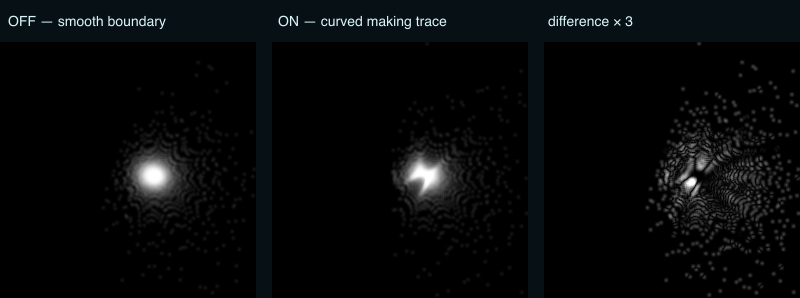

# hikari — light drawing from the author's trace

Status: core optical quality requirement
UpdatedAt: 2026-08-01

## Author observation

In the selected physical photographs, light runs across the floor or wall like a drawing. The interesting pattern comes from irregularities left by the author's hand—changes in surface, curvature, and thickness. A hard or direct light environment makes the trace legible; a broad or diffuse environment softens or nearly erases it. The current CG study has not yet reached this appearance.

hikari treats this **light drawing** as an output of equal importance to the body itself. It is not a decorative caustic overlay.

## Causal chain

```text
author gesture / making trace
  → real geometric curvature and thickness variation
  → reflected/refracted ray-direction field
  → convergence, folds, lines, and arcs on a receiver
  → clarity controlled by source size, ambient/direct ratio,
    receiver distance/material, absorption, and scattering
```

Every implementation and comparison must preserve this causality. Adding procedural lines to the receiver, moving a fake texture with the object, or changing a pattern independently of geometry fails the requirement.

## Current gap

The current optics tracer can carry broad ball-SDF curvature to receiver hit positions. On 2026-08-01 the receiver-field foundation was changed so the comparison itself no longer moves beneath the observation:

- CPU fallback traces the requested optical sample count (16k by default) while keeping the visible diagnostic-ray count independent;
- receiver hits are accumulated in a fixed world-space domain at 256×256;
- percentile framing, per-frame maximum normalization, density thresholding, and the second blur pass were removed from this path;
- exposure is fixed relative to emitted ray count, so adding samples improves convergence without automatically making each frame equally bright;
- the field builder is a pure tested module; tests cover fixed framing, sample-count invariance, and the absence of hotspot-driven re-normalization.

This is the stable paper on which a light drawing can appear.

## LD1 controlled making-trace prototype

On 2026-08-01 the former `surfaceVariation` view-shader normal effect was replaced by `curved-ribbon-v1`, a saved, band-limited displacement of the actual optical boundary. The control is now labelled **表面の手跡**. Its default is 0.14 and its author-facing range is 0–0.25.

The same coefficients are evaluated by:

- the serializable `ShapeAsset` and CPU `RuntimeShape` distance/normal queries;
- the WebGL Hikari boundary used for camera rays and transparent shadow;
- the WebGPU focused-light boundary.

The Katachi base form remains unchanged when Hikari is not the active optical view. The Hikari case hash, expanded bounds, save/open data, and approximation notes include the trace, so this is no longer a screen-only effect.

The controlled LD1 test uses one sphere, fixed IOR 1.5, 16,384 rays, a fixed receiver, and trace OFF/ON. Automated checks confirm a local boundary and normal change and that the same incoming rays move on the receiver. A fixed comparison at light angle 60° shows the smooth sphere's round focus becoming an oblique bright stroke; the difference image locates the redirected paths:



Metrics and exact fixed inputs: [LD1 report JSON](evidence/ld1-curved-ribbon-2026-08-01.json).

This passes the causality part of LD1 as a prototype, not the artistic completion gate. The remaining blockers are:

- `curved-ribbon-v1` is one analytic proxy; it is not yet a trace formed by the author's Katachi gesture, physical object, or scan;
- the trace orientation and width are fixed in v1 rather than authored or moved as LD3 requires;
- decorative elliptical deposits and spectral offsets are mixed into the displayed caustic rather than derived from a ray-bundle Jacobian;
- finite source size currently softens the transparent shadow but is not integrated through the focused-light tracer.
- the 16k receiver image still shows sparse peripheral samples; the two-texel one-pass reconstruction closes gaps but is not a ray-bundle Jacobian or progressive accumulation.

These effects may remain useful as exploratory display modes, but they cannot be the validation path for light drawing.

## Geometry contract

The trace must be part of the shared `ShapeSource` distance/normal query used by CPU, view shader, and WebGPU. Start with a controlled band-limited bulge or recorded local gesture whose physical amplitude and width are saved. Later inputs can include hand-shaped meshes, scans, or a surface-displacement field.

Do not call shader-only normal noise a making trace. Preserve mid-scale irregularity through freezing, meshing, scale changes, and Blender export; do not smooth it away merely to make a generic glass surface.

## Focused-light reference path

1. Fix one receiver plane and world-space domain across cases.
2. Deposit each real receiver hit once into a floating-point monochrome/HDR field with shared Fresnel and RGB Beer–Lambert throughput.
3. Remove decorative deposits, spectral offsets, adaptive reframing, and per-frame maximum normalization from the reference mode.
4. Use a deterministic 2D source sampler and estimate the local receiver-mapping area/Jacobian from neighbouring rays. Energy concentration follows convergence rather than an invented point sprite.
5. Derive the splat footprint from receiver texel size and finite source angle/area. Integrate multiple source directions so a larger source physically softens the same line.
6. Accumulate progressively while shape, source, and receiver are still; reset accumulation on any relevant change.
7. Port the passing CPU reference to WebGPU. Natural tone-maps the same HDR field; Analysis can show raw endpoint density, log irradiance, and convergence diagnostics.

Transparent shadow and focused light stay separate outputs. A weak or blurred light drawing never causes the shadow to disappear or become a substitute pattern.

## First cases

| Case | Fixed | Change | Required observation |
|---|---|---|---|
| LD0 symmetric lens | receiver/source/material | sample count | stable centroid and symmetry as samples increase |
| LD1 one authored bulge | base form/source/receiver | bulge off/on | one local line or arc appears or moves because of geometry |
| LD2 light size | LD1 | 0.5° / 5° / 20° or equivalent area sizes | peak/contrast falls monotonically while total transmission remains comparable |
| LD3 gesture movement | LD1 | move the bulge slightly | the receiver line moves continuously, without random re-layout |
| LD4 receiver distance | LD1 | near/mid/far | position and spread change in fixed world coordinates |
| LD5 physical references | chosen R04/R06 | photographed light condition | compare arc/cusp presence, direction, and sharp/soft tendency; not pixels |

Begin at 256×256 with 16k–64k deterministic CPU samples. Treat 512×512 progressive accumulation as a GPU quality mode after the reference cases pass. The minimum geometric feature width must remain larger than normal/march epsilon; otherwise aliasing can invent light lines.

## Natural-view experience

The author should be able to:

1. move around the body and notice a light line on the floor or wall;
2. make one local bend, inflate, or pinch gesture;
3. see the light drawing move with it;
4. switch from hard West light to a broad area source and watch the trace soften;
5. pause and save body, trace, light, receiver, and view as one observation.

Analysis explains why; it is not required to enjoy the result.

## Completion gate

- Flattening/removing the authored irregularity removes or predictably changes its light drawing.
- Source enlargement softens the same geometry-derived line without replacing it with a different procedural pattern.
- A still case converges rather than sparkling or changing from random reseeding.
- CPU and WebGPU agree on the qualitative fold/line position and source-size response.
- The receiver material changes readability, not the traced ray endpoints.
- At least one selected physical image and one Blender case record the current gap and the next single-variable comparison.
