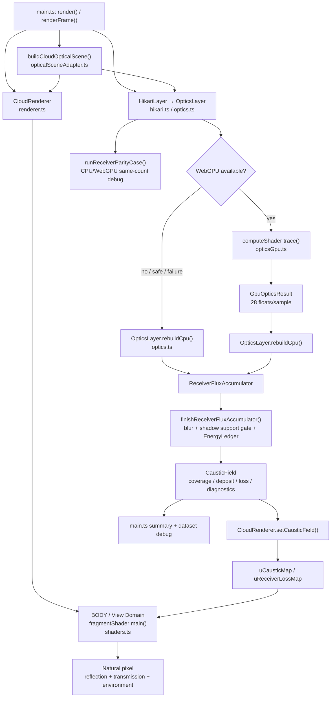

# Hikari R0.5 Optical Event Contract — 調査報告・Luna実装指示書

Status: ready for implementation handoff

Current stage status and acceptance authority: [`master-plan.md`](master-plan.md). This document remains the detailed OPT-0.5 contract.

UpdatedAt: 2026-08-02

Design authority: `Hikari Light Layers / Visual Art Render — 設計仕様書`, SpecRevision 2

Repository baseline: `65149073c3cbff480d8dff2a9f1223f36e4a84cf` (`origin/main`, Hikari v0.32.1)

この文書はR0.5の設計上の正本である。`CURRENT`は上記commitで確認した事実、`PROPOSED`はLunaがR0.5で実装する内容を表す。R0.5は診断契約と自動テストだけを追加し、Natural、UI、`.hkr`、production Display Layerを変更しない。

## 1. 作者確認用サマリー

```text
R0.5実装可否: GO

今回Lunaが実装するもの:
- View／Receiverを型上で分離したOptical Event Contract
- internal reflectionをpath属性として保持する取得状態付き型
- 現行receiver ledgerを包むFrameTransportLedger adapter
- BODY／CPU receiver／WebGPU receiverの能力表と最小adapter
- backend分類を検証する10個の固定ケースと自動テスト

今回実装しないもの:
- R1の4 Display LayerとVisual Art表現
- PHENOMENON／ENVIRONMENT COMPOSITE／UI
- Natural、shaderの見た目、現在のreceiver transportの変更
- .hkr、Render Job、Final renderer、連番／PNG／EXR出力
- 深い内部反射や完全なpath tracer

現行Naturalへの影響:
- なし
- test-only instrumentationと未接続のpure contract／adapterだけを追加し、通常のrender経路から呼ばないため

作者判断が必要な項目:
- なし

主要リスク:
- BODYのpath属性はshader内に閉じておりR0.5では取得不能のまま
- 現行materialInterfaceLossは吸収と界面損失を分離しておらず、absorbed分類はambiguous
- WebGPUの28-float payloadにはbounce数、medium／inclusion ID、全path長がない

Lunaへの受け渡し:
- この文書だけで開始可能
```

## 2. Executive Summary

現行Hikariは一つの`OpticalScene` adapterを参照するが、光学計算は三つの並行実装である。BODYはWebGL fragment shader内でcamera rayを追跡するView Domain、CPUとWebGPUは有限光源から床receiverへ光を送るReceiver Domainである。CPUまたはWebGPUが作った固定領域の`CausticField`は`CloudRenderer.setCausticField()`でtexture化され、Natural shaderが遮られた直達光を除去して到達光を加える。

R0.5で解決するのはレンダリング品質ではなく、三backendの出力を同じ意味で比較できない問題である。domain、terminal event、path history、diagnostic termination、属性の取得状態を型で分ける。取得不能値を`0`や`false`にせず、`unavailable`、`unknown`、`ambiguous`、`backend-specific`として保持する。

最大の技術リスクは、BODYが一つの最終色へ反射と透過を合成し、path情報をCPUへ返さないこと、receiverの`materialInterfaceLossRgb`がBeer–Lambert吸収とFresnel界面損失を一つの量として記録していることである。R0.5はこの差を隠さず、能力表とclosure判定の`not-computable`状態として固定する。

R1開始前には、R0.5の型・adapter・10ケースが通り、少なくともView／Receiverのdomain混同、内部反射のterminal化、欠損値の暗黙補完を型とテストで防げる必要がある。R1が物理量として`absorbed`を使う場合は、吸収と界面反射の分離が追加gateになる。作者確認が必要なBLOCKERはない。

## 3. Repository Findings

### 3.1 Rendering and domain

- `CURRENT`: `src/studies/cloud-sculpt/main.ts`の`render()`は同じballsとsmooth union値から`buildCloudOpticalScene()`、`CloudRenderer.setOpticalScene()`、`HikariLayer.update()`を呼ぶ。
- `CURRENT`: `src/studies/cloud-sculpt/renderer.ts`の`CloudRenderer`は`vertexShader`／`fragmentShader`を持つfullscreen quadでBODYとNatural環境を描画する。
- `CURRENT`: `src/studies/cloud-sculpt/shaders.ts`の`fragmentShader`はcamera rayを使うView Domainである。反射色、透過色、吸収、屈折、最大1回の外形TIR bounceを同一pixel色へ合成する。
- `CURRENT`: `src/studies/cloud-sculpt/optics.ts`の`OpticsLayer.rebuildCpu()`と`OpticsLayer.rebuildGpu()`は有限光源sampleを床receiverへ輸送するReceiver Domainである。
- `PROPOSED`: `transportDomain`をdiscriminantにしたunionを導入し、View radianceとReceiver fluxを同じ加算対象にできない型にする。

### 3.2 BODY

- `CURRENT`: entryは`fragmentShader`の`refract(rd, geometricNormal, eta)`、内部marchは`marchInside()`、exitは`refract(finalHostDirection, -exitGeometricNormal, uIor)`で計算される。
- `CURRENT`: outer TIR時は`tirDirection = reflect(...)`を作り、`marchInside()`で一回だけ次のexitを探索する。成功すれば透過、失敗すれば内部反射方向をView専用の環境lookupへ使う。
- `CURRENT`: 表面反射はSchlick近似`fresnel`、透過は`refractedColor * transmission`で、最終的に`mix(..., reflectedColor, fresnel)`へ合成される。
- `CURRENT`: shaderはevent buffer、MRT、SSBO、readbackを持たず、`internalBounceCount`、terminal event、path length、medium IDをJavaScript側へ出力しない。
- `CURRENT`: Progressive Renderは同じBODY shaderをsub-pixel jitterで蓄積する。深いpathを追加する仕組みではない。
- `PROPOSED`: R0.5ではBODY shaderを変更しない。BODY adapterは「内部で計算されるが契約値として取得不能」を能力表として返し、架空のeventを生成しない。
- `BLOCKER`: R1で実際の`viewSurfaceReflection`／`viewTransmission`bufferを作る前に、別render targetまたはMRTによるView instrumentation設計が必要。これはR0.5実装のBLOCKERではない。

### 3.3 CPU receiver

- `CURRENT`: `OpticsLayer.rebuildCpu()`が`generateFiniteLightSamples()`から決定論的sampleを作り、`marchToSurface()`、`marchInside()`、`refract()`、`intersectFloor()`を順に実行する。
- `CURRENT`: entry missはreceiver transportの「affected」集合に入らない。entry hit後、unobstructed baselineが固定receiver領域内にあるsampleだけが`incidentAffectedFluxRgb`へ入る。
- `CURRENT`: outer exit TIRは次のbounceを追跡せず、`recordReflectedFlux()`へ送る。したがってCPU receiverに内部反射後のreceiver hitは存在しない。
- `CURRENT`: single inclusionは解析球を入出射まで追跡する。nested refraction失敗またはhost再march失敗は`recordUnresolvedPath()`である。
- `CURRENT`: packed inclusionは個々の界面を曲げず、`segmentLengthInsideInclusions()`で直線segment内の合計距離を吸収へ反映する。packed inclusionのIORはhostと等しく設定される。
- `CURRENT`: `hostDistance`、`inclusionDistance`、`outgoing`はloop内で得られるがsample結果として保持しない。
- `PROPOSED`: 通常経路では未使用のevent sinkを`ReceiverBuildOptions`へ追加し、test-only runだけがloop内の確定済み分岐をrecordする。traceの判断自体を変更しない。

### 3.4 WebGPU receiver

- `CURRENT`: `src/studies/cloud-sculpt/opticsGpu.ts`の`computeShader` entry point `trace`が64 thread/workgroupで実行される。
- `CURRENT`: `RayResult`は28 floatで、`origin`、`entry`、`exitPoint`、`floorPoint`、4 flags、`baselinePoint`、`throughputRgb`だけを返す。offset正本は`GPU_OPTICS_RESULT_OFFSETS`である。
- `CURRENT`: flagsはentry valid、exit valid、floor valid、平均energyであり、diagnostic reason codeではない。`throughputRgb.w`はoutgoing refraction validを表す。
- `CURRENT`: shader内の`exitHit.w`やinclusion距離はpayloadへ出ず、bounce数、medium ID、inclusion IDも出ない。
- `CURRENT`: WebGPU failureまたは利用不能時、`OpticsLayer.startGpuRebuild()`は`rebuildCpu()`へfallbackする。`?safe=1`またはWindows auto-safeでは最初からCPUを使う。
- `CURRENT`: packed inclusionのWebGPU payloadはhost traceであり、JavaScript側`rebuildGpu()`がentry–exit chordと`segmentLengthInsideInclusions()`から吸収だけを補正する。
- `PROPOSED`: R0.5では28-float layoutとWGSLを変更しない。pure decoder adapterが既存flagsから確定できる値だけを契約へ移す。

### 3.5 Receiver field, shadow, ledger and Natural connection

- `CURRENT`: `src/studies/cloud-sculpt/receiverTransport.ts`の`ReceiverTransportField`は`geometricCoverage`、`straightThroughputRgb`、`depositedFluxRgb`、`lossFluxRgb`を別配列で保持する。
- `CURRENT`: `finishReceiverFluxAccumulator()`はenergy-normalized blur後、`applyShadowContainedSupport()`でcoverage支持域外のdepositをrejectする。
- `CURRENT`: `EnergyLedger`は`incidentRgb = deposited + absorbed + reflected + escaped + supportRejected + unresolvedLoss + residual`を検証する。
- `CURRENT`: `absorbedRgb`へ渡される値は`materialInterfaceLossRgb = 1 - throughputRgb`であり、Beer–Lambert吸収だけでなく通常界面反射も含む。名前より広い意味を持つ。
- `CURRENT`: `CloudRenderer.setCausticField()`はdeposit RGBを`uCausticMap.rgb`、coverageをalpha、lossを`uReceiverLossMap.rgb`へ変換する。
- `CURRENT`: Natural shaderはaffected baselineを除去してtransport depositを加える。`receiverDisplayMode`のcomposite／stroke／coverage／deposit／lossは既にあるが、R1のDisplay Layer契約ではない。
- `CURRENT`: `main.ts`はledger summaryをUIと`document.documentElement.dataset.hikariReceiverField`へ渡し、CPU/WebGPU same-count parityを起動できる。
- `PROPOSED`: 現行`EnergyLedger`を削除・改名せず、`FrameTransportLedger` adapterを新設する。意味を確定できない`materialInterfaceLossRgb`は`ambiguous`のまま保持し、吸収量を推測しない。

### 3.6 Reference scene and straight trace

- `CURRENT`: `src/studies/cloud-sculpt/opticalScene.ts`はruntime-independentな`OpticalScene`、`Medium`、`PlaneReceiver`、`DirectionalLight`、RGB absorption、physical scaleを定義する。
- `CURRENT`: `buildCloudOpticalScene()`が現行settingsをsceneへ変換し、host／inclusion material、receiver `legacy-floor`、daylightを一箇所で作る。
- `CURRENT`: `src/studies/cloud-sculpt/opticalTrace.ts`の`traceStraightRay()`はmedium boundaryとBeer–Lambertを決定論的に検証できるが、意図的にrayを屈折させないreferenceであり、現在のNatural／receiver主経路からは呼ばれない。
- `CURRENT`: `TraceOptions.maxEvents`超過は`valid=false`とissueになるが、energy ledgerへは接続されていない。
- `PROPOSED`: boundary／medium／event上限の固定ケースにはこのpure referenceを使う。ただし屈折receiverの正解値として扱わない。

### 3.7 Specification gap record

```text
SPEC:
viewSurfaceReflection、viewTransmission、内部反射属性をbackend共通のPhysical Sourceとして取得する。

CURRENT:
BODYは最終pixelへ合成するだけで、各成分とpath属性を読み戻せない。

GAP:
View event bufferがない。

PROPOSED:
R0.5はunavailableを正しく表すcontractと能力表を実装する。R1着手時に別途View instrumentationを設計する。

AUTHOR DECISION:
不要
```

```text
SPEC:
receiver ledgerはabsorbedFluxRgbを持つ。

CURRENT:
materialInterfaceLossRgbは吸収と通常界面損失を合算する。

GAP:
物理的なabsorbedだけを抽出できない。

PROPOSED:
R0.5 adapterはこの量をambiguousとして保持し、closureをnot-computableにする。R1がabsorbed層を使う前にbackend側を分離する。

AUTHOR DECISION:
不要
```

## 4. Current Architecture Map



主要symbolとI/O:

| 経路 | entry／caller | 入力 | 出力 |
| --- | --- | --- | --- |
| Natural/BODY | `main.ts render()` → `CloudRenderer.setOptics()`／`setOpticalScene()` → `fragmentShader main()` | balls、camera uniforms、`OpticalScene`由来material、receiver textures | tone-mapped framebuffer pixel。event dataなし |
| CPU receiver | `OpticsLayer.update()` → `rebuildCpu()` | balls、smoothness、`OpticalSettings`、seeded light samples | `CausticField`とAnalysis geometry |
| WebGPU receiver | `startGpuRebuild()` → `WebGpuOpticsEngine.compute()` → WGSL `trace` → `rebuildGpu()` | 最大256 balls、40-float params、source samples | `GpuOpticsResult` → `CausticField` |
| fallback | `WebGpuOpticsEngine.initialize()`／`compute()` failure → `rebuildCpu()` | 同上 | CPU `CausticField`、status `cpu` |
| shadow/receiver composite | `CloudRenderer.setCausticField()` → shader `naturalEnvironment()` | deposit／coverage／loss textures | baselineを置換したNatural floor color |
| debug | `runReceiverParityCase()`、`summarizeReceiverEnergy()`、receiver display modes | completed CPU／GPU fields | parity metrics、UI text、dataset JSON |

## 5. Backend Capability Matrix

これはR0.5実装前の取得能力である。「画面計算に変数が存在する」だけでは`available`にせず、adapterが推測なしに契約値として出せるかで判定した。

| capability | BODY | CPU receiver | WebGPU receiver |
| --- | --- | --- | --- |
| domain | available | available | available |
| terminal event | ambiguous | derivable without guessing | ambiguous |
| surface reflection | unavailable | backend-specific | backend-specific |
| transmission | unavailable | derivable without guessing | derivable without guessing |
| receiver hit | unavailable | available | available |
| internalBounceCount | unavailable | unavailable | unavailable |
| hadInternalReflection | unavailable | unavailable | unavailable |
| opticalPathLength | unavailable | derivable without guessing | unavailable |
| exitDirection | unavailable | derivable without guessing | backend-specific |
| medium id | unavailable | backend-specific | backend-specific |
| inclusion id | unavailable | backend-specific | unavailable |
| absorbed | unavailable | ambiguous | ambiguous |
| escaped | unavailable | available | available |
| rejected | unavailable | available | available |
| unresolved | unavailable | available | derivable without guessing |
| shadowCoverage | backend-specific | available | available |
| emitted flux | unavailable | derivable without guessing | derivable without guessing |
| delivered flux | unavailable | available | available |
| absorbed flux | unavailable | ambiguous | ambiguous |
| captured radiance | ambiguous | unavailable | unavailable |
| sample weight | backend-specific | available | available |

根拠:

- BODYの反射・透過・TIRは`shaders.ts`に存在するが最終色へ合成され、個別出力がない。`captured radiance`もtone mappingとenvironment composite後のpixelしか得られないためambiguousである。
- CPUは分岐時点のevent、`hostDistance + inclusionDistance`、`outgoing`を推測なしに得られる。R0.5 event sinkで保持可能だが、現行`CausticField`には未保存である。CPU／WebGPUのsurface reflection分類はouter TIRのreceiver非到達だけを指し、Viewの通常Fresnel反射とは同じ意味でないためbackend-specificである。
- WebGPUはflagsからentry／exit／floor hitを読める。exitとfloorの両方がある場合だけexit directionを導出でき、それ以外は得られない。
- CPU/WebGPUの`absorbed`は現行ledger上の名称であり、実量は吸収と通常界面損失の混合なのでambiguousである。
- `shadowCoverage`の正本はreceiver field。BODYはそのtextureを消費するだけなのでbackend-specificとした。
- BODYのsample weightはRealtimeとProgressiveで意味が異なり、event単位の値として出力されない。

## 6. Optical Event Contract

Lunaは次の型を`src/studies/cloud-sculpt/opticalEvents.ts`へ実装する。`any`、nullableな欠損値、取得不能値の`0`／`false`代入は禁止する。

```ts
import type { Rgb, Vec3 } from "./opticalScene.ts";

export const OPTICAL_EVENT_CONTRACT_VERSION = "hikari-optical-event/0.5" as const;

export type TransportDomain = "view" | "receiver";
export type SourceBackend = "body-webgl" | "cpu-receiver" | "webgpu-receiver";
export type CapabilityState =
  | "available"
  | "derivable without guessing"
  | "unavailable"
  | "ambiguous"
  | "backend-specific";

export type AcquisitionConfidence = "exact" | "bounded" | "approximate";
export type MissingReason =
  | "not-emitted-by-backend"
  | "mixed-in-final-output"
  | "unsupported-path"
  | "diagnostic-disabled"
  | "invalid-input"
  | "classification-not-unique";

export type Observed<T> =
  | {
      state: "available";
      value: T;
      confidence: AcquisitionConfidence;
      provenance: "backend-output" | "backend-branch" | "lossless-derivation";
    }
  | { state: "unavailable"; reason: MissingReason }
  | { state: "unknown"; reason: string }
  | { state: "ambiguous"; reason: string; candidates?: readonly string[] }
  | {
      state: "backend-specific";
      backend: SourceBackend;
      semantics: string;
      value?: T;
    };

declare const receiverFluxUnit: unique symbol;
declare const viewRadianceUnit: unique symbol;
export type ReceiverFluxRgb = Readonly<Rgb> & {
  readonly [receiverFluxUnit]: "receiver-flux";
};
export type ViewRadianceRgb = Readonly<Rgb> & {
  readonly [viewRadianceUnit]: "view-radiance";
};

export type ViewTerminalEvent = "surface-reflection" | "transmission";
export type ReceiverTerminalEvent = "receiver-hit";
export type DiagnosticTermination = "absorbed" | "escaped" | "rejected" | "unresolved";

export interface OpticalPathAttributes {
  internalBounceCount: Observed<number>;
  hadInternalReflection: Observed<boolean>;
  opticalPathLength: Observed<{
    shapeUnits: number;
    millimetres: number;
    scaleSource: "assumed" | "derived-from-mesh" | "author";
  }>;
  exitDirectionWorld: Observed<Vec3>;
  mediumIds: Observed<readonly string[]>;
  inclusionIds: Observed<readonly string[]>;
}

export interface EventIdentity {
  contractVersion: typeof OPTICAL_EVENT_CONTRACT_VERSION;
  sampleId: string;
  sceneRevision: string;
  lightRevision: string;
  sourceBackend: SourceBackend;
}

export type PathOutcome<TTerminal extends string> =
  | { kind: "terminal"; terminalEvent: Observed<TTerminal> }
  | { kind: "diagnostic"; termination: Observed<DiagnosticTermination> };

export interface ViewOpticalEvent extends EventIdentity {
  transportDomain: "view";
  outcome: PathOutcome<ViewTerminalEvent>;
  path: OpticalPathAttributes;
  capturedRadianceRgb: Observed<ViewRadianceRgb>;
  sampleWeight: Observed<number>;
}

export interface ReceiverOpticalEvent extends EventIdentity {
  transportDomain: "receiver";
  outcome: PathOutcome<ReceiverTerminalEvent>;
  path: OpticalPathAttributes;
  receiverId: Observed<string>;
  receiverUv: Observed<readonly [number, number]>;
  deliveredFluxRgb: Observed<ReceiverFluxRgb>;
  shadowCoverageWeight: Observed<number>;
  sampleWeight: Observed<number>;
}

export type OpticalEvent = ViewOpticalEvent | ReceiverOpticalEvent;

export interface BackendCapabilityDescriptor {
  backend: SourceBackend;
  domain: TransportDomain;
  capabilities: Readonly<Record<
    | "terminalEvent" | "surfaceReflection" | "transmission" | "receiverHit"
    | "internalBounceCount" | "hadInternalReflection" | "opticalPathLength"
    | "exitDirection" | "mediumId" | "inclusionId" | "absorbed"
    | "escaped" | "rejected" | "unresolved" | "shadowCoverage"
    | "emittedFlux" | "deliveredFlux" | "absorbedFlux"
    | "capturedRadiance" | "sampleWeight",
    CapabilityState
  >>;
}
```

必須invariant:

1. `transportDomain === "view"`のeventにreceiver fluxを持たせない。
2. `transportDomain === "receiver"`のeventにcaptured radianceを持たせない。
3. internal reflectionは`DiagnosticTermination`にもterminal eventにも追加しない。
4. bounce countとbooleanが両方`available`なら、`hadInternalReflection.value === (internalBounceCount.value > 0)`でなければinvalid。
5. `available`なbounce countは非負整数、sample weightとRGB量は有限・非負である。
6. `unavailable`／`unknown`／`ambiguous`から値を読み出すhelperを作らない。呼び出し側は`state`でnarrowingする。
7. `viewInternalReflection`はこのcontractのevent名にせず、`view transmission && hadInternalReflection`というR1の派生条件にする。

推奨export関数:

```ts
export function validateOpticalEvent(event: OpticalEvent): readonly string[];
export function observed<T>(value: T, confidence: AcquisitionConfidence, provenance: "backend-output" | "backend-branch" | "lossless-derivation"): Observed<T>;
export function unavailable<T>(reason: MissingReason): Observed<T>;
export function receiverFluxRgb(value: Rgb): ReceiverFluxRgb;
export function viewRadianceRgb(value: Rgb): ViewRadianceRgb;
```

## 7. FrameTransportLedger Contract

### 7.1 採用方針

`receiverTransport.ts`の`EnergyLedger`は固定receiver fieldの保存則実装として再利用する。ただし名称と意味を直接上書きせず、新しい`frameTransportLedger.ts`でadapterを追加する。理由は次の通り。

- current `incidentRgb`は全光源ではなく「objectへ当たり、unobstructed baselineが固定receiver領域内に入ったsample」のfluxである。
- current `absorbedRgb`はmaterial/interface混合損失である。
- current ledgerにはView radianceがなく、追加してもReceiver closureへ混ぜてはいけない。

### 7.2 型

```ts
import type {
  Observed,
  ReceiverFluxRgb,
  SourceBackend,
  ViewRadianceRgb,
} from "./opticalEvents.ts";

export interface ReceiverLedgerScope {
  kind: "affected-baseline-in-fixed-receiver-domain";
  receiverId: string;
  sceneRevision: string;
  lightRevision: string;
}

export interface FrameTransportLedger {
  contractVersion: "hikari-frame-transport-ledger/0.5";
  sourceBackend: SourceBackend;
  receiver: {
    scope: ReceiverLedgerScope;
    emittedFluxRgb: Observed<ReceiverFluxRgb>;
    deliveredFluxRgb: Observed<ReceiverFluxRgb>;
    absorbedFluxRgb: Observed<ReceiverFluxRgb>;
    escapedFluxRgb: Observed<ReceiverFluxRgb>;
    rejectedFluxRgb: Observed<ReceiverFluxRgb>;
    unresolvedFluxRgb: Observed<ReceiverFluxRgb>;
  };
  view: {
    capturedRadianceIntegralRgb: Observed<ViewRadianceRgb>;
    sampleWeight: Observed<number>;
  };
}

export interface ReceiverClosureResult {
  status: "closed" | "open" | "not-computable";
  residualRgb: Observed<ReceiverFluxRgb>;
  relativeResidual: Observed<number>;
  tolerance: number;
  issues: readonly string[];
}
```

### 7.3 Closure

contract上の`escapedFluxRgb`は「receiverへ届かなかったが物理的に解決した全出射」であり、現行`reflectedRgb`と`escapedRgb`の和を含む。二重計上しない。

全6量が`available`の場合だけ次を計算する。

```text
accounted = delivered + absorbed + escaped + rejected + unresolved
residual = emitted - accounted
relativeResidual = max(abs(residual.r,g,b)) / max(emitted.r,g,b, 1e-12)
```

- CPU tolerance: `0.01`
- WebGPU tolerance: `0.05`
- BODY: Receiver closureの対象外
- emittedが全channelで0の場合: residualも0なら`closed`、それ以外は`open`
- 量が一つでも`unavailable`、`unknown`、`ambiguous`、値なし`backend-specific`なら`not-computable`
- `unresolvedFluxRgb`はclosureのaccounted側へ含めるが、品質合格とは別に評価する。`unresolved / emitted <= tolerance`を追加gateとする。

現行adapter対応:

| R0.5 field | Current source | status |
| --- | --- | --- |
| emitted | `energyLedger.incidentRgb` | available。scope名で限定する |
| delivered | `energyLedger.depositedRgb` | available |
| absorbed | `energyLedger.absorbedRgb` | ambiguous。吸収と界面損失の混合 |
| escaped | `energyLedger.reflectedRgb + energyLedger.escapedRgb` | available |
| rejected | `energyLedger.supportRejectedRgb` | available |
| unresolved | `energyLedger.unresolvedLossRgb` | available |
| view radiance | current ledgerに存在しない | unavailable |
| view sample weight | current ledgerに存在しない | unavailable |

したがって現行runtime fieldから作るR0.5 ledgerは正直に`not-computable`となる。pure ledgerおよび固定fixtureではclosureを自動検証できる。R1で`absorbed`を物理量として表示する前に、backendが吸収と界面出射を分離して全量を`available`にする。

## 8. Fixed Test Cases

### 8.1 共通fixture規約

- geometryの単位はshape unit、physical scaleは`20 mm / shape-unit`, `source: "assumed"`。
- hostは特記がなければ中心`(0,0,0)`、半径`1`、smoothness `0`のsingle-ball SDF。
- host materialは特記がなければIOR `1.5`、RGB absorption `0 mm^-1`、roughness `0`。
- receiverは特記がなければ`id="test-floor"`、`y=-2.35`、normal `(0,1,0)`、U/V範囲`[-16,16]²`。
- finite lightのradianceは`(1,1,1)`、sample weightは`1`。seedはcase ID。
- contract／ledger pure testは`1e-12`、CPU SDF pointは`2e-3 shape-unit`、CPU flux closureは`1%`、WebGPU integrated fluxは`5%`を許容する。
- WebGPU spatial parityは現行`DEFAULT_RECEIVER_PARITY_THRESHOLDS`、すなわちcentroid `1 texel`、envelope `2 texel`、support IoU `0.9`、deposit normalized L1 `0.15`、coverage normalized L1 `0.10`を使う。

### 8.2 Case 1 — `R05-view-surface-reflection`

- geometry: 共通host。front surfaceの基準点`(0,0,1)`。
- material / IOR / absorption: clear host、`1.5`、`(0,0,0)`。
- camera: `(0,0,4)`から原点を見る。
- light: propagation `(0,0,-1)`。front normalでcamera方向へ正反射する配置。
- receiver: 共通receiver、判定対象外。
- inclusion: disabled。
- expected domain: `view`。
- expected terminal event: `surface-reflection`。
- expected path attributes: bounce count `0`、had internal reflection `false`。その他はbackend取得状態に従う。
- expected ledger result: View sampleだけを記録しReceiver closureへ加算しない。
- backend expectations: BODYは現状final mixのみなのでterminal／captured radianceは`ambiguous`。CPU/WebGPU receiverはこのView caseにeventを作らない。
- tolerance: contract invariant exact。画像輝度をgolden値にしない。
- success: View event fixtureがReceiver型へ代入できず、BODY adapterがreflection量を捏造しない。
- currently unverifiable: BODYのreflection単独RGBとsample weight。

### 8.3 Case 2 — `R05-view-simple-transmission`

- geometry: 共通host。centerline ray。
- material / IOR / absorption: clear host、`1.5`、`(0,0,0)`。
- camera: `(0,0,-4)`から原点を見る。
- light: propagation `(0,0,-1)`。
- receiver: 共通receiver、判定対象外。
- inclusion: disabled。
- expected domain: `view`。
- expected terminal event: `transmission`。
- expected path attributes: optical length `2 shape-unit = 40 mm`、bounce `0`、exit direction `(0,0,-1)`をreference fixtureではavailableとする。
- expected ledger result: captured radianceとweightだけ。Receiver closure対象外。
- backend expectations: BODYでは透過が描画されるが成分取得は`unavailable`／final eventは`ambiguous`。receiver backendはView eventを作らない。
- tolerance: path length `2e-3`、direction component `1e-6`。
- success: transmissionとsurface reflectionを同一terminal eventにしない。
- currently unverifiable: BODY単独transmission radiance。

### 8.4 Case 3 — `R05-path-internal-reflection`

- geometry: 共通host。内部seed ray origin `(0,0,0.8)`、direction `(1,0,0)`。
- material / IOR / absorption: host `1.5`、air `1.0`、吸収0。初回出射角は臨界角より大きい。
- camera: `(0,0,4)`、contract fixtureでは観察メタデータのみ。
- light: fixture rayが入射済みとみなす。
- receiver: 共通receiver。
- inclusion: disabled。
- expected domain: terminalの観察先により`view`または`receiver`。内部反射自体はdomainでもterminalでもない。
- expected terminal event: 最終的に出射すれば`transmission`、receiverへ届けば`receiver-hit`。
- expected path attributes: `internalBounceCount >= 1`、`hadInternalReflection=true`。
- expected ledger result: 内部反射でsource fluxを複製しない。最終outcome一つだけをaccountする。
- backend expectations: BODYは一回bounceを内部計算するが属性は`unavailable`。CPU/WebGPU receiverはbounceを追わずreflected／unresolvedへ分類するため属性は`unavailable`。
- tolerance: invariant exact。
- success: `internal-reflection`というterminal event型が存在せず、booleanとcountのinvariantが通る。
- currently unverifiable: 三backend間のbounce後exit一致。これはR1前のbackend instrumentation課題。

### 8.5 Case 4 — `R05-receiver-focus`

- geometry: 共通host。
- material / IOR / absorption: `1.5`、吸収0。
- camera: `(4,2.5,5)`から原点。Receiver判定には使わない。
- light: propagation `(0,-1,0)`、finite disk samples 2048、seed `R05-receiver-focus`。
- receiver: 共通receiver。
- inclusion: disabled。
- expected domain: `receiver`。
- expected terminal event: receiver到達sampleは`receiver-hit`。
- expected path attributes: floor hit sampleはexit directionを持つ。internal bounceは現backendでは`unavailable`。
- expected ledger result: delivered > 0、emitted > 0、escaped/rejected/unresolvedは非負。semantic splitが全availableなfixtureではclosure within tolerance。
- backend expectations: CPUはbranchからevent作成可能。WebGPUは`floorValid`からhit available。BODYはeventを作らずreceiver textureを消費するだけ。
- tolerance: CPU ledger `1%`、CPU/WebGPU flux差`5%`、既存spatial parity thresholds。
- success: hit eventの`receiverId`とUVがavailable、deliveredをView radianceへ入れない。
- currently unverifiable: WebGPUのfull path length／medium IDs。

### 8.6 Case 5 — `R05-receiver-absorbing-medium`

- geometry: 共通host、center chord `2 shape-unit`。
- material / IOR / absorption: IOR `1.5`、absorption `(0.01,0.02,0.04) mm^-1`。
- camera: `(0,0,4)`。
- light: propagation `(0,-1,0)`、2048 samples。
- receiver: 共通receiver。
- inclusion: disabled。
- expected domain: `receiver`。
- expected terminal event: resolved sampleは`receiver-hit`または`escaped`。
- expected path attributes: optical pathはsampleごと。mediumIdsに`host`が含まれる場合だけ吸収を適用。
- expected ledger result: zero-absorption対照よりdelivered各channelが増えない。reference center chordのBeer–Lambert factorは`exp(-coefficient * 40mm)`。
- backend expectations: CPU/WebGPU throughputはRGB減衰を持つが現`absorbed` bucketは界面損失混合のため`ambiguous`。BODYの吸収は表示に使うだけで取得不能。
- tolerance: analytic transmission `1e-6`、integrated monotonicity strict、backend flux `5%`。
- success: `absorbed=0`へ偽装せずambiguousを返し、monotonic testが通る。
- currently unverifiable: 現ledgerから純吸収量だけを抽出すること。

### 8.7 Case 6 — `R05-boundary-event-limit`

- geometry: host sphere radius `1.5`、同心inclusion sphere radius `0.4`。centerlineは4 boundaryを横切る。
- material / IOR / absorption: host `1.5`、inclusion `1.2`、双方吸収0。
- camera: `(0,0,4)`。
- light: straight reference ray origin `(0,0,3)`、direction `(0,0,-1)`。
- receiver: 共通receiver。
- inclusion: `id="inclusion-limit"`、enabled。
- expected domain: `receiver` diagnostic fixture。
- expected terminal event: なし。diagnostic termination `unresolved`。
- expected path attributes: `traceStraightRay(...,{maxEvents:2})`はvalid false。bounce属性はunavailableでよい。
- expected ledger result: affected sample weightをunresolvedへ一度だけ入れ、deliveredへ入れない。
- backend expectations: straight referenceで自動検証可能。CPU/WebGPU main transportの上限はiteration上限で意味が異なり、同じboundary countは取得不能。
- tolerance: exact classification、ledger residual `1e-12` fixture。
- success: limit到達をescaped／absorbedへ変換せずunresolvedとする。
- currently unverifiable: GPUがどのiteration上限で失敗したかのreason code。

### 8.8 Case 7 — `R05-inclusion-pass`

- geometry: host radius `1.5`、inclusion radius `0.35` at origin、centerline。
- material / IOR / absorption: host IOR `1.5`, absorption `(0.005,0.005,0.005)`、inclusion IOR `1.2`, absorption `(0.001,0.02,0.04)`。
- camera: `(0,0,-4)`。
- light: propagation `(0,0,-1)`。
- receiver: plane `z=-2.35`、normal `(0,0,1)`をfixture用に使用。
- inclusion: `id="inclusion-a"`。
- expected domain: `receiver`。
- expected terminal event: `receiver-hit` for resolved centerline。
- expected path attributes: `mediumIds`はair／host／inclusion transitionを保持、`inclusionIds=["inclusion-a"]`、optical length > 0。
- expected ledger result: inclusion吸収を通ったdelivered、または失敗時unresolved。host-onlyとして成功扱いにしない。
- backend expectations: straight referenceはboundary IDsをavailable。CPU single inclusionはbranchからIDをderivable。WebGPUはIDをpayloadに持たずunavailable。packedは個別ID unavailable。
- tolerance: boundary t／length `2e-3`、throughput `1e-5`。
- success: inclusion failureがunresolvedになり、空配列で「通過なし」を捏造しない。
- currently unverifiable: WebGPU sampleごとのinclusion IDと曲がった全path長。

### 8.9 Case 8 — `R05-shadow-coverage`

- geometry: 共通host。
- material / IOR / absorption: `1.5`、吸収0。
- camera: `(4,2.5,5)`。
- light: propagation `(0,-1,0)`、2048 samples。
- receiver: 共通receiver、16×16 pure field fixtureも併用。
- inclusion: disabled。
- expected domain: `receiver` diagnostic。
- expected terminal event: coverage自体はterminal eventではない。
- expected path attributes: coverage sampleにpath属性を要求しない。必要ならunavailable。
- expected ledger result: `geometricCoverage`はscalarで、RGB emitted／deliveredへ重複加算しない。blur前後でintegrated coverageを保存。
- backend expectations: CPU/WebGPU available。BODYはalpha textureを消費するbackend-specific input。
- tolerance: pure splat／blur `5e-6`、CPU/WebGPU coverage normalized L1 `0.10`、support IoU `0.9`。
- success: coverageを黒いRGB fluxとしてledgerへ入れない。
- currently unverifiable: BODY自身が生成したcoverageは存在しない。

### 8.10 Case 9 — `R05-receiver-escaped`

- geometry: 共通host。
- material / IOR / absorption: `1.5`、吸収0。
- camera: `(4,2.5,5)`。
- light: propagationをnormalizeした`(0.995,-0.1,0)`とし、floor交点を固定receiver範囲外へ送る。
- receiver: 共通receiver `[-16,16]²`。
- inclusion: disabled。
- expected domain: `receiver`。
- expected terminal event: なし。diagnostic termination `escaped`。
- expected path attributes: exit directionはCPUでderivable、WebGPUはfloor miss時にpayloadから復元不能なのでunavailable／backend-specific。
- expected ledger result: delivered `0`、escaped `>0`、同一sampleをunresolved／rejectedへ重複計上しない。
- backend expectations: CPUの`recordEscapedReceiverFlux()`とWebGPU postprocessのoutgoing valid + floor invalidで検証。BODYは対象外。
- tolerance: classification exact、fixture closure `1e-12`、runtime ledger toleranceはbackend既定。
- success: receiver領域外hitをfield再frameせずescapedにする。
- currently unverifiable: WebGPUの実exit direction。

### 8.11 Case 10 — `R05-invalid-path-rejected`

- geometry: host radius `1`、inclusion radius `0.4` center `(1.2,0,0)`でhost外へ突出。
- material / IOR / absorption: host `1.5`、inclusion `1.2`、吸収0。
- camera: `(0,0,4)`。
- light: propagation `(0,0,-1)`。
- receiver: 共通receiver。
- inclusion: `id="invalid-inclusion"`、containment invalid。
- expected domain: `receiver` diagnostic。
- expected terminal event: なし。diagnostic termination `rejected`。
- expected path attributes: medium／inclusion IDsはvalidation inputからavailableでも、path traversal値はunknownとする。
- expected ledger result: assigned sample weightをrejectedへ一度だけ入れ、deliveredへ入れない。
- backend expectations: `validateOpticalScene()`／`findInvalidContainment()`はinvalidを検出できる。現Natural adapterはinvalid inclusionを無効にしてhost-onlyを継続するため、runtime flux rejected量は現在取得不能。
- tolerance: containment result exact、fixture closure `1e-12`。
- success: invalidを空のinclusion pathまたはhost-only成功eventへ変換しないcontract testが通る。
- currently unverifiable: 現runtimeがinvalid inclusionに割り当てたsource flux量。

## 9. Luna向け実装手順

### 9.1 実装目的と境界

R0.5で作るのは、現行三backendの差を隠さずに記録・比較する診断契約である。作品表示を増やすreleaseではない。通常のNatural render、receiver field生成、UI、保存形式には接続せず、R1が安全に参照できるpure型、adapter、ledger、固定caseを完成させる。

### 9.2 実装順序

#### Step 1 — Contract型と能力表

- 目的: domain、outcome、path、欠損状態をコンパイル時に固定する。
- 新設: `src/studies/cloud-sculpt/opticalEvents.ts`。
- 変更symbol: なし。
- 追加型: Section 6の全型、`CURRENT_OPTICAL_BACKEND_CAPABILITIES`、validator/helper。
- 実装: Section 5のmatrixをreadonly dataとして実装し、validatorでinvariantを検査する。
- 既存挙動への影響: なし。既存runtimeからimportしない。
- テスト: `tests/hikari/opticalEvents.test.ts`。
- 完了条件: View／Receiverの誤ったfield混在が型上できず、欠損状態とbounce invariantが自動判定される。

#### Step 2 — Frame ledgerとcurrent adapter

- 目的: Receiver closureとView observationを一つのframe record内で分離する。
- 新設: `src/studies/cloud-sculpt/frameTransportLedger.ts`。
- 変更symbol: なし。
- 追加型: Section 7の型、`adaptCurrentEnergyLedger()`、`evaluateReceiverClosure()`。
- 実装: current reflected+escapedをcontract escapedへ一度だけ足す。current absorbedはambiguousにする。全量availableでない場合はnot-computableにする。
- 既存挙動への影響: なし。`finalizeEnergyLedger()`を変更しない。
- テスト: `tests/hikari/frameTransportLedger.test.ts`。
- 完了条件: closed／open／not-computableとCPU／WebGPU toleranceが数値判定できる。

#### Step 3 — backend adapter

- 目的: 三backendの境界で取得可能情報だけをcontractへ移す。
- 新設: `src/studies/cloud-sculpt/opticalEventAdapters.ts`。
- 変更: `src/studies/cloud-sculpt/optics.ts`の`ReceiverBuildOptions`、`rebuildCpu()`、`rebuildGpu()`。
- 追加型: `ReceiverEventSink`, `CpuReceiverSampleObservation`, `GpuReceiverSampleObservation`。これはbackend-local raw observationであり共通eventそのものではない。
- 実装: CPU loopの既存分岐直後にoptional sinkへraw observationを渡す。GPUは既存28-float payloadをpure decoderで読む。BODYは能力descriptorだけを返し、eventを作らない。
- 既存挙動への影響: 通常はsink未指定。分岐、throughput、field、shader、sample数を変えない。
- テスト: `tests/hikari/opticalEventAdapters.test.ts`。
- 完了条件: 取得不能属性を補完せず、同じraw branchが一つのoutcomeだけへ変換される。

#### Step 4 — 固定fixture catalog

- 目的: 10ケースを一箇所の決定論的入力にする。
- 新設: `tests/hikari/fixtures/opticalEventCases.ts`。
- 変更symbol: なし。
- 追加型: `OpticalEventFixedCase`。Section 8のgeometry/material/camera/light/receiver/inclusion/expected/toleranceを必須fieldにする。
- 実装: 各caseを`as const satisfies OpticalEventFixedCase`で定義する。`.hkr`へ保存しない。
- 既存挙動への影響: なし。
- テスト: catalog completeness testでID重複と必須10分類を検査。
- 完了条件: seed、数値、期待状態が暗黙defaultなしで再現できる。

#### Step 5 — CPU／reference／ledger自動テスト

- 目的: Node上で実行できる分類を最大化する。
- 新設: `tests/hikari/opticalEventFixedCases.test.ts`。
- 変更: 必要なら`optics.ts`にtest-only public runnerを一つ追加する。
- 実装: `traceStraightRay()`でboundary／medium／limit、pure receiver fieldでcoverage／escaped／rejected、optional CPU sinkでreceiver hit／unresolvedを確認する。
- 既存挙動への影響: なし。
- テスト: 自分自身が`npm run test:hikari`へglob追加される。
- 完了条件: 人間の画像確認なしに最低10 caseのcontract期待値が判定される。

#### Step 6 — WebGPU payloadとshader契約テスト

- 目的: 実機WebGPUがなくてもdecoderとBODY非取得能力の退行を検出する。
- 新設: 原則なし。Step 3／5のtestへ追加。
- 変更: `tests/hikari/opticsGpuPayload.test.ts`、`tests/hikari/viewShader.test.ts`。
- 実装: 28-float synthetic recordsを全flags組合せでdecodeし、欠損属性がunavailableになることを確認する。BODYはbounded TIRが存在しつつevent outputが存在しないことをsource contract testで確認する。
- 既存挙動への影響: なし。
- テスト: Node shader string test、synthetic payload test。実機same-count parityは既存browser debugを維持。
- 完了条件: payload offset driftと架空のBODY event生成を検出できる。

#### Step 7 — 全gateと文書照合

- 目的: R0.5完了を判定する。
- 変更: この文書は事実差があった場合だけmatrixを更新。`docs/hikari/README.md`のlinkはSol側で追加済み。
- 実装: build、全Hikari test、既存Natural smoke、same-count parityを実施する。
- 既存挙動への影響: なし。
- テスト: Section 12／13。
- 完了条件: matrixと実装が一致し、Explicit Non-Goalsに触れていない。

### 9.3 Backend Adapter方針

- BODY境界: `fragmentShader`の出力後ではなく、静的`BackendCapabilityDescriptor`だけを提供する。final pixelから反射／透過比を逆算しない。
- CPU境界: `rebuildCpu()`の既存branchがoutcomeを確定した直後。fieldへsplatする前後の値をoptional sinkへ渡し、adapterはそのraw observationを共通eventへ変換する。
- WebGPU境界: `WebGpuOpticsEngine.compute()`が返した`GpuOpticsResult`を`rebuildGpu()`が読む直前。`GPU_OPTICS_RESULT_OFFSETS`以外の位置を直書きしない。
- Ledger境界: completed `CausticField.diagnostics.energyLedger`の後。Display exposure、tone mapping、receiver strokeより前にadapterを適用する。
- `OpticalScene`はidentity、material、scaleの根拠として参照するが、payloadにない「そのsampleが通ったID」をscene設定だけから推測しない。

### 9.4 Feature Flag

採用方式は**test-only instrumentation**とする。URL query、localStorage、UI toggle、`.hkr` fieldは追加しない。`ReceiverBuildOptions.eventSink`が明示されたtest／diagnostic runnerだけでrecordし、通常の`OpticsLayer.update()`、`startGpuRebuild()`、`main.ts render()`はsinkを渡さない。これにより通常buildに型と分岐は含まれても、event配列allocation、GPU readback追加、render差分は発生しない。

将来browser consoleから実行する必要が出てもR0.5では`window`へ公開しない。既存debug APIへ接続する判断は、Natural smokeとM4 costを測る次段階へ送る。

## 10. Files to Create

| path | 責務 | 主なexport | 依存先 | 使用箇所 |
| --- | --- | --- | --- | --- |
| `src/studies/cloud-sculpt/opticalEvents.ts` | 共通event／取得状態／能力契約 | Section 6の型、validator、能力表 | type-onlyで`opticalScene.ts`, `receiverTransport.ts` | adapters、tests、将来R1 |
| `src/studies/cloud-sculpt/frameTransportLedger.ts` | current ledger adapterとclosure | `FrameTransportLedger`, `adaptCurrentEnergyLedger`, `evaluateReceiverClosure` | `opticalEvents.ts`, type-onlyで`receiverTransport.ts` | tests、将来debug/R1 |
| `src/studies/cloud-sculpt/opticalEventAdapters.ts` | BODY capability、CPU raw branch、GPU payloadのpure変換 | `bodyCapabilityDescriptor`, `adaptCpuReceiverObservation`, `decodeGpuReceiverObservation`, `adaptGpuReceiverObservation` | `opticalEvents.ts`, `opticsGpu.ts` | optional instrumentation、tests |
| `tests/hikari/fixtures/opticalEventCases.ts` | 10固定ケース | `OPTICAL_EVENT_FIXED_CASES`, fixture type | scene／event types | fixed-case tests |
| `tests/hikari/opticalEvents.test.ts` | union／validator／matrix | なし | `opticalEvents.ts` | test runner |
| `tests/hikari/frameTransportLedger.test.ts` | closureとcurrent adapter | なし | ledger、receiver transport | test runner |
| `tests/hikari/opticalEventAdapters.test.ts` | backend変換 | なし | adapters、GPU offsets | test runner |
| `tests/hikari/opticalEventFixedCases.test.ts` | 10ケースの数値／分類 | なし | fixtures、trace、receiver field | test runner |

新しいproduction-visible UI、shader、保存schema、assetは作らない。

## 11. Files to Modify

| path | 対象symbol | 変更内容／理由 | 変更禁止範囲 |
| --- | --- | --- | --- |
| `src/studies/cloud-sculpt/optics.ts` | private `ReceiverBuildOptions`, `rebuildCpu()`, `rebuildGpu()` | optional test-only `eventSink`と、必要なら`runOpticalEventContractCase()`を追加。既存分岐結果を観察するため | march条件、IOR、吸収、sample count、deposit、ledger、visual geometryを変えない |
| `tests/hikari/opticsGpuPayload.test.ts` | existing payload tests | synthetic flags／欠損状態のdecoder testを追加 | 28-float layoutをR0.5都合で変更しない |
| `tests/hikari/viewShader.test.ts` | BODY source contract tests | bounded TIRの存在とevent output非存在を明記したtestを追加 | shaderの見た目、GLSLを変更しない |
| `docs/hikari/r05-optical-event-contract-handoff.md` | matrix/status | 実装調査で事実誤りが判明した場合だけ根拠付きで更新 | Revision 2の命題とnon-goalsを変更しない |

変更しないファイル: `main.ts`, `renderer.ts`, `shaders.ts`, `hikari.ts`, `hikariDocument.ts`, `document-format.md`, UI/CSS、Cloudflare設定。`receiverTransport.ts`と`opticsGpu.ts`も既存exportだけで実装できる限り変更しない。

## 12. Test Plan

### Unit

- `opticalEvents.test.ts`: discriminated union、全欠損state、non-negative RGB／weight、bounce invariant、domain field separation。
- `frameTransportLedger.test.ts`: exact closed、residual open、current absorbed ambiguousによるnot-computable、reflected+escapedの一回だけの合算、unresolved quality gate。
- `opticalEventAdapters.test.ts`: CPU全branch、WebGPU flags全組合せ、NaN／負値reject、BODY event非生成。
- `opticalEventFixedCases.test.ts`: Section 8の10 cases。

### Integration

- optional CPU event sinkのsample event合計が`CausticField.diagnostics.affectedSampleCount`を超えない。
- receiver terminal／diagnostic outcomeは一sample一つ。deliveredとescaped等へ二重分類しない。
- fixed receiver fieldのevent合計とfield／ledgerのRGB積分がCPU `1%`以内。

### Shader contract

- `viewShader.test.ts`でBODYのsurface Fresnel、transmission、bounded one-bounce TIRが残ることを確認する。
- R0.5ではMRT、event texture、readbackを要求しない。BODY capabilityがunavailable／ambiguousのままであることも正しい期待値とする。

### WebGPU

- Nodeではsynthetic 28-float payloadを検証する。
- WebGPU実機では既存`runReceiverParityCase({caseId, sampleCount:2048})`を固定case 4/5/8/9相当で実行する。
- parity合格値は`DEFAULT_RECEIVER_PARITY_THRESHOLDS`をそのまま使い、R0.5のために緩めない。

### Commands and manual smoke

```text
npm run build
npm run test:hikari
node /Users/atsushisato/Projects/scripts/verify-hikari-current.mjs
```

Natural smokeは同じ`.hkr`、同じcamera、`?safe=0`と`?safe=1`で開き、R0.5前後のpixel screenshotを比較する。R0.5は通常render pathへ接続しないため、差分0を完了条件とする。動画背景やProgressiveの新規golden生成は不要。

## 13. Acceptance Criteria

1. `npm run build`が成功する。
2. 既存を含む`npm run test:hikari`が全件成功する。
3. Section 8の10 caseがIDごとに自動判定される。
4. Naturalの通常render pathから新contract／adapterが呼ばれず、同一入力の見た目と挙動に変化がない。
5. ViewとReceiverがdiscriminated unionで分離され、View radianceとReceiver fluxを足す共通fieldがない。
6. internal reflectionは`internalBounceCount`／`hadInternalReflection`だけで表され、terminal event enumに存在しない。
7. unavailable属性を`0`、`false`、空配列、zero vectorで補完する実装がない。
8. ledgerが全量availableなfixtureでclosureを検証し、ambiguous量を含むcurrent adapterでは`not-computable`を返す。
9. current `EnergyLedger`のreflectedとescapedをcontract `escapedFluxRgb`へ二重計上しない。
10. code上のbackend capability descriptorがSection 5と一致する。
11. CPU test-only instrumentationはevent sink未指定時にallocationを行わない。
12. `GPU_OPTICS_RESULT_FLOATS === 28`と既存offsetを維持する。
13. `main.ts`、UI、`.hkr` schema、`fragmentShader`、receiver field表示を変更していない。
14. production Display Layer、Art Layer、PHENOMENON、ENVIRONMENT COMPOSITEを作っていない。
15. Hikari current gateがv0.32.1とbaseline commit系統を確認する。

## 14. Rollback Plan

R0.5は新設3 production moduleとtest-only instrumentationに閉じる。

1. 問題時は通常renderからのimportがないことを確認する。
2. `optics.ts`のoptional `eventSink`とtest runnerだけをrevertする。CPU／GPUの既存branch本体は触れていないため、Naturalとreceiverは直ちに元へ戻る。
3. 新設`opticalEvents.ts`、`frameTransportLedger.ts`、`opticalEventAdapters.ts`と新規testsを一まとまりでrevertする。
4. `receiverTransport.ts`、`opticsGpu.ts`、`shaders.ts`、`main.ts`へrollbackを波及させない。
5. rollback後に`npm run build`、`npm run test:hikari`、Natural smokeを再実行する。

runtime feature flagを保存データへ追加しないため、`.hkr` migrationやユーザーデータrollbackは不要である。

## 15. Risks and Open Questions

### R1 gateとなるリスク

1. **View observability**: BODYはfinal colorしか出さない。R1でView layerを作るにはMRT／別passの設計とM4帯域評価が必要。
2. **Absorption semantics**: current material lossは吸収とFresnel lossの混合。`absorbed`を作品layerや音へ使う前に分離が必要。
3. **WebGPU path history**: payloadにbounce、全path長、IDs、reason codeがない。必要属性ごとにpayload拡張コストを測り、全てを一度に増やさない。

### R0.5内でSol判断として確定した事項

- event contractは平坦な共通interfaceではなくdomain discriminated unionにする。
- 欠損は`Observed<T>`で表し、nullableやsentinel値を使わない。
- internal reflectionはpath属性でありterminal eventにしない。
- current ledgerは破壊的改名せずadapterで包む。
- current material lossはambiguous。名称を根拠にabsorbedと断定しない。
- feature flagは**test-only instrumentation**。URL、UI、`.hkr`に新しいflagを追加しない。
- BODY shaderとWebGPU payloadはR0.5で変更しない。
- fixed casesは`.hkr`ではなくtest fixtureにし、保存形式へ影響させない。

### UNKNOWN

- `traceStraightRay()`は現時点で`tests/hikari`から直接使用されていないため、SDF edge caseでの実運用安定性は固定cases追加後に初めて確定する。
- M4 MBAで将来のView MRTが許容される帯域は未計測。R0.5では実行しない。
- 現行WebGPU failureのreasonをflagsだけから一意に復元できない。

これらはR0.5開始を妨げず、作者判断も不要である。

## 16. Explicit Non-Goals

R0.5では次を実装しない。

- R1の`viewSurfaceReflection`、`viewTransmission`、`viewInternalReflection`、`receiverDelivery` Display Layer
- Art Layer、Projection、spatial／temporal／color effect
- PHENOMENON、ENVIRONMENT COMPOSITE、DEBUG UI
- Naturalの外観、receiver stroke、coverage／deposit／loss表示の変更
- `.hkr`、case JSON、Blender bundleのschema変更
- Render Job、Final renderer、Observation Clock、checkpoint
- PNG／EXR／連番／4K／8K出力
- shader MRT、AOV、GPU readback
- recursive internal reflection、完全なnested-media path tracing
- BODY／CPU／WebGPUの大規模共通化
- backend欠損属性の推測補完
- View radianceとReceiver fluxのclosure加算
- Cloudflare deployまたは公開UI変更

## 17. Lunaへそのまま渡す最終指示

Hikari R0.5を、commit `65149073c3cbff480d8dff2a9f1223f36e4a84cf`以降の最新`origin/main`へ実装してください。設計上の正本は`docs/hikari/light-layers-art-render-spec.md`のSpecRevision 2と、この`docs/hikari/r05-optical-event-contract-handoff.md`です。

実装対象はOptical Event Contract、FrameTransportLedger adapter、BODY／CPU receiver／WebGPU receiverの最小adapter、10固定case、自動テストだけです。Section 6と7の型をそのまま出発点とし、Section 9の順序、Section 10／11のfile境界、Section 12／13のgateに従ってください。

最重要ルールは次の通りです。

1. View radianceとReceiver fluxを型でもclosureでも混ぜない。
2. internal reflectionをterminal eventにせず、`internalBounceCount`と`hadInternalReflection`で表す。
3. backendから取得できない値は`unavailable`、確定不能は`unknown`、複数解釈は`ambiguous`、backend固有意味は`backend-specific`にする。`0`、`false`、空配列で代用しない。
4. BODY shaderは変更せずeventを捏造しない。BODYの取得不能を能力表へ正確に残す。
5. WebGPUの28-float payloadを変更せず、既存flagsからlosslessに導出できる値だけをadapterへ渡す。
6. CPU instrumentationはoptional test-only event sinkとし、通常のNatural／receiver経路では無効、未指定時allocationなしにする。
7. 現行`EnergyLedger`を破壊的に変更しない。current `absorbedRgb`は吸収と界面損失の混合なのでambiguousとし、closureはnot-computableにする。pure fixtureではclosureを検証する。
8. `.hkr`、UI、`main.ts`、Natural表示、production Display Layer、Art／PHENOMENON／ENVIRONMENT、renderer出力を変更しない。

実装後は`npm run build`、`npm run test:hikari`、Hikari current gate、同一`.hkr`のNatural smokeを実行してください。WebGPU実機が利用できる場合だけ既存same-count parityも実行し、利用不能はtest失敗ではなく環境上の`unavailable`として報告してください。完了報告には変更file、10 case結果、matrixとの一致、Natural差分なし、残るR1 gateの4点（BODY observation、吸収分離、WebGPU path history、内部反射receiver未対応）を明記してください。R1へ進まず、R0.5で停止してください。
