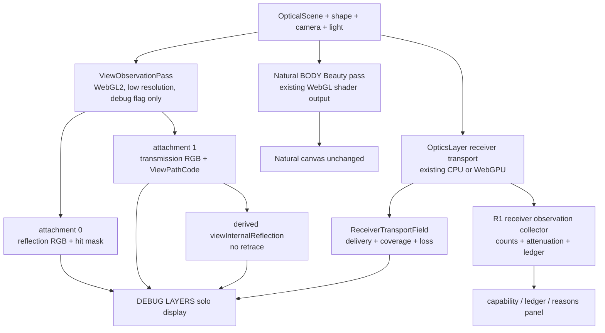

# Hikari R1 Optical Observation — Gate調査報告・Luna実装指示書

Status: **ready for staged implementation handoff**
Current stage status, acceptance, and execution order: [`master-plan.md`](master-plan.md). This document remains the detailed OPT-1 implementation contract.
UpdatedAt: 2026-08-03
Target application: Hikari `v0.32.1`
R0.5 historical pre-fix baseline: `f81e03d3b26b93479854faa9ae179f179183afb2`
Reviewed correction candidate (PR #1 merged into `main` via `2b5475f7f8ab81a852025e2a8fe1a59f4f74f0ec`; second parent): `4ccc83c7c51469972d78c474180daafa5bbdeea1`
Design authority: [`r05-optical-event-contract-handoff.md`](r05-optical-event-contract-handoff.md) and the reviewed R0.5 correction candidate preserved in merged history

本書はR0.5を再設計する文書ではない。R0.5のOptical Event Contract、FrameTransportLedger、backend adapter、固定10ケースを基準点として、LunaがR1aからR1eを**一段階ずつ**実装するための調査報告兼指示書である。

記法:

- `CURRENT` — 現在のR0.5実装と検証で確認した事実
- `PROPOSED` — R1で実装する決定
- `UNKNOWN` — 実装または実機計測まで確定できない事項
- `BLOCKER` — 次段階へ進む前に解消必須の事項
- `DEFERRED` — R1では実装しない事項

---

## 1. 作者確認用サマリー

```text
R1実装可否: GO

R1で実装するもの:
- R1 Display Layer／availability／provenance契約
- 既存receiver fieldからのreceiverDeliveryとshadowCoverage
- CPU receiverのBeer–Lambert吸収／界面損失の分離観察
- 低解像度・診断専用BODY observation pass
- viewSurfaceReflectionとviewTransmissionの線形HDR source
- viewTransmissionから派生するviewInternalReflection
- URL flagで分離したDEBUG LAYERSとFrameTransportLedger表示

R1で実装しないもの:
- Natural Beautyの見た目変更
- WebGPU 28-float payloadの拡張
- receiverAfterInternalReflection
- PHENOMENON／ENVIRONMENT COMPOSITE／Art Layer
- blur／feedback／advection／palette
- .hkr／Render Job／連番／PNG／EXR変更
- 20分持続試験、RTX Final、深いpath transport

Naturalへの影響:
- なし
- 診断passはBeautyと別targetへ描き、feature flagなしではtargetもshaderも生成しない。Beauty shaderの通常compile path、canvas target、tone mapping、MSAAを維持する

GPU payload変更:
- なし
- GPU_OPTICS_RESULT_FLOATS === 28と現decoderを維持する。R1用descriptorが既存layoutをversion 1として参照するだけで、bufferは変更しない

作者判断が必要な項目:
- なし

主要リスク:
- BODY shaderへ診断compile分岐を追加するためNatural 0-pixel回帰が必須
- BODY View observationは現行のbounded one-bounce実装までで、nested未解決pathはpartialになる
- WebGPUでは吸収と界面損失、詳細reason、内部反射属性を分離できない
- M4の実コストはpass実装前には確定せず、R1cで実測gateが必要

Lunaへの受け渡し:
- この文書とR0.5正本だけでR1aを開始可能
- R1a〜R1eを一括実装せず、各段階の完了報告後に次へ進む
```

`RESOLVED`（repository hygiene）: historical pre-fix baseline `f81e03d3b26b93479854faa9ae179f179183afb2`はFresh Sol `fix-first`／NO-GOでsupersededした履歴として保持する。その直接修正のreviewed candidateは`4ccc83c7c51469972d78c474180daafa5bbdeea1`（parentは前者、patch ID `7a6ec7e341dc61c149b7b06639b450293ea45c1b`）である。bounded verificationとFresh Sol `ship`によりOPT-0.5 review gateはGOで、candidateはReadyである。これは当時のPR Ready authorizationを表すものではない。修正範囲はreceiver `deliveredFlux` accounting units、outcome/flux invariants、integration testsのみであり、renderer、UI、Naturalの変更を含まない。PR #1はmerge commit `2b5475f7f8ab81a852025e2a8fe1a59f4f74f0ec`により`main`へmerge済みで、reviewed candidateはそのsecond parentとして保持する。形態配置計画と本R1指示書は別の文書commitへ分離され、R1aへR0.5差分を混ぜない境界が成立している。

---

## 2. Executive Summary

`CURRENT`: R0.5はView DomainとReceiver Domainを型で分離し、内部反射をterminal eventではなくpath属性に固定した。CPU/WebGPU receiverは固定領域の`ReceiverTransportField`と`EnergyLedger`を生成する。BODYは`fragmentShader`内で反射、透過、最大一回の外形TIR bounceを計算するが、最終Beauty色へ合成しており、個別sourceを出力しない。

`PROPOSED`: R1は二つの既存transport系を無理に一つへ統合しない。同一backend内での再traceを避ける。

- Receiver側は既存の一回のCPU/WebGPU transportから`receiverDelivery`、`shadowCoverage`、ledger、coarse reasonを取り出す。
- View側はBeautyとは別の低解像度診断passを一回だけ実行し、2 attachmentへ反射RGBと透過RGB＋path codeを同時出力する。
- `viewInternalReflection`は3枚目をtraceせず、透過textureとpath codeからdisplay時に派生する。
- debug表示は`?debugLayers=1`でのみ生成する。flagなしではR1 runtime object、render target、shader compile、receiver event集積を開始しない。

BODY observation方式は、Beauty MRT、full-resolution別pass、geometry再構成、Final-only取得を比較した結果、**低解像度の診断専用WebGL2 MRT pass**を採用する。MRTはBeauty framebufferへ追加せず、診断target内の2枚だけとする。

CPU attenuationは、既存`approximateOpticalPathThroughput()`がすでに持つBeer–Lambert項とnormal-interface transmissionを同じ計算中に分けて記録する。WebGPUは28-float payloadから分離不能なので、`combinedAttenuation`だけをavailableとし、`absorbed`と`interfaceLoss`はambiguousにする。推測やCPU側再traceは行わない。

WebGPU payloadはR1で拡張しない。bounce、全path長、medium/inclusion ID、詳細reasonはunavailable／backend-specificのまま能力表へ出す。receiver transportは内部反射後の再出射を追跡していないため、`receiverAfterInternalReflection`はR1で`unsupported`とする。

設計上のBLOCKERはない。実装は`R1a → R1b → R1c → R1d → R1e`を独立commit／review単位で進める。

---

## 3. R0.5 Baseline

### 3.1 検証済み状態

`HISTORICAL PRE-FIX`（2026-08-03、Apple M4 MacBook Air、16 GB、`f81e03d3b26b93479854faa9ae179f179183afb2`）:

- Hikari manifest version: `0.32.1`
- R0.5 historical pre-fix baseline: `f81e03d3b26b93479854faa9ae179f179183afb2`
- `npm run build`: PASS
- `npm run test:hikari`: 107 / 107 PASS
- R0.5固定10ケース: 10 / 10 PASS
- `node /Users/atsushisato/Projects/scripts/verify-hikari-current.mjs`: `HIKARI_VERSION_GATE_OK`
- `git diff --check`: PASS
- `GPU_OPTICS_RESULT_FLOATS`: 28
- Hikari current gate: version `0.32.1`、`workingManifestChanged=false`
- build warning: shared `version` chunkが500 kBを超える既存warning。R1 gateではない

依頼で確定済みのNatural regression（historical pre-fix evidence。`4ccc83c7c51469972d78c474180daafa5bbdeea1`では再実行していない）:

- safe=0 viewport/canvas: 0 pixel差
- safe=1 viewport/canvas: 0 pixel差
- R0.5 reviewer前後: 対象hash一致
- CPU/WebGPU parity: RGB flux 0.0860%、centroid 0.0844 texel、envelope 0、support 100%、deposit L1 0.8189%、coverage L1 約0.00004%

`REVIEWED CORRECTION CANDIDATE`（2026-08-03、`4ccc83c7c51469972d78c474180daafa5bbdeea1`）:

- direct parent / historical pre-fix baseline: `f81e03d3b26b93479854faa9ae179f179183afb2`
- direct correction patch ID: `7a6ec7e341dc61c149b7b06639b450293ea45c1b`
- targeted tests: 21 / 21 PASS
- `npm run test:hikari`: 111 / 111 PASS; R0.5固定10ケースは全件PASS
- `npx tsc -p tsconfig.json`: PASS
- `npm run build`: PASS（shared `version` chunkが500 kBを超える既存warningのみ）
- `git diff --check`: PASS
- Hikari version gate: expected exit 2 solely for the owner-approved known v0.32.1 parallel-branch divergence; this is not `HIKARI_VERSION_GATE_OK` for `4ccc83c7c51469972d78c474180daafa5bbdeea1`
- Fresh Sol review verdict: `ship`。reviewer role `sol_advisor_sol_reviewer`、model `gpt-5.6-sol`、effort high、sandbox `workspace-write`、permission managed。behaviorally read-only（OS-enforced read-onlyではない）で、pre/post HEAD、tracked/untracked、index diff、worktree diffはいずれも完全一致。
- GitHub reviewは未投稿。`ship`はGitHub review approvalではなく、独立task evidenceである。

### 3.2 R0.5不変条件

R1で維持する。

1. View radianceとReceiver fluxを加算しない。
2. internal reflectionをterminal eventへ追加しない。
3. unavailableを`0`、`false`、空配列、zero vectorで補わない。
4. `Observed<T>`のstateをnarrowingせず値を読まない。
5. current `EnergyLedger`を破壊的に改名しない。
6. BODYとReceiverを同じray trace実装へ統合しない。
7. `.hkr`、Natural、receiver表示の既存既定値を変えない。

### 3.3 R1開始前preflight

`RESOLVED`:

1. historical pre-fix R0.5差分は`f81e03d3b26b93479854faa9ae179f179183afb2`として履歴に保持した。
2. reviewed correction candidate `4ccc83c7c51469972d78c474180daafa5bbdeea1`でtargeted 21 / 21、Hikari 111 / 111（R0.5固定10ケース全件）、TypeScript、build、`git diff --check`を確認した。version gateはowner-approved known parallel-branch divergenceだけによりexpected exit 2であり、candidateのversion gate PASSではない。
3. Fresh Sol reviewは`ship`でOPT-0.5 review gateはGO、candidateはReadyである。既存のDraft PR #3〜#5 candidate履歴はそのまま保持し、このtaskは新しいR1実装またはAcceptanceを許可しない。
4. PR #1とPR #2は`main`へmerge済みである。PR #2のmerge前gateは履歴として保持し、current state、PR #3〜#5のbase／head／Acceptanceは`master-plan.md` §0とGitHub上のPRを正とする。downstream baseとreverificationは、current-state entryのmerge gateに従う。

---

## 4. Repository Findings

### 4.1 BODY / View Domain

- `CURRENT`: `src/studies/cloud-sculpt/renderer.ts`の`CloudRenderer`は`THREE.WebGLRenderer({ antialias: true })`、一枚のfullscreen quad、`THREE.ShaderMaterial`を使う。
- `CURRENT`: `CloudRenderer.material`は`src/studies/cloud-sculpt/shaders.ts`の`fragmentShader`を使用する。
- `CURRENT`: `fragmentShader main()`は128 stepの外側march、`marchInside()`、nested single inclusion、最大一回の外形TIR bounceを計算する。
- `CURRENT`: 反射と透過は`mix(refractedColor * transmission, reflectedColor, fresnel)`でBeautyへ合成される。edge glow、internal haze、GGX sun highlightが後段で加算される。
- `CURRENT`: Realtimeはcanvasへ直接renderする。Progressiveは`sampleTarget`と2枚のhalf-float accumulation targetを使うが、同じBODY shaderのjittered BeautyでありAOVではない。
- `CURRENT`: Progressive support判定はWebGL2と`EXT_color_buffer_float`。targetはRGBA HalfFloat、depth/stencilなし。
- `CURRENT`: `renderer.capabilities.isWebGL2`とframebuffer completenessを既に検査する先例がある。
- `CURRENT`: Three.js `0.169.x`では`WebGLRenderTarget`の`count` optionでMRTを作れる。旧`WebGLMultipleRenderTargets`はdeprecatedである。

### 4.2 Receiver Domain

- `CURRENT`: `src/studies/cloud-sculpt/optics.ts`の`OpticsLayer.rebuildCpu()`と`rebuildGpu()`が512×512固定領域の`CausticField`を作る。
- `CURRENT`: `ReceiverTransportField`は`geometricCoverage`、`straightThroughputRgb`、`depositedFluxRgb`、`lossFluxRgb`を別配列で保持する。
- `CURRENT`: `CloudRenderer.setCausticField()`はdeposit+coverageをRGBA32F `uCausticMap`、lossをRGBA32F `uReceiverLossMap`へ変換する。既存2 textureのGPU容量は合計8 MiBである。
- `CURRENT`: receiver表示のcomposite／stroke／coverage／deposit／lossは既にあるが、R1 Display Layer契約、provenance、availability表示を持たない。
- `CURRENT`: CPU/WebGPUは同じseeded finite-light samplesとreceiver boundsを使う。WebGPU失敗またはsafe modeではCPUへfallbackする。

### 4.3 Attenuation

- `CURRENT`: CPU `approximateOpticalPathThroughput()`は、Beer–Lambert指数、host entry/exit transmission、必要ならinclusion entry/exit transmissionを同じ関数内で計算する。
- `CURRENT`: WebGPU `hostExitIncidentEnergy()`／`nestedExitIncidentEnergy()`も同じ項を計算するが、出力payloadには積算後の`throughputRgb`しか残らない。
- `CURRENT`: `recordMaterialInterfaceLoss()`は`1 - throughputRgb`を`materialInterfaceLossRgb`へ積み、純吸収と通常Fresnel界面損失を混合する。
- `CURRENT`: outer TIRではexit-interface transmissionを掛けず、exit incident energyを`reflectedFluxRgb`へ記録する。この分岐は維持すべきである。

### 4.4 WebGPU payload

- `CURRENT`: `src/studies/cloud-sculpt/opticsGpu.ts`は1 sampleあたり28 float固定。
- `CURRENT`: offsetsはorigin 0、entry 4、exit 8、floor 12、flags 16、baseline 20、throughput 24。
- `CURRENT`: payloadにbounce count、全path長、medium/inclusion ID、詳細reasonはない。
- `CURRENT`: JavaScript側は全sampleを既に走査するため、coarse outcome countは追加readbackなしで集積できる。
- `CURRENT`: payloadの長さだけで将来versionを判別するとsample countとの組合せが曖昧になる。

### 4.5 UI and feature boundary

- `CURRENT`: `main.ts`は`safe` queryだけを読み、`__cloudSculpt`へ診断handleを公開する。
- `CURRENT`: Naturalのプロパティpanelは既に長い。R1 DEBUG LAYERSをそこへ常設すると設計正本の分離原則に反する。
- `CURRENT`: `main.ts`の`onCausticField` callbackはcompleted fieldとledgerへ到達できる。
- `PROPOSED`: DEBUG LAYERSはviewport上の独立drawerとし、`?debugLayers=1`がない場合はDOMもruntime resourceも作らない。

---

## 5. Gate 1 Review — BODY Observation Options

### 5.1 比較

| 案 | Natural影響 | shader／pass | 帯域・texture | 互換性 | R1再利用性 | 判定 |
|---|---|---|---|---|---|---|
| Beauty shaderへMRT追加 | 毎frameのBeauty framebufferと出力契約が変わる | 一回traceだがBeautyと診断が密結合 | full resolutionで常時2〜3 attachment | WebGL2/MRT必須。safe pathへ影響 | 高いがrollbackが重い | reject |
| full-resolution別pass | Beauty出力は保てる | 同じ重いBODY traceを追加 | full-size HDR target。診断時にほぼ2倍のraymarch | WebGL2 | 高いがM4負荷が大きい | reject |
| **低解像度・診断専用別pass** | **Beauty targetは不変** | **一回の追加traceで2 attachment** | **0.5 scale、最大1280×720、RGBA16F×2** | **WebGL2 + EXT_color_buffer_float** | **R2以降のscreen sourceへ再利用可能** | **採用** |
| geometry/materialから再構成 | Beauty不変 | CPUまたは別簡易shader | 小さい | 広い | captured environment radianceとTIRを再現できない | reject |
| realtime限定＋Finalで深い属性 | Beauty不変 | R1は限定値のみ | 小さい | 広い | Finalは未実装 | realtime限定だけ採用、Finalはdefer |

### 5.2 採用方式

`PROPOSED`: Beautyとは別の`ViewObservationPass`を作る。

- `THREE.WebGLRenderTarget(width, height, { count: 2, format: RGBAFormat, type: HalfFloatType, samples: 0, depthBuffer: false, stencilBuffer: false })`
- attachment 0: `viewSurfaceReflection` linear HDR RGB + surface hit mask in alpha
- attachment 1: `viewTransmission` linear HDR RGB + `ViewPathCode` in alpha
- min/mag filter: `NearestFilter`
- mipmap: off
- output colorspace／tone mapping: sourceには適用しない
- display時だけ専用false-color／tone-map shaderを使う
- internal resolution: drawing-buffer各軸0.5倍、ただし総pixel数を`1280 * 720`以下へfit
- update: scene/camera/light/environment revisionでdirty化。静止時は一回、運動中または動画environmentは最大10 Hz
- flagなし: pass object、target、material、collectorを生成しない

### 5.3 shader出力

`PROPOSED`: `fragmentShader`の光学計算そのものを別ファイルへ複製しない。`HIKARI_VIEW_OBSERVATION` compile defineだけを追加し、診断materialは`THREE.GLSL3`で2出力を宣言する。Beauty materialはdefineなしで従来compileする。

```glsl
#ifdef HIKARI_VIEW_OBSERVATION
layout(location = 0) out vec4 hikariViewReflection;
layout(location = 1) out vec4 hikariViewTransmission;
#endif
```

Beautyの既存式は変更しない。診断compileだけで寄与を計算する。

```glsl
// existing Beauty inputs remain unchanged
vec3 baseTransmission = refractedColor * transmission;
vec3 color = mix(baseTransmission, reflectedColor, fresnel);
// existing edge glow, haze, highlight additions remain in the Beauty path

#ifdef HIKARI_VIEW_OBSERVATION
vec3 reflectionSource = reflectedColor * fresnel + directSpecular;
vec3 transmissionSource = hasTransmittedExit
  ? baseTransmission * (1.0 - fresnel)
  : vec3(0.0);
hikariViewReflection = vec4(max(reflectionSource, vec3(0.0)), 1.0);
hikariViewTransmission = vec4(max(transmissionSource, vec3(0.0)), float(pathCode));
return;
#else
gl_FragColor = vec4(opticalOutput(color), 1.0);
#include <colorspace_fragment>
return;
#endif
```

`directSpecular`は現BeautyのGGX sun highlight項を同じ式から参照する。edge glowとinternal hazeは現状、物理sourceへ一意分類できないため両layerへ入れない。reflection + transmissionがBeautyへ閉じるとは主張せず、DEBUGに`unclassified Beauty contribution: edge glow / internal haze / unresolved view fallback`と表示する。

### 5.4 ViewPathCode

0やfalseをunavailable値として代用しない。alphaは値そのものではなく明示した分類codeとする。

```ts
export const VIEW_PATH_CODE = {
  noViewEvent: 0,
  transmittedWithoutInternalReflection: 1,
  transmittedAfterOneInternalReflection: 2,
  unresolvedOuterPath: 3,
  ambiguousNestedFallback: 4,
} as const;
```

- code 1だけが`hadInternalReflection = available(false)`を意味する。
- code 2だけが`internalBounceCount = available(1)`、`hadInternalReflection = available(true)`を意味する。
- code 0は背景／object missであり、bounce 0を意味しない。
- code 3はtransmission source unavailable。
- code 4はcurrent nested fallbackのためpartial／ambiguous。

### 5.5 Framebuffer、MSAA、tone mapping

- `PROPOSED`: observation targetはMSAAなし。Beauty canvasのantialias設定へ触れない。
- `PROPOSED`: `MAX_DRAW_BUFFERS >= 2`、`MAX_COLOR_ATTACHMENTS >= 2`、WebGL2、`EXT_color_buffer_float`、FBO completeをruntimeで確認する。
- `PROPOSED`: 一つでも失敗すればView layersを`unsupported`にし、RGBA8 fallbackでHDRを偽装しない。Receiver layersは利用可能なままにする。
- `PROPOSED`: source textureへ`<colorspace_fragment>`とexposureを適用しない。solo display passでだけ固定scaleとfalse colorを適用し、そのscaleをUIへ表示する。

---

## 6. Gate 2 Review — Attenuation Classification

### 6.1 分類

`PROPOSED`:

```ts
export interface R1AttenuationObservation {
  absorbedFluxRgb: Observed<ReceiverFluxRgb>;
  interfaceLossFluxRgb: Observed<ReceiverFluxRgb>;
  combinedAttenuationFluxRgb: Observed<ReceiverFluxRgb>;
  unknownAttenuationFluxRgb: Observed<ReceiverFluxRgb>;
}
```

CPU resolved pathでは次を一回の既存計算から得る。

```text
entryInterface = hostEntry * inclusionEntry * inclusionExit
mediumTransmissionRgb = exp(-hostAbsorption * hostDistance
                            - inclusionAbsorption * inclusionDistance)
afterEntryRgb = entryInterface
absorbedRgb = afterEntryRgb * (1 - mediumTransmissionRgb)
exitIncidentRgb = afterEntryRgb * mediumTransmissionRgb

if outgoing resolved:
  exitInterfaceLossRgb = exitIncidentRgb * (1 - hostExit)
  deliveredOrEscapedRgb = exitIncidentRgb * hostExit
else if outer TIR:
  exitInterfaceLossRgb = 0
  reflectedRgb = exitIncidentRgb

interfaceLossRgb = (1 - entryInterface) + exitInterfaceLossRgb
combinedAttenuationRgb = absorbedRgb + interfaceLossRgb
```

CPU testでは、resolved outgoing pathについて`combinedAttenuationRgb == 1 - transmittedRgb`、TIRについて`combinedAttenuationRgb == 1 - exitIncidentRgb`を`1e-12`以内で確認する。

### 6.2 ledgerへの写像

- `PROPOSED`: R0.5 `FrameTransportLedger`型を破壊的に変更しない。
- `PROPOSED`: CPU R1 collectorが作るledgerではpure Beer–Lambertだけを`absorbedFluxRgb`へ置く。
- `PROPOSED`: interface lossは物理的に解決したreceiver非到達量として`escapedFluxRgb`へ一度だけ加える。
- `PROPOSED`: DEBUGの`interfaceLossFluxRgb`はescapedの内訳であり、closureへ別途加えない。
- `PROPOSED`: current adapterのmixed `absorbedRgb`はそのままambiguous。R0.5 adapterの意味を書き換えない。

### 6.3 backend別状態

| 量 | CPU receiver | WebGPU receiver | BODY View |
|---|---|---|---|
| absorbed | available for resolved path | ambiguous | unavailable |
| interfaceLoss | available for resolved path | ambiguous | backend-specific Beauty contribution only |
| combinedAttenuation | available | available from `1-throughput` | ambiguous in final Beauty |
| unknownAttenuation | available for unresolved allocation | available as coarse unresolved flux | unavailable |
| escaped | available | available | unavailable |
| rejected | available at field/validation level | available at field/validation level | unavailable |
| unresolved | available | derivable coarse count | partial View path code |

`DEFERRED`: WebGPU shaderが内部で持つBeer–Lambert項を別payloadへ出すこと。R1ではpayload変更を行わない。

---

## 7. Gate 3 Review — WebGPU Payload Extension

### 7.1 決定

`PROPOSED`: R1ではpayloadを拡張しない。

理由:

1. R1最低Display Layerの`receiverDelivery`と`shadowCoverage`は現payload／fieldで取得済み。
2. `viewSurfaceReflection`、`viewTransmission`、`viewInternalReflection`はWebGL BODY passの責任であり、receiver WebGPU payloadへ入れる値ではない。
3. receiver内部反射を追跡していないため、bounce fieldだけ追加しても値は常にunsupportedになる。
4. reason、path長、ID、exit directionを同時追加するとR1の最小変更を超える。

### 7.2 layout descriptor

bufferを変更せず、R1側へ次のdescriptorを追加する。

```ts
export const R1_GPU_PAYLOAD_DESCRIPTOR = Object.freeze({
  version: "hikari-gpu-optics-result/1",
  floatsPerSample: 28,
  offsets: GPU_OPTICS_RESULT_OFFSETS,
  optionalFields: [] as const,
});
```

testで`floatsPerSample === GPU_OPTICS_RESULT_FLOATS`とoffset identityを確認する。`GpuOpticsResult`へrequired version fieldを追加せず、既存callerを壊さない。

### 7.3 将来versioning

`DEFERRED`:

- v2が必要になったら別`GpuOpticsResultV2`、別buffer allocation、別`decodeGpuReceiverObservationV2()`を作る。
- payload lengthからversionを推測しない。
- v1 decoderと28-float fixtureを削除しない。
- feature flagでv1/v2 compute pipelineを選び、同じbufferを条件付きoffsetで読む実装にしない。

### 7.4 R1 capability truth

- reason code: CPU exact／WebGPU coarseまたはambiguous
- internalBounceCount: receiver両backendともunsupported
- opticalPathLength: CPU available／WebGPU unavailable
- medium ID: CPU backend-specific／WebGPU backend-specificまたはunavailable
- inclusion ID: CPU single inclusionのみbackend-specific／WebGPU unavailable
- exit direction: CPU available／WebGPU floor hit時のみlossless derivation、miss時unavailable

---

## 8. Gate 4 Review — Internal Reflection Receiver Support

### 8.1 View

`PROPOSED`:

```text
viewInternalReflection
= viewTransmission
  where ViewPathCode == transmittedAfterOneInternalReflection
```

- `viewInternalReflection`をterminal eventへ追加しない。
- `viewTransmission`と`viewInternalReflection`は重複表示できる。排他的energy splitとは呼ばない。
- current BODY outer-host pathは最大1 bounceなのでcountは0または1だけ。
- nested inclusionで未解決のfallbackはcode 4とし、内部反射なしへ偽装しない。

### 8.2 Receiver

`CURRENT`: CPU/WebGPU receiverはouter exit TIR後の次bounceを追わず、reflected／unresolvedへ送る。

`DEFERRED`:

```text
receiverAfterInternalReflection: unsupported in current receiver transport
```

R1ではlayerを作らず、capability panelへ次を表示する。

```text
availability: unsupported
reason: receiver backend terminates at outer-exit TIR and does not trace a later receiver hit
next gate: R1.5 or later bounded receiver bounce transport
```

深いtransportをR1のためだけに実装しない。

---

## 9. Recommended R1 Architecture



### 9.1 shared calculation rule

- Viewの3表示層のために3回traceしない。一回のView observation passから2 sourceを出し、内部反射を派生する。
- ReceiverのlayerごとにCPU/WebGPU traceを再実行しない。completed `CausticField`と同じloop内collectorを使う。
- BODYとReceiverの相互統合は行わない。それぞれdomainが異なるためである。
- Debug display切替はtexture選択だけで、source再計算を起動しない。

### 9.2 lifecycle

```text
feature flag absent
  -> R1 resourceなし
  -> existing Natural path only

feature flag present
  -> capability check
  -> receiver collector enabled before first rebuild
  -> view target created only if WebGL2/FBO gate passes
  -> source revision changesでdirty
  -> observation pass一回
  -> layer soloはdisplay passだけ
```

### 9.3 feature flag

`PROPOSED`: `?debugLayers=1`。

- `.hkr`へ保存しない。
- localStorageへ保存しない。
- flagなしでUI node、GPU target、event collectorを作らない。
- `safe` queryと独立させる。`?safe=1&debugLayers=1`ではreceiver CPU、View passはWebGL capabilityに応じてavailableまたはunsupported。

---

## 10. Backend Capability Changes

R0.5の`CURRENT_OPTICAL_BACKEND_CAPABILITIES`はbaseline fixtureとして残す。R1 runtime/debugは新しい`R1_OPTICAL_OBSERVATION_CAPABILITIES`を使う。

| capability / layer | BODY observation | CPU receiver | WebGPU receiver |
|---|---|---|---|
| viewSurfaceReflection | available when pass supported | unsupported | unsupported |
| viewTransmission | partial | unsupported | unsupported |
| viewInternalReflection | partial, derived | unsupported | unsupported |
| receiverDelivery | unsupported | available | available |
| shadowCoverage | backend-specific input only | available | available |
| transport ledger | View closure unsupported | available with R1 split | ambiguous absorbed; not-computable closure |
| hadInternalReflection | partial, outer-host 0/1 | unsupported | unsupported |
| opticalPathLength | unavailable in R1 View buffer | available | unavailable |
| exitDirection | unavailable in R1 View buffer | available | backend-specific on floor hit |
| absorbed | unavailable | available resolved paths | ambiguous |
| interfaceLoss | Beauty source only, not receiver flux | available resolved paths | ambiguous |
| combinedAttenuation | Beauty mixed contribution ambiguous | available | available |
| detailed reason | partial code | available | partial/coarse |

`PROPOSED`: runtime capability stateは次を使う。

```ts
export type R1Availability =
  | { state: "available" }
  | { state: "partial"; reason: string }
  | { state: "unavailable"; reason: string }
  | { state: "ambiguous"; reason: string }
  | { state: "backend-specific"; backend: SourceBackend; semantics: string }
  | { state: "unsupported"; reason: string };
```

空textureや黒画像を`available`の証拠にしない。

---

## 11. Data Types and Contracts

新設`opticalObservation.ts`の出発点:

```ts
export type R1DisplayLayerId =
  | "viewSurfaceReflection"
  | "viewTransmission"
  | "viewInternalReflection"
  | "receiverDelivery"
  | "shadowCoverage";

export type ObservationDomain = "view" | "receiver";

export interface R1DisplayLayerDescriptor {
  id: R1DisplayLayerId;
  domain: ObservationDomain;
  sourceBackend: SourceBackend;
  availability: R1Availability;
  derivedFrom: readonly string[];
  sampleCount: Observed<number>;
  displayScale: number;
  internalResolution: Observed<readonly [number, number]>;
  textureFormat: Observed<string>;
}

export interface R1ReasonCounts {
  receiverHit: Observed<number>;
  escaped: Observed<number>;
  rejected: Observed<number>;
  unresolved: Observed<number>;
  details: Readonly<Record<string, Observed<number>>>;
}

export interface R1ObservationSnapshot {
  revision: string;
  enabled: boolean;
  layers: readonly R1DisplayLayerDescriptor[];
  receiverLedger: FrameTransportLedger | null;
  attenuation: R1AttenuationObservation | null;
  reasons: R1ReasonCounts;
}
```

Invariants:

1. `viewInternalReflection.derivedFrom`は`["viewTransmission", "hadInternalReflection"]`。
2. View layerのsample countはraster texel数でありfinite-light sample countではない。
3. Receiver layerのsample countはemitted finite-light sample count。
4. View `capturedRadiance`とReceiver `deliveredFlux`は同じfieldへ入れない。
5. `displayScale`はsource値を書き換えずsolo表示だけへ適用する。
6. unsupported layerはtextureを要求しない。
7. layer descriptorと実target format／size／backendが一致しなければsnapshotをinvalidにする。

---

## 12. GPU Payload Strategy

- `PROPOSED`: 28 floatsを維持する。
- `PROPOSED`: R1 descriptorを追加して現layoutを明示する。
- `PROPOSED`: existing `decodeGpuReceiverObservation()`を使い続ける。
- `PROPOSED`: coarse outcome countは`rebuildGpu()`の既存sample loopでcollectorへ送る。追加GPU readbackなし。
- `PROPOSED`: missing reason／bounce／path length／IDをscene入力から逆算しない。
- `DEFERRED`: v2 storage layout、optional buffer、reason enum、bounce counter。

旧decoder互換性:

- R0.5の28-float synthetic fixtureを残す。
- `GPU_OPTICS_RESULT_FLOATS === 28`をR1全段階のgateにする。
- offsetsの直接数値をR1 moduleへ複製せず、`GPU_OPTICS_RESULT_OFFSETS`を参照する。

---

## 13. Render Pass Strategy

### 13.1 View source pass

- class: `ViewObservationPass`
- owner: `CloudRenderer`
- scene: 専用fullscreen scene／quad
- camera: 既存fullscreen vertex shaderがcamera inverse uniformsを使うため、専用orthographic cameraでよい
- uniforms: Beauty materialのuniform entry objectを共有し、`uResolution`、`uPixelJitter`、`uProgressiveLinearOutput`、`uProgressiveSampleIndex`だけ専用entryへ差し替える
- target: RGBA16F × 2、no depth、no stencil、no MSAA
- render order: observation offscreen passを先に実行し、target／viewport／scissor／autoClearを復元した後、既存Natural Beautyを最後にcanvasへ描く
- update: dirtyかつrate limitを満たすときだけ

scalar uniformは値をcopyして分離しない。Beauty側が`uniform.value = next`で置き換えたときにdriftするため、同じuniform entry objectを共有する。

### 13.2 Debug display pass

- selected source textureを一枚だけcanvasへ表示するfullscreen post pass。
- View reflection/transmissionはRGB linear HDRを固定tone map／false colorで表示する。
- View internal reflectionはtransmission textureを`ViewPathCode == 2`でmaskする。
- receiverDeliveryは既存caustic texture RGBを表示する。
- shadowCoverageは既存caustic texture alphaをscalar false colorで表示する。
- layer切替でtransportやBODY observationを再実行しない。
- `Natural`を選択すると既存Beauty canvasへ戻る。

### 13.3 captured value probe

CPU readbackを連続実行しない。

- receiver layerは既存CPU-side field配列からpointer位置の値を読む。
- View layerは作者がdebug canvasをクリックした時だけ、選択textureを1×1 probe targetへsampleし、`readRenderTargetPixelsAsync`を一回実行する。
- probe失敗／extension不足では`captured value: unavailable`を表示する。
- pointer moveごとのreadback、full texture readback、`gl.finish()`は禁止する。

### 13.4 Progressiveとの関係

- R1 View observationはRealtime bounded BODY pathだけを対象とする。
- Progressive sample targetからAOVを抽出しない。
- Progressive実行中はView observationを`partial: realtime observation paused during progressive render`として最後のframeを保持するか、未取得ならunavailableにする。
- Final固定評価、spp平均、deep pathはDEFERRED。

---

## 14. Files to Create

| path | 責務 | 主なsymbol | 段階 |
|---|---|---|---|
| `src/studies/cloud-sculpt/opticalObservation.ts` | R1 layer、availability、snapshot、payload descriptor | `R1Availability`, `R1DisplayLayerDescriptor`, `R1ObservationSnapshot`, `VIEW_PATH_CODE`, `R1_OPTICAL_OBSERVATION_CAPABILITIES` | R1a |
| `src/studies/cloud-sculpt/receiverObservation.ts` | aggregate collector、attenuation split、ledger adapter | `ReceiverObservationCollector`, `R1AttenuationObservation`, `buildR1CpuFrameLedger` | R1b |
| `src/studies/cloud-sculpt/viewObservationPass.ts` | 低解像度MRT、capability、resize、dirty/rate limit、probe | `ViewObservationPass`, `fitViewObservationSize`, `ViewObservationStatus` | R1c |
| `src/studies/cloud-sculpt/opticalDebugPanel.ts` | feature-flag時だけ作る独立DEBUG drawer | `createOpticalDebugPanel` | R1e |
| `tests/hikari/fixtures/r1ObservationCases.ts` | R0.5 10 caseに対するR1 layer期待 | `R1_OBSERVATION_CASES` | R1a |
| `tests/hikari/opticalObservation.test.ts` | layer契約、capability、payload descriptor | — | R1a |
| `tests/hikari/receiverObservation.test.ts` | attenuation、collector、ledger、reason | — | R1b |
| `tests/hikari/viewObservationPass.test.ts` | size、format、path code、shader contract | — | R1c/R1d |
| `tests/hikari/opticalDebugPanel.test.ts` | flag、metadata、solo selection model | — | R1e |

ファイル名は既存命名との衝突が判明した場合だけ同責務の範囲で変更してよい。責務を`renderer.ts`や`ui.ts`へ丸ごと埋め込まない。

---

## 15. Files to Modify

| path | 対象symbol | 変更内容 | 変更禁止 |
|---|---|---|---|
| `src/studies/cloud-sculpt/optics.ts` | `ReceiverBuildOptions`, `rebuildCpu()`, `rebuildGpu()`, `approximateOpticalPathThroughput()` | debug時aggregate collector、pure attenuation breakdown、coarse reason | march、sample、deposit、field値、Natural textureを変えない |
| `src/studies/cloud-sculpt/hikari.ts` | `HikariLayer` constructor／getter | observation collector optionとsnapshot取得を中継 | particle/flow挙動を変えない |
| `src/studies/cloud-sculpt/shaders.ts` | `fragmentShader` optical branch | compile define、2 diagnostic outputs、ViewPathCode | defineなしBeautyの式と出力を変えない |
| `src/studies/cloud-sculpt/renderer.ts` | `CloudRenderer` constructor、`resize()`, `render()` | optional `ViewObservationPass` lifecycle、source texture solo display | default render target、Progressive target、Beauty materialを置換しない |
| `src/studies/cloud-sculpt/main.ts` | query parse、`onCausticField`, `renderFrame`, debug handle | `debugLayers` flag、snapshot更新、panel接続 | 通常UI、save、case、Blenderを変えない |
| `src/studies/cloud-sculpt/style.css` | 新規`hikari-debug-*` classのみ | 独立drawerと狭幅表示 | 既存selectorを変更しない |
| `tests/hikari/opticsGpuPayload.test.ts` | payload gate | version-1 descriptorと28-float一致 | fixture削除、閾値緩和禁止 |
| `tests/hikari/viewShader.test.ts` | source contract | defineなしBeauty、defineあり2 output、path code | 既存R0.5 tests削除禁止 |

原則変更しない:

- `src/studies/cloud-sculpt/opticalEvents.ts`
- `src/studies/cloud-sculpt/frameTransportLedger.ts`
- `src/studies/cloud-sculpt/opticalEventAdapters.ts`
- `src/studies/cloud-sculpt/opticsGpu.ts`
- `src/studies/cloud-sculpt/receiverTransport.ts`
- `src/studies/cloud-sculpt/hikariDocument.ts`
- `docs/hikari/document-format.md`
- `src/studies/cloud-sculpt/manifest.json`
- Cloudflare設定

R1完了後のversion／releaseは別の作者承認taskとする。R1a〜R1e中にmanifest versionを上げない。

---

## 16. R1a — Contract and Fixed Cases

### 16.1 Purpose

描画やruntimeへ触れる前に、R1で何を「見える」と呼ぶか、どこから先を`partial / ambiguous / unsupported`と呼ぶかを型と固定ケースで凍結する。R1aはproduction behaviorを一切変えない。

### 16.2 Files and symbols

Create:

- `src/studies/cloud-sculpt/opticalObservation.ts`
  - `R1Availability`
  - `R1ObservationDomain`
  - `R1DisplayLayerId`
  - `R1DisplayLayerDescriptor`
  - `R1ObservationSnapshot`
  - `R1AttenuationObservation`
  - `ViewPathCode` / `VIEW_PATH_CODE`
  - `R1_OPTICAL_OBSERVATION_CAPABILITIES`
  - `R1_GPU_RESULT_DESCRIPTOR_V1`
- `tests/hikari/fixtures/r1ObservationCases.ts`
- `tests/hikari/opticalObservation.test.ts`

Modify:

- `tests/hikari/opticsGpuPayload.test.ts`: 現行offsetとR1 descriptorの一致だけを追加する。

### 16.3 Implementation contract

```ts
export type R1Availability =
  | { kind: "available" }
  | { kind: "partial"; reason: string }
  | { kind: "ambiguous"; reason: string }
  | { kind: "unsupported"; reason: string };

export type R1ObservationSnapshot = {
  contractVersion: "hikari-optical-observation/1";
  backend: "body-webgl" | "receiver-cpu" | "receiver-webgpu";
  frameId: number;
  capturedAtMs: number;
  layers: Partial<Record<R1DisplayLayerId, R1Availability>>;
};
```

`reason`は自由文だけにせず、後続段階で定数化できる安定した短いcodeを先頭へ置く。例: `receiver-tir-terminal: receiver trace currently stops at TIR`。

`R1_GPU_RESULT_DESCRIPTOR_V1`は既存28-float layoutのoffset定数を参照して組み立て、数値を複製しない。payload lengthからversionを推測するAPIは禁止する。

### 16.4 Fixed cases

R0.5の10 caseを削除・置換せず、R1で次の期待を重ねる。

| case | View reflection | View transmission | View IR | Receiver delivery | absorbed / interface |
|---|---|---|---|---|---|
| front-facing entry | available | available | availableだが値0を許容 | available | CPU available / GPU ambiguous |
| grazing entry | available | available | availableだが値0を許容 | available | 同上 |
| no hit | 値0、no-event | 値0、no-event | 値0 | 値0 | 値0 |
| receiver hit | BODY domainの結果に従う | 同左 | 同左 | available | 同上 |
| receiver miss | BODY domainの結果に従う | 同左 | 同左 | 値0 | 同上 |
| TIR entry | reflected pathを記録 | transmission 0またはunresolved | path code 3 | receiver unresolved | unsupported / ambiguous理由必須 |
| TIR exit | reflected pathを記録 | bounded解決時のみ | path code 2または3 | receiver unresolved | unsupported / ambiguous理由必須 |
| one internal reflection | available | bounded解決時available | path code 2 | receiverはunsupported | CPU/GPUともreceiver IR不可 |
| nested inclusion | available | partial | partial | backend既存結果 | nested fallback理由必須 |
| shadow-only | BODY source 0を許容 | BODY source 0を許容 | 0 | delivery 0 | coverage available |

case名は実在fixtureのIDへ合わせる。表の語を新しいR0.5 event taxonomyとして追加しない。

### 16.5 Feature flag and existing behavior

- `?debugLayers=1`のparseやruntime allocationはまだ追加しない。
- Natural、Receiver field、保存、書出し、manifestは変更しない。
- R0.5 testを全件残す。

### 16.6 Tests

- 全layer IDにdomain、energy role、availabilityがある。
- `ViewPathCode`の値が`0..4`で固定され重複しない。
- capability matrixがBODY／CPU／WebGPUの全組合せを明示する。
- descriptor versionは`hikari-gpu-optics-result/1`、`floatsPerSample === 28`。
- descriptor offsetsが既存exported constantsと一致する。
- 10 fixed casesに期待がある。
- `npm run test:hikari`、`npm run build`、`git diff --check`。

### 16.7 Completion, report, rollback

Done:

- production sourceの挙動差分が0。
- 新型が`any`なしでcompileする。
- 10 caseとpayload descriptorが固定される。

Luna report:

- commit hash
- 作成・変更ファイル
- capability matrixの確定値
- payload descriptor確認値
- test/build結果
- 次段階へ残るambiguity

Rollback: R1aの単独commitをrevertする。R0.5 codeやfixtureを戻さない。

---

## 17. R1b — Receiver Observation and Energy Split

### 17.1 Purpose

既存CPU／WebGPU receiver traceを増やさず、現在の一回の計算からaggregate観測を作る。CPUでは吸収と界面損失を分離し、WebGPUでは現行payloadが許すcoarse observationだけを正直に返す。

### 17.2 Files and symbols

Create:

- `src/studies/cloud-sculpt/receiverObservation.ts`
  - `ReceiverObservationCollector`
  - `ReceiverObservationFrame`
  - `ReceiverOutcomeCounts`
  - `buildR1CpuFrameLedger()`
  - `buildR1GpuFrameLedger()`
  - `classifyReceiverUnresolvedReason()`
- `tests/hikari/receiverObservation.test.ts`

Modify:

- `src/studies/cloud-sculpt/optics.ts`
  - `ReceiverBuildOptions`
  - `approximateOpticalPathThroughput()`の返値
  - `rebuildCpu()` / `rebuildGpu()`のaggregate hook
- `src/studies/cloud-sculpt/hikari.ts`
  - optional observation optionとsnapshot getterの中継

### 17.3 Implementation procedure

1. `approximateOpticalPathThroughput()`内で既に存在する値を、計算順を変えずに命名して返す。
2. CPU sample loopの既存分岐点でcounterとRGB sumだけをcollectorへ加える。
3. deposit／coverage fieldの書込みと同じ値をcollectorへ通知する。fieldを読み直さない。
4. frame終端でimmutable snapshotへsealする。
5. WebGPU resultは既存28 floatsだけをdecodeし、combined attenuationをavailable、吸収と界面の個別値をambiguousにする。

CPU throughputの擬似コード:

```ts
const enteredRgb = inputRgb;
const entryInterfaceRgb = enteredRgb * entryTransmissionFactor;
const afterMediumRgb = entryInterfaceRgb * beerLambert;
const exitInterfaceRgb = afterMediumRgb * exitTransmissionFactor;

const entryInterfaceLossRgb = enteredRgb - entryInterfaceRgb;
const absorbedRgb = entryInterfaceRgb - afterMediumRgb;
const exitInterfaceLossRgb = afterMediumRgb - exitInterfaceRgb;
const interfaceLossRgb = entryInterfaceLossRgb + exitInterfaceLossRgb;
```

clampは各差分を`max(value, 0)`する安全策に限る。closureを合わせるための事後normalizeは禁止する。

R0.5 `FrameTransportLedger`ではinterface lossを`escaped`へ含め、既存closure定義を変えない。R1 debug ledger上では`interfaceLossRgb`をescapedの内訳として表示し、`entered = deposited + absorbed + reflected + escaped + unresolved`へ二重加算しない。

### 17.4 Collector constraints

- sample/event配列を保持しない。
- RGB sum、count、centroid accumulator、min/max envelope、reason countだけを持つ。
- `reset(frameId)` → `record...()` → `seal()`の順序をassertする。
- disabled時はcollector object自体を作らず、hot loop内のbranchもoptionsの局所定数一つに抑える。
- snapshotはdeep-frozen相当のread-only plain dataにする。

### 17.5 Reason taxonomy

最低限、次を混ぜない。

- `no-host-entry`
- `receiver-miss`
- `entry-tir-terminal`
- `exit-tir-terminal`
- `invalid-number`
- `gpu-combined-attenuation-only`
- `nested-path-not-represented`

既存R0.5 reasonを置換せずadapterで対応づける。

### 17.6 CPU / WebGPU parity gate

同一fixture、同一seed、同一receiver gridでaggregateを比較する。GPU固有の吸収／界面分離は比較対象外。

- sample count: 完全一致
- receiver support overlap: `>= 0.90`
- deposited RGB relative error: `<= 0.05`
- deposited centroid distance: `<= 1.0 cell`
- support envelope edge差: `<= 2 cells`
- normalized deposit-field L1: `<= 0.15`
- normalized coverage-field L1: `<= 0.10`
- normalized outcome-count L1: `<= 0.05`
- unresolved fraction absolute difference: `<= 0.01`

閾値不達を`test.skip`や閾値緩和で通さない。原因を`algorithm / precision / unsupported semantics`に分類し、R1bを止める。

### 17.7 Feature flag and existing behavior

- R1bではinternal API optionとしてcollectorを有効化できるようにする。
- public query UIはまだ作らない。
- option未指定時のCPU/WebGPU field byte valuesとevent sequenceを固定fixtureで比較する。
- `opticsGpu.ts`、GPU payload、dispatch geometryは変更しない。

### 17.8 Tests

- attenuation splitのRGB単位closure。
- absorption 0、strong absorption、grazing、TIR、invalidの固定値。
- interface lossがledgerへ二重加算されない。
- collector lifecycle、reset漏れ、zero-sample frame。
- disabled時snapshot unavailable。
- CPU/GPU capability reason。
- 上記parity gate。
- R0.5全test、build、diff check。

### 17.9 Completion, report, rollback

Done:

- receiver trace回数、field resolution、seed、deposit式に差がない。
- CPU absorptionとinterface lossが分離される。
- GPU ambiguityがUIで判別可能なdataになる。
- flag off相当でfield／event回帰が許容差内。

Luna report:

- commit hash
- CPU splitの数値例1件
- CPU/GPU parity全指標
- unavailable／ambiguous reason一覧
- test/build結果
- hot-loopの追加分

Rollback: R1b commitのみrevertする。R1a contractは残せる。collector呼出しを外せばR0.5 receiverへ完全に戻る構造にする。

---

## 18. R1c — View Reflection and Transmission Observation

### 18.1 Purpose

Natural Beautyを変えず、同じBODY optical branchを一度だけ追加実行して、View reflectionとView transmissionを線形HDR sourceとして観察可能にする。

### 18.2 Files and symbols

Create:

- `src/studies/cloud-sculpt/viewObservationPass.ts`
  - `ViewObservationPass`
  - `detectViewObservationCapability()`
  - `fitViewObservationSize()`
  - `ViewObservationStatus`
- `tests/hikari/viewObservationPass.test.ts`

Modify:

- `src/studies/cloud-sculpt/shaders.ts`
- `src/studies/cloud-sculpt/renderer.ts`
- `tests/hikari/viewShader.test.ts`

### 18.3 Shader contract

`HIKARI_VIEW_OBSERVATION` define時だけfragment outputを切り替える。

```glsl
#ifdef HIKARI_VIEW_OBSERVATION
layout(location = 0) out vec4 outViewReflection;
layout(location = 1) out vec4 outViewTransmission;
#endif
```

BODY hitで:

```glsl
vec3 reflectionSource = reflectedColor * fresnel + directSpecular;
vec3 transmissionSource = hasTransmittedExit
  ? baseTransmission * (1.0 - fresnel)
  : vec3(0.0);

outViewReflection = vec4(max(reflectionSource, 0.0), 1.0);
outViewTransmission = vec4(max(transmissionSource, 0.0), float(viewPathCode));
```

`directSpecular`は現在Beautyへ入るGGX direct highlightと同じ値。edge glow、internal haze、背景合成、tone mapping、colorspace変換は含めない。no BODY hitは両attachmentを0にする。

defineなしのshader sourceについて、既存Beautyの最終式および`gl_FragColor`出力をsource-contract testで固定する。

### 18.4 Pass lifecycle

1. `debugLayers` disabledならclassをinstantiateしない。
2. capability gateを全条件チェックする。
3. `.5` scaleと720p capでtarget sizeを決める。
4. dirty + rate limit時だけdiagnostic materialで一回renderする。
5. 次のstateを`try/finally`で復元する。
   - render target
   - viewport
   - scissor / scissor test
   - `autoClear`
   - clear color / alpha
   - XR enabled state
   - tone mapping exposureを触った場合はその値
6. Natural Beautyを既存経路で最後に描く。

resize、context lost/restored、disposeを実装する。target recreateごとに旧textureをdisposeする。

### 18.5 Capability and fallback

必要条件:

- WebGL2
- `EXT_color_buffer_float`
- `MAX_DRAW_BUFFERS >= 2`
- `MAX_COLOR_ATTACHMENTS >= 2`
- RGBA16F × 2 framebuffer complete

不足時は`unsupported`を返し、RGBA8、単一textureへのpacking、複数traceへ自動fallbackしない。Naturalは通常どおり動く。

### 18.6 Tests and visual fixed cases

Unit/source tests:

- size fit: 低DPI、高DPI、ultrawide、0 size、720p cap。
- target: count 2、HalfFloat、no depth/stencil/MSAA、Nearest、no mipmap。
- capability failureごとのreason。
- shader defineあり2 outputs、defineなしBeauty unchanged。
- no hit、front hit、TIR、nested fallbackのpath code。
- dispose／resizeでresource countが増え続けない。

Browser fixed cases on M4 MBA:

- `safe=0` / `safe=1`
- `debugLayers`なし / `debugLayers=1`
- Naturalをpixel screenshot比較: 最大channel差`<= 1/255`、different pixel ratio`<= 0.001`。
- flag onでもNatural canvasは同じ寸法・同じ背景・同じinteraction。
- front、grazing、TIR、nestedのdiagnostic captureを保存する。

feature offのpixel差が閾値を超えたらR1cはNO-GO。画像閾値を緩めない。

### 18.7 Performance gate

M4 MBA、同じwindow/case、release build、60秒warm-up後に3分測定する。

- feature absent: median GPU frame time増加`<= max(0.2 ms, 2%)`
- feature on、static idle: median frame time増加`<= 5%`
- motion/video、10 Hz diagnostic: displayed Natural `>= 30 fps`
- consecutive `> 50 ms` frameが2回以上続かない
- target count／renderer memoryがresizeを跨いで単調増加しない

不達時の順序:

1. updateを10 Hz→5 Hz
2. scaleを0.5→0.35
3. capを1280×720→960×540

source削除、RGBA8化、Beauty式変更で合わせない。

### 18.8 Existing behavior, completion, report, rollback

- feature flag: 内部constructor optionのみ。query UI接続はR1e。
- existing impact: flagなしでallocation、shader compile、追加passとも0。
- done: View reflection/transmission textureとstatusが得られ、Natural pixel gateとM4 gateを通過する。

Luna report:

- commit hash
- GL capability実測値
- target実寸とVRAM見積り
- fixed capture path
- Natural pixel比較結果
- 3分performance結果
- test/build結果

Rollback: R1c commitをrevertする。R1a/bは残す。rendererの既存Beauty pathへ条件分岐を残さない状態へ戻せること。

---

## 19. R1d — Derived View Internal Reflection

### 19.1 Purpose

追加traceや3枚目のattachmentを作らず、R1cのtransmission sourceと`ViewPathCode`から、一回の内部反射を通ったView成分を派生表示する。

### 19.2 Files and symbols

Modify:

- `src/studies/cloud-sculpt/opticalObservation.ts`
  - internal reflection availabilityの確定
- `src/studies/cloud-sculpt/viewObservationPass.ts`
  - `getInternalReflectionSource()`または同等のderived descriptor
- `src/studies/cloud-sculpt/shaders.ts`
  - path codeの設定箇所
- `tests/hikari/viewObservationPass.test.ts`
- `tests/hikari/opticalObservation.test.ts`

新規production fileは原則作らない。

### 19.3 Implementation contract

R1cのattachment 1 alphaを次で固定する。

```ts
export const VIEW_PATH_CODE = {
  noEvent: 0,
  transmittedWithoutInternalReflection: 1,
  transmittedAfterOneInternalReflection: 2,
  unresolvedOuterPath: 3,
  ambiguousNestedFallback: 4,
} as const;
```

display側で:

```glsl
float isOneInternalReflection =
  1.0 - step(0.25, abs(pathCode - 2.0));
vec3 viewInternalReflection = transmissionRgb * isOneInternalReflection;
```

実装時はHalfFloat補間でcodeが混ざらないよう、source textureをNearest samplingし、整数codeの許容幅をtestで固定する。

### 19.4 Meaning and limits

- 表示するのは「一回内部反射を経て最終的に透過したView source」。反射点そのもののradiance fieldではない。
- 現行BODY shaderのbounded one-bounceだけが対象。
- code 3はunresolvedであり、internal reflection layerへ加えない。
- code 4はnested ambiguityであり、別色／metadataで示し、internal reflectionへ混ぜない。
- Receiver側のTIRはterminalのまま。`receiverAfterInternalReflection`は`unsupported`。
- reflection + transmission + internal reflectionを合算してBeauty closureを主張しない。internalはtransmissionの部分集合だからである。

### 19.5 Feature flag and existing behavior

- R1c passが有効な時だけ派生可能。
- 追加render pass、追加target、CPU readbackは0。
- Natural、receiver、R0.5 ledgerへ影響なし。

### 19.6 Tests

- no event→0。
- no IR transmission→internal 0。
- one bounded IR→transmissionと同RGBがderived layerへ出る。
- unresolved outer→internal 0 + partial reason。
- nested fallback→internal 0 + ambiguous reason。
- Nearest samplingとpath code tolerance。
- shader内で2回目のscene traceを呼ばないsource assertion。
- R0.5全test、build、diff check。

### 19.7 Completion, report, rollback

Done:

- 3枚目のattachmentなしにView IRを識別できる。
- UIへ渡すmetadataにsubsetであることと限界が含まれる。
- receiver IRをavailableと誤表示しない。

Luna report:

- commit hash
- path code fixed-case一覧
- 追加pass/targetが0である確認
- unavailable/ambiguous reason
- test/build結果

Rollback: R1d commitのみrevertし、R1cのreflection/transmissionを維持する。

---

## 20. R1e — Independent DEBUG LAYERS UI

### 20.1 Purpose

通常のCloud Sculpt UIを複雑にせず、作者がR1 observationを比較・solo表示・一点採取できる独立drawerを、明示的なquery flag時だけ提供する。

### 20.2 Files and symbols

Create:

- `src/studies/cloud-sculpt/opticalDebugPanel.ts`
  - `createOpticalDebugPanel()`
  - `OpticalDebugPanelController`
  - pure selection/status model
- `tests/hikari/opticalDebugPanel.test.ts`

Modify:

- `src/studies/cloud-sculpt/main.ts`
- `src/studies/cloud-sculpt/renderer.ts`
- `src/studies/cloud-sculpt/hikari.ts`
- `src/studies/cloud-sculpt/style.css`

### 20.3 Entry and lifetime

```ts
const debugLayersEnabled =
  new URLSearchParams(location.search).get("debugLayers") === "1";
```

- absent、`0`、その他の値では完全無効。
- localStorage、document schema、manifestへ保存しない。
- panelは初期closed、selected layerは`natural`。
- disposerでDOM listener、probe request、observation targetsを解放する。
- debug stateを通常のundo/historyへ入れない。

### 20.4 Panel structure

表示順を固定する。

1. Natural
2. View Reflection
3. View Transmission
4. View Internal Reflection
5. Receiver Delivery
6. Shadow Coverage
7. Energy Ledger

各row:

- source domain badge: `VIEW` / `RECEIVER` / `LEDGER`
- availability: available / partial / ambiguous / unsupported
- 一行の理由
- solo button

Natural以外をsoloした時だけdebug display passをcanvasへ表示する。現行オブジェクト操作、カメラ、背景video更新は継続する。layerを変えても光学traceは再実行しない。

### 20.5 Display rules

- sourceは線形値のまま保持する。
- 表示だけに固定exposure、tone map、false-color scaleを使う。
- auto-normalizeは禁止。frame間で意味が変わるため。
- scalar coverageは固定legendを表示する。
- unavailableは黒画面にせず説明panelを表示し、Naturalを維持する。
- partial／ambiguous sourceは画面右上にもbadgeを重ねる。
- Ledgerは数値表であり、Beauty canvasを塗り替えない。

### 20.6 Captured value probe

明示的なcanvas clickだけで採取する。

- Receiver Delivery / Shadow Coverage: pointerをreceiver gridへ写像し、既存CPU-side arrayの1 cellを読む。
- View layers: selected sourceを1×1 probe targetへsampleし、`readRenderTargetPixelsAsync`を一回だけ呼ぶ。
- Ledger: probeなし。
- pointer move、animation frame、panel openでreadbackしない。
- stale async responseは`probeRequestId`で破棄する。
- 表示値にはsource名、UV、linear RGB/scalar、path code、frameIdを含める。

### 20.7 Debug handle

既存`window.__cloudSculpt`がある場合、その下へread-only getterだけを追加する。

```ts
getOpticalObservationSnapshot(): R1ObservationSnapshot;
setDebugLayerForTest?(id: R1DisplayLayerId): void;
```

production interactionを変更するsetterや、raw GPU textureを公開しない。test-only setterは`debugLayers=1`かつdev/test buildに限定する。

### 20.8 Tests

- query parser: absent、0、1、重複query。
- flag offでpanel DOM、target、collectorが存在しない。
- initial closed / Natural。
- selection modelは一度に一layerだけ。
- availabilityとreasonが全rowに出る。
- unsupported選択でNatural維持。
- layer切替でtrace counterが増えない。
- click 1回→readback 1回、pointer move→0回。
- stale probe結果を捨てる。
- narrow viewportで通常controlsを覆わない。
- keyboard focus、Escape close、ARIA label。
- `safe=0` / `safe=1` smoke。
- R0.5全test、build、diff check。

### 20.9 Completion, report, rollback

Done:

- query flag時だけ独立drawerへアクセスできる。
- 6 observation/ledger entryのsolo、status、固定scale、probeが動く。
- flagなしのDOM、pixel、performanceがR1c gate内。
- 通常UI、保存、Blender、background image/videoに差がない。

Luna report:

- commit hash
- panel screenshot: closed、各domain、unsupported表示
- flag off/on resource counts
- probe readback call count test
- safe 0/1 smoke結果
- accessibility check
- test/build/performance結果

Rollback: R1e commitをrevertする。R1a〜R1dの観測APIは残せる。queryを消すだけで通常UIはR0.5同等へ戻る。

---

## 21. Test Plan

### 21.1 Required command gates per commit

各R1a〜R1e commitで:

```text
npm run test:hikari
npm run build
git diff --check
node /Users/atsushisato/Projects/scripts/verify-hikari-current.mjs
```

version verifierはR1途中でversionを上げないため、working manifestが不意に変わっていないことの監視に使う。

### 21.2 Test layers

| layer | checks | stage |
|---|---|---|
| Type/contract | discriminated availability、IDs、matrix、payload v1 | R1a |
| Fixed optical cases | R0.5 10 cases + R1 expectation | R1a〜d |
| Numeric unit | attenuation split、ledger closure、path codes | R1b/d |
| CPU/GPU parity | field、centroid、coverage、outcome aggregates | R1b |
| Shader source | Beauty unchanged、MRT outputs、no retrace | R1c/d |
| Renderer lifecycle | capability、resize、dispose、state restore | R1c |
| Pixel regression | Natural safe0/1、flag off/on | R1c/e |
| UI model/DOM | flag、solo、reason、probe、a11y | R1e |
| Performance | M4 MBA 3-minute smoke | R1c/e |

### 21.3 Fixed evidence output

自動生成物はrepositoryへ大量commitせず、Luna reportへ次を添える。

- test summary
- hardware/browser/viewport/DPR
- fixed seed/case ID
- pixel diff summary
- timing summary
- renderer memory before/after
- screenshotまたはartifact path

fixture更新が必要なときは、理由と旧新差分を独立reviewへ出す。実装に合わせてbaselineを無言更新しない。

---

## 22. Performance Plan

### 22.1 Memory and bandwidth budget

RGBA16Fは8 bytes/pixel。2 attachmentsなので16 bytes/pixel/update。

| diagnostic size | 2 attachments memory/write per update | 10 Hz nominal write |
|---|---:|---:|
| 960×540 | 8.29 MB | 82.9 MB/s |
| 1280×720 | 14.75 MB | 147.5 MB/s |
| 2560×1440 | 58.98 MB | 589.8 MB/s |

R1採用は最大1280×720。full-resolution 2560×1440はM4 MBA常用に不適切として禁止する。

比較:

- RGBA32F ×2 at 1280×720 = 29.49 MB: R1では不採用。
- RGBA16F ×3 at 1280×720 = 22.12 MB: internal reflectionを派生できるため不採用。
- RGBA8 ×2 = 軽いがHDR sourceをclampするため不採用。

既存Receiver textureはRGBA32F 512×512 ×2で約8 MiB。R1はこれを複製しない。

### 22.2 Measurement protocol

- hardware: M4 MacBook Air、16 GB。
- browser/build/version、viewport、DPR、safe値を記録。
- caseとseedを固定。
- AC／battery、thermal条件を記録し、可能なら同条件でbaselineと比較。
- 60秒warm-up、3分採取。
- metric: displayed fps、CPU frame time、GPU timer queryが安定利用可能ならGPU time、long frame、memory.info textures、target count。
- baseline、flag absent、flag on static、flag on continuous motion/videoを同順序で測る。

3分smokeはR1 gate。20分thermal soak、4K/8K、RTX 3080連番出力はR1後のR1.5/R2 gateへ送る。

### 22.3 Invariants

- observation updateを飛ばしてもNatural frameを止めない。
- animation time、video texture、camera interactionをdiagnosticの10 Hzへ落とさない。
- dynamic resolutionの自動揺動はR1で行わない。閾値不達時は固定presetを一段下げて再測定する。
- `renderer.info.memory.textures`と独自target countがresize／panel close後にbaselineへ戻る。

---

## 23. Acceptance Criteria

R1全体をGOにする条件:

1. R1a〜R1eが別commitで、各commitにLuna reportと独立review結果がある。
2. R0.5 fixed 10 cases、全既存test、buildが全段階で通る。
3. flagなしでNatural pixel、Receiver field、保存、Blender export、背景image/videoに意味のある差がない。
4. View reflectionとtransmissionが一回の追加BODY diagnostic traceから得られる。
5. View internal reflectionが同じMRT結果から派生し、追加trace/targetを使わない。
6. Receiverは既存一回のtraceから観測され、CPUは吸収と界面、GPUはcombined ambiguityを正しく表示する。
7. `FrameTransportLedger` closureを壊さず、interface lossを二重計上しない。
8. GPU payloadはversion 1、28 floatsのまま。
9. `receiverAfterInternalReflection`、path length、deep nestedをavailableと偽らない。
10. WebGL capability不足時もNaturalが動き、理由付きunsupportedになる。
11. DEBUG LAYERSは`?debugLayers=1`だけで現れ、初期closed/Naturalである。
12. solo切替がoptical traceを再実行しない。
13. readbackは明示click時の1 pixelだけである。
14. M4 MBA performance gateを通る。fallback presetを使った場合は最終固定値を報告する。
15. resource leak、NaN/Infinity、console errorがない。
16. manifest version、Cloudflare、公開URLを変更していない。

一つでも満たさない段階は、その段階だけNO-GOとして止める。後続段階で覆い隠さない。

---

## 24. Rollback Strategy

### 24.1 Commit boundary

推奨commit subject:

```text
hikari: define R1 optical observation contracts
hikari: collect R1 receiver observations
hikari: add gated BODY observation pass
hikari: derive one-bounce view internal-reflection layer
hikari: add gated optical debug layers UI
```

実際のrepository conventionが違う場合は文体だけ合わせ、境界は変えない。

### 24.2 Stage rollback

- R1e不具合: UI commitだけrevert。観測sourceは残る。
- R1d不具合: derived layerだけrevert。reflection/transmissionは残る。
- R1c不具合: View passだけrevert。Receiver観測は残る。
- R1b不具合: collectorとsplitだけrevert。R1a契約は残る。
- R1a不具合: R1全commitを逆順revertしR0.5 baselineへ戻る。

emergency runtime killはquery flagを外すことで成立するが、これはcode rollbackの代わりではない。flag offでも回帰があれば該当commitをrevertする。

### 24.3 Data safety

R1は`.hkr` schema、history、localStorage、manifestへdataを保存しないため、migration/rollback migrationは不要。もし実装中に永続化が必要になったらR1 scopeを超えるためSTOPして再設計する。

---

## 25. Risks and Blockers

### 25.1 Operational preflight gate — resolved

historical pre-fix baselineは`f81e03d3b26b93479854faa9ae179f179183afb2`として保持し、reviewed correction candidateは`4ccc83c7c51469972d78c474180daafa5bbdeea1`である。PR #1はmerge commit `2b5475f7f8ab81a852025e2a8fe1a59f4f74f0ec`により`main`へmerge済みで、candidateはそのsecond parentとして保持する。既存のDraft PR #3〜#5 candidate履歴は変更せず、このtaskは新しいR1実装またはAcceptanceを許可しない。PR #2はその後merge済みであり、現在のPR #3〜#5 statusとdownstream base／reverificationは`master-plan.md` §0とGitHub上のPRを正とする。

HEADまたはworktreeがこの記録と異なる場合だけSTOPし、差分を一括commitしない。historical pre-fix baselineとreviewed correction candidateの履歴を消去・再ラベルせず、PR #1のmerge historyを越えてR0.5 authorityを推定しない。

### 25.2 Technical risks

| risk | signal | mitigation | stop condition |
|---|---|---|---|
| Beauty shader drift | flag off pixel差 | defineなしsource contract + pixel gate | 閾値超過 |
| MRT state leak | viewport/clear/target異常 | `try/finally` state restore | Natural破損 |
| M4 GPU負荷 | fps/long frame不達 | rate/scale/cap順で固定縮小 | 最小presetでも不達 |
| HDR attachment unsupported | incomplete FBO | reason付きunsupported | fallbackで意味を変えない |
| Energy二重計上 | closure excess | interfaceをescaped内訳に限定 | closure failure |
| CPU/GPU semantic drift | parity閾値不達 | backend matrixで曖昧性分離 | coarse項目も不達 |
| HalfFloat path code bleed | code中間値 | Nearest + integer tolerance | 誤分類 |
| readback stall | click時long frame | async 1×1、一回のみ | continuous readback検出 |
| resource leak | texture count増加 | explicit dispose tests | monotonic growth |
| nested/TIR過大主張 | available誤表示 | path code + reason taxonomy | fixed case mismatch |

### 25.3 Author decisions

R1の実装開始を妨げる未決の作品判断はない。次は実装判断として本書で固定済み:

- diagnosticは低解像度、最大720p。
- internal reflectionはViewの一回bounded pathだけ。
- DEBUG LAYERSは独立drawer。
- fixed scaleで観察しauto-normalizeしない。
- Receiver TIR continuationは延期。

---

## 26. Non-goals

R1では行わない:

- Natural Beautyの再設計、色調補正、アートエフェクト追加。
- Light Layers全計画の実装。
- View path length、surface ID、deep AOV、任意bounce count。
- ReceiverでTIR後を追跡する新しいintegrator。
- multiple nested inclusionsの完全解決。
- GPU payload v2、29 floats以上への拡張。
- Progressive／Final rendererからのAOV抽出。
- diagnostic textureの保存、`.hkr` schema変更。
- 背景画像／動画のBlender書出し。
- Blender materialやgeometry fidelity改善。
- Cloud Sculptの通常UIへの常設layer操作。
- mobile最適化、Windows/RTXの本番レンダー実装。
- 4K/8K、連番画像、20分thermal validation。
- sound/ambientとの新しい連携。
- manifest version bump、release commit、Cloudflare deploy。

これらはR1の観測sourceと契約を基礎に、R1.5/R2以降で別途設計・承認する。

---

## 27. Final Luna Instruction

Lunaは本書をHikari R1の実装正本として扱い、次の順で実行すること。

1. まずhistorical pre-fix baseline `f81e03d3b26b93479854faa9ae179f179183afb2`とreviewed correction candidate `4ccc83c7c51469972d78c474180daafa5bbdeea1`の関係を確認する。PR #1とPR #2は`main`へmerge済みで、candidate履歴は保持する。既存のDraft PR #3〜#5 candidate履歴は変更せず、このtaskは新しいR1実装またはAcceptanceを許可しない。現在のPR status、base、current headは`master-plan.md` §0とGitHub上のPRを正とする。意図しない差分がある場合だけ変更せずSTOPして報告する。
2. R1aだけを実装する。test/build/reportを揃え、独立reviewでGOを得るまでR1bへ進まない。
3. R1bだけを実装する。CPU/GPU parityの全数値を報告し、独立reviewでGOを得るまでR1cへ進まない。
4. R1cだけを実装する。Natural pixel gate、GL capability、M4 MBA 3分測定を報告し、独立reviewでGOを得るまでR1dへ進まない。
5. R1dだけを実装する。追加trace/targetが0である証拠とfixed casesを報告し、独立reviewでGOを得るまでR1eへ進まない。
6. R1eだけを実装する。flag off/on、solo、probe、safe 0/1、accessibility、performanceを報告し、独立reviewへ出す。

全段階共通:

- 一つの大きな変更にまとめない。
- R0.5のevent taxonomy、ledger、GPU 28-float payloadを無断変更しない。
- BeautyとReceiverの同じtraceから観測し、layerごとの再traceを作らない。
- unavailable／partial／ambiguousをavailableへ丸めない。
- testや閾値を実装に合わせて弱めない。
- unrelated working-tree changesを編集・commitしない。
- manifest、release、Cloudflareへ進まない。
- acceptance不達時は該当段階をNO-GOとして止め、後続実装で埋め合わせない。

各段階の最終報告形式:

```text
Stage:
Commit:
Files created:
Files modified:
Contract/capability changes:
Tests:
Visual evidence:
Performance evidence:
Known partial/ambiguous/unsupported:
Acceptance result: GO | NO-GO
Rollback command/commit:
Next-stage recommendation:
```

R1e reviewがGOになった時点でも、公開やversion更新は行わない。作者へR1 completion reportを返し、release判断を待つこと。
