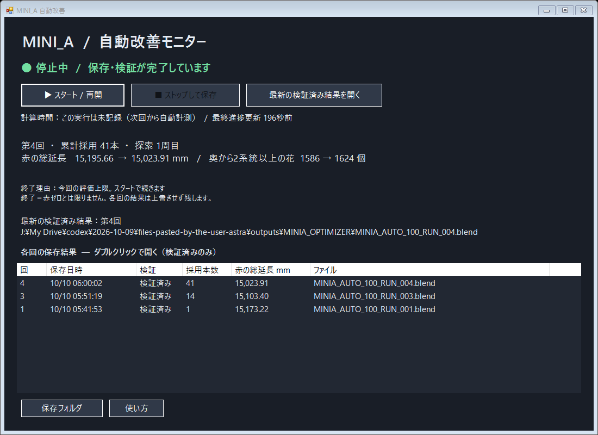

# 自動改善プログラムとGUI

## GUIの使い方

`GUI_START.lnk`（元の作業フォルダ）または復元手順のコマンドで `dashboard.ps1` を開きます。

- **スタート／再開**：元の入力を読み、checkpointの採用済み接続を再現して探索します。バックグラウンドBlenderを使用し、操作用Blender画面は起動しません。
- **ストップして保存**：STOPファイルを作り、現在の候補評価が終わる区切りで保存・検証して止めます。プロセスの強制終了ではありません。
- **進捗**：2秒間隔で状態、赤の総延長、採用本数、花の支持系統、最終更新を表示。探索中の値は仮採用値です。
- **時間**：記録された開始・終了時刻から経過時間を表示。古い実行で時刻がないものは未記録。残り時間の予測ではありません。
- **最新結果**：`latest_verified.json` に登録された検証済み結果だけを最新として開きます。
- **保存一覧**：各RUNのファイルを残し、検証済み行のダブルクリックでその回を開きます。未検証結果は区別します。

GUIを閉じても計算は続きます。計算を止める場合は停止ボタンを使います。現在の実装に完了音・Windows通知はありません。画面の完了表示で確認します。

画像はGUI作成時の自己テストです。最新RUN_007の数値を示す画面ではありません。

## 評価式

全モデルのグラフに固定支持点から多点始点Dijkstraを行い、辺長をL、両端の最短距離をd1,d2としたとき、基本値は `min(d1,d2) + L/2`。仮想支持rootを追加した二重連結成分の判定で合流の対象となる辺には係数0.65を掛けます。25.65 mm以上、または支持へ到達不能なら赤として総延長に加算します。色の距離上限は30 mmです。

この35%の合流補正や閾値は、実測破壊試験で校正された値ではありません。従来の色との連続性を保つため固定しています。以前の独立したlayerwise V2解析と異なり、**このoptimizerの採否は全体グラフであり、積層途中の到達可能性を評価していません。**

## 探索

1. 元のファイル、固定支持点、削除記録、花接続を保持して0〜100%を対象にします。
2. 赤い部分と奥向き支持が不足する花を優先し、既存編集点の近傍から候補を作ります。
3. 長さ、内部深さ、花から奥への向き、外形への収まりで絞ります。
4. 1候補を仮追加し、追加線も含む全グラフの赤い総延長を再計算します。
5. 赤が0.25 mm以上減る候補、または赤を増やさず花の3系統までの不足を減らす候補を採用します。2系統までの不足を悪化させる候補は拒否します。
6. 採用後に順位を更新します。不採用候補は別の周回で再評価できます。

AI/API/ネット接続を使わない決定的な局所探索です。既存点間の**接続追加のみ**で、枝の削除・付け替え・自由な新規点配置は行いません。LOWER50/70の折り曲げ生成処理とは別です。

## 制約（保存時のsettings.json）

| 条件 | 値 |
|---|---:|
| 対象 | 0〜100% |
| 点や分岐をまたぐ連続直線の最大長 | 50 mm |
| 内部同士の新規線 | 8 mm以下 |
| 花から奥への新規線 | 9.5 mm以下 |
| 通常の接続点の内部深さ | 4 mm以上 |
| 花の接続先の内部深さ | 5 mm以上 |
| 花側からの深さの増加 | 4 mm以上 |
| 花の内向き方向とのcosine | 0.7以上 |
| 新規線の証明用最小clearance | 0.145 mm |
| 点ごとの追加次数 | 最大3 |
| 総追加本数 | 最大200 |
| 1実行の評価予算 | 幾何条件通過後120候補 |
| 近傍候補数／最大周回 | 8／8 |

線の全長に沿うサンプルと距離境界で閉じたhostへの収まりを調べます。表示半径0.14 mmに対する確認であり、将来の印刷部材の半径・太さを検証したものではありません。既存の接続済み点同士を結ぶため新しい行き止まりは作りません。花の元の末端は消しません。

## 花の複数経路

同じ花の接点と座標aliasをまとめ、花から経路長20 mm以内で奥の枝へ到達する経路を最大3まで数えます。花以外の途中点を共有する経路、同じ奥の枝の別の点に到達する経路は別系統に数えません。他の花を経由する経路や表面だけの経路を除きます。

判定は局所的な頂点容量付きmax-flowです。深い到達先から先の経路が同じ弱い枝へ集まる可能性は残ります。また、同じ花の開始接点から複数経路を出せるため、**花の表面上の離れた複数箇所での接続を保証しません。**

## 終了・再開・ファイル

| 停止理由 | 意味 |
|---|---|
| RED_ZERO | この評価式で赤ゼロ |
| RUN_BUDGET | 今回の評価予算終了。再開可能 |
| USER_STOP | 停止要求に従って保存終了 |
| NO_IMPROVING_CANDIDATE_IN_THIS_NEIGHBORHOOD | 今の候補範囲で改善なし。大域的最適解の証明ではない |
| LINK_LIMIT / ROUND_LIMIT | 本数／周回上限。上限を変えず再開しても探索拡大にはならない |
| FAILED | 処理または検証失敗。前の検証済み結果を保持 |

`running.lock`を排他的に開いて重複実行を防ぎます。checkpointは採用履歴・既評価候補・周回・入力/設定/hostのhashを保存。JSON置換の一時的なPermissionErrorを最大8回リトライします。任意表示用PROGRESS.txtの書込失敗で探索を止めない処理があります。

各回は `MINIA_AUTO_100_RUN_NNN.blend` と `RUN_NNN.json` に保存。別のBlenderプロセスで再読込・再着色してから最新ポインタとOPEN_LATESTを更新します。実行時刻とログはexecution_historyにも保存します。GUIはRUN報告と検証状態を区別します。

入力や条件を変える場合は、新しいフォルダで新しい探索として開始します。既存checkpointを違う入力に無理に流用しません。各回の履歴はDriveに保持し、今回のGitHub記録には集計とファイルhashを保存しました。
